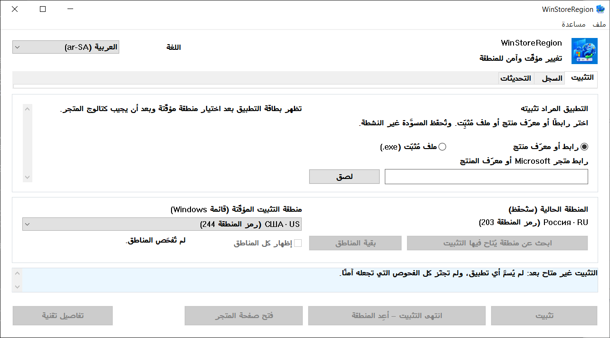

# WinStoreRegion


[](https://github.com/kroxiksut/win-store-region/actions/workflows/ci.yml)


أداة لـ Windows تبدّل منطقة Windows طوال عملية تثبيت واحدة، وتسلّم التثبيت إلى آلية متجر Microsoft نفسها، ثم تعيد المنطقة بعد أن ترى النتيجة الفعلية.

ملف تنفيذي واحد محمول `WinStoreRegion.exe`، نحو ٢ ميغابايت، يُنشر لمعماريات x64 وARM64 وx86 ‏٣٢‑بت. لا يحتاج صلاحيات المدير ولا يطلبها. ولم تُشغَّل فعليًّا إلا نسخة x64 — انظر [ما جرى التحقّق منه فعلًا](#ما-جرى-التحقّق-منه-فعلًا).

**العربية** · [English](README.md) · [Español](README.es-ES.md) · [فارسی](README.fa.md) · [日本語](README.ja.md) · [한국어](README.ko.md) · [Português](README.pt-BR.md) · [Русский](README.ru.md) · [Türkçe](README.tr.md) · [简体中文](README.zh-CN.md) · [繁體中文](README.zh-TW.md)

[سجل التغييرات](CHANGELOG.md)

> **هذا المستند مسوَّدة آلية لم يقرأها ناطق بالعربية.** المشروع لا يراجع الترجمات، وهذه لم يكن لها مترجم، فاحتمال الخطأ فيها أعلى من النص الإنجليزي الأصلي. من وجد خللًا فليفتح issue أو pull request. والمرجع عند الاختلاف هو [English](README.md).



أسماء المناطق تأتي من Windows نفسه، باللغة التي يسمّيها بها — ولهذا يحمل الحقل عنوان «قائمة Windows»، ولهذا تبقى أسماء المناطق في النافذة أعلاه بالروسية. أُخذت الصورة على Windows روسي بتكبير ١٢٥٪.

## المحتويات

- [لماذا وُجد هذا البرنامج](#لماذا-وُجد-هذا-البرنامج)
- [ماذا يفعل وماذا لا يفعل](#ماذا-يفعل-وماذا-لا-يفعل)
- [ما جرى التحقّق منه فعلًا](#ما-جرى-التحقّق-منه-فعلًا)
- [المتطلّبات](#المتطلّبات)
- [كيف يُستعمل](#كيف-يُستعمل)
- [تشغيله من سطر الأوامر](#تشغيله-من-سطر-الأوامر)
- [حين لا يخدم المتجر منطقتك](#حين-لا-يخدم-المتجر-منطقتك)
- [البحث عن منطقة حسب السوق](#البحث-عن-منطقة-حسب-السوق)
- [علامة التحديثات](#علامة-التحديثات)
- [سجل العمليات](#سجل-العمليات)
- [أين تُحفظ البيانات](#أين-تُحفظ-البيانات)
- [حين يحدث خطأ](#حين-يحدث-خطأ)
- [حدود معروفة ومسائل مفتوحة](#حدود-معروفة-ومسائل-مفتوحة)
- [الترجمات](#الترجمات)
- [البناء من المصدر](#البناء-من-المصدر)
- [الرخصة](#الرخصة)
- [إشعارات قانونية](#إشعارات-قانونية)

## لماذا وُجد هذا البرنامج

منطقة Windows إعداد، لا محلّ إقامة، والاثنان يفترقان باستمرار. قد يعيش المرء في الولايات المتحدة ويشغّل Windows روسيًّا بمنطقة مضبوطة على روسيا: عندئذ لا يعرض عليه متجر Microsoft التطبيقات المتاحة في بلده الفعلي — خدمات البثّ وما شابهها.

وMicrosoft توثّق تغيير البلد أو المنطقة بوصفه إجراءً عاديًّا: [تغيير بلدك أو منطقتك في متجر Microsoft](https://support.microsoft.com/en-us/account-billing/change-your-country-or-region-in-microsoft-store-5895e006-34f4-10f7-16b1-999e40adb048). وWinStoreRegion يُؤتمت ذلك بالضبط ولا شيء وراءه: يتغيّر إعداد في Windows، ويؤدّي متجر Microsoft التثبيت، ثم يعود الإعداد. ما يتغيّر هو طريق تسليم التطبيق لا آليّته. والمقال نفسه يُفتح من البرنامج: **مساعدة ← ‏Microsoft: تغيير بلدك أو منطقتك**.

والإجراء إذا فُعل باليد: غيّر المنطقة في الإعدادات، وانتظر حتى ينتبه المتجر، وابحث عن التطبيق، وابدأ التثبيت، وتذكّر أن تعيد المنطقة، ولا تخطئ في تذكّر ما كانت. والخطوة الأخيرة هي موضع المشكلة: من السهل أن تُترك المنطقة غريبة، والعملية التي تنقطع في منتصفها لا تترك أثرًا. وهذه الأداة تؤدّي الخطوات نفسها، لكنها تكتب المنطقة الأصلية على القرص قبل أن تغيّر شيئًا، وتعيدها حتى بعد انهيار أو إعادة تشغيل.

## ماذا يفعل وماذا لا يفعل

يفعل:

- يكتب منطقة Windows الحالية على القرص **قبل** أن يغيّر شيئًا؛
- يبدّل المنطقة ويؤكّد التبديل بإعادة قراءته؛
- يبحث عن التطبيق في الكتالوج **تحت المنطقة المؤقّتة**؛
- يسأل الكتالوج، قبل أن يمسّ المنطقة، هل يمكن تسليم المنتج إلى هذا الجهاز أصلًا؛
- يبدأ التثبيت عبر الآلية المعتادة ويعرض تقدّمه؛
- يعيد المنطقة الأصلية دون انتظار نهاية التثبيت، لكن بعد أن يكون التثبيت قد بدأ بدليل؛
- يؤكّد الاكتمال بظهور حزمة التطبيق، لا برمز خروج؛
- يجلب مُثبِّت المتجر من Microsoft نفسها حين تعجز الآلية المعتادة عن التثبيت، ويشغّله تحت المنطقة المؤقّتة؛
- يحتفظ بسجل عمليات محلي وسجل تشخيص؛
- يعيد المنطقة عند التشغيل التالي إذا انقطعت الجلسة السابقة.

ولا يفعل:

- لا يغيّر منطقة حساب Microsoft الخاص بك؛
- لا يغيّر عنوان IP ولا ينتحل موقعك الشبكي؛
- لا ينزّل حزم المتجر من خوادم غير رسمية؛
- لا يعدّل Windows ولا متجر Microsoft، ولا يرقّع شيئًا، ولا يتجاوز شيئًا؛
- لا يَعِد بكسر كل قيد: ما هو متاح يقرّره متجر Microsoft لا هذه الأداة؛
- وليس من Microsoft.

وتبعات اختلاف المنطقة مدّةً من الزمن تخصّ المستخدم وحده: المحتوى والاشتراكات المشتراة في منطقة قد تسلك سلوكًا مختلفًا في أخرى. والأداة لا تخفي ذلك ولا تَعِد بشأنه بشيء.

## ما جرى التحقّق منه فعلًا

يوجد هذا القسم لأنّ «إنه يعمل» ادّعاء، والادّعاءات في هذا المشروع يُنتظر منها أن تسمّي دليلها.

جرى تنفيذ الدورة كاملة من طرفها إلى طرفها على Windows 10 وعلى Windows 11: تُسجَّل المنطقة قبل أن يتغيّر شيء، ثم تُبدَّل وتُؤكَّد بإعادة قراءتها، ويُبحث عن التطبيق تحت المنطقة المؤقّتة، ويُثبَّت مع عرض التقدّم، وتُعاد المنطقة مبكّرًا، ويُؤكَّد الاكتمال بظهور حزمة التطبيق لا برمز خروج. وكذلك جُرِّب مسار التسليم، ومُثبِّت المتجر المجلوب بمعرّف المنتج مع فحص توقيعه وموقِّعه، ورفضُ منتج يقول الكتالوج إنّ هذا الجهاز لا يستقبله. وكل تشغيل أخفق حتى الآن انتهى والمنطقة مُعادة وسجل الاستعادة ممسوح.

أمّا أيّ إصدارات Windows هي، فليست مسألة اختبار بل مسألة ما يتطلّبه الرمز: البيان يعلن دعم Windows 10 وWindows 11، والحدّ الأدنى داخل هذا المدى هو Windows 10 1809، ويحدّده App Installer. انظر [المتطلّبات](#المتطلّبات).

وما لم يُتحقّق منه، ويُقال كذلك:

- **لا تشغيل على جهاز غير جهاز المطوّر** منذ اكتمال المسارات التي تعمل بالأزرار.
- **هل يحدّث مُثبِّت المتجر تطبيقًا مثبَّتًا سلفًا.** ولذلك تسرد علامة التحديثات وتشرح، ولا تعرض تحديثًا بضغطة واحدة. انظر [حدود معروفة](#حدود-معروفة-ومسائل-مفتوحة).
- **المظهر عند تكبير ١٥٠٪.** تُفحص الراقة حسابيًّا بين ١٠٠٪ و٢٠٠٪، وهذا لا يقول هل يتّسع عنوان داخل زرّه.
- **نسختا ARM64 وx86 ‏٣٢‑بت على أجهزة حقيقية.** المعماريات الثلاث تُبنى مع كل دفعة وتُنشر مع كل إصدار، أي أنّها تُترجَم. ولم تُشغَّل أيٌّ من هاتين على جهاز فعلي قطّ. وهما معروضتان لأنّ جهازًا يقدر على تشغيلهما هو السبيل الوحيد لتغيير ذلك، لا لأنّ شيئًا هنا يقول إنّهما تعملان.

## المتطلّبات

- **‏Windows 10 إصدار 1809 (بناء 17763) أو أحدث، أو أي Windows 11.** يحدّد الأرضية App Installer، وهو حامل واجهة COM للتثبيت ويتطلّب 1809 بنفسه؛ وكل ما عداه مما يستدعيه هذا البرنامج أقدم — ‏`GetDpiForWindow` يحتاج 1607، والتكبير لكل شاشة من الجيل الثاني يحتاج 1703. والبيان يعلن دعم Windows 10 و11. جُرِّب على Windows 10 22H2، وقبل ذلك في أثناء التطوير على Windows 11.
- ‏x64 أو ARM64 أو x86 ‏٣٢‑بت. وكل إصدار يحمل الثلاثة. وعلى جهاز ARM64 تعمل نسخة x64 أيضًا تحت محاكاة Windows، وهو المسار الذي جُرِّب على الأقل على عتاد x64.
- **‏App Installer** (`Microsoft.DesktopAppInstaller`) — التثبيت يجري عبره. وبدونه تقول الأداة ذلك وتعرض فتح صفحته في المتجر.
- **متجر Microsoft** (`Microsoft.WindowsStore`).
- يجب أن يكون المجلد الذي يعمل منه الملف التنفيذي قابلًا للكتابة: عند أول تشغيل تظهر بجانب البرنامج نسخة من `Microsoft.Management.Deployment.winmd` مأخوذة من App Installer المثبَّت. وبدونها تكون واجهات COM للتثبيت غير متاحة. والبرنامج لا ينسخ نفسه إلى مكان آخر للالتفاف على ذلك — بل يبلّغ بالشرط غير المستوفى.
- لا صلاحيات مدير.

**الملف التنفيذي غير موقَّع، وWindows سيقول ذلك.** عند أول تشغيل يعرض SmartScreen «حمى Windows جهازك» ويخفي زرّ التشغيل خلف **مزيد من المعلومات ← تشغيل على أي حال**. وهذا ما يفعله Windows بأي ملف تنفيذي لا يحمل توقيع Authenticode ولا سمعة تنزيل؛ وليس حكمًا على هذا الملف بعينه. ويترتّب على ذلك أمران، وتقديرهما لك:

- لا يزول التحذير إلا بتوقيع الإصدار بشهادة توقيع برمجيات. ولا شيء في البناء يستطيع كتمه، ولا شيء هنا يحاول.
- وما يمكن فحصه بدلًا من ذلك هو الهوية. كل بناء ينشر بصمة SHA-256 للملف الذي أنتجه — في ملخّص التشغيل، وفي ملف بجانب الملف التنفيذي داخل الأرشيف — والتشغيل نفسه علني. قارن ما لديك بـ `Get-FileHash .\WinStoreRegion.exe -Algorithm SHA256`، فإمّا أن يكون الملف هو ما بناه ذلك التشغيل وإمّا لا.

والملف المنزَّل من متصفّح يحمل أيضًا علامة تُبقي SmartScreen متدخّلًا بعد فكّ الأرشيف. و`Unblock-File .\WinStoreRegion.exe` في PowerShell، أو **خصائص ← إلغاء الحظر**، تزيل تلك العلامة. وإذا ألغيت حظر الأرشيف قبل فكّه خرجت الملفات نظيفة.

## كيف يُستعمل

1. سمِّ التطبيق في علامة **التثبيت**: رابط متجر Microsoft أو معرّف منتج. ويمكن أيضًا إفلات ملف مُثبِّت من المتجر (`.exe`) على النافذة؛ فيُفحص بحثًا عن توقيع موثوق من Microsoft ويُشغَّل تحت المنطقة المؤقّتة، لكن لا يمكن التعرّف عليه — فمثل هذا الملف لا يحمل معرّف منتج مقروءًا، والتطبيق الذي يثبّته دعواك أنت لا حقيقة يستطيع هذا البرنامج فحصها.
2. اختر منطقة مؤقّتة. وبمجرّد تحليل معرّف المنتج تسأل الأداة المصدر عن بطاقة التطبيق تحت تلك المنطقة — فيظهر الاسم والناشر ونوع التسليم قبل أن يتغيّر شيء.
3. إن كان التطبيق غير متاح في المنطقة المختارة، اضغط **ابحث عن منطقة يُتاح فيها التثبيت**. تُسأل نحو أربعين سوقًا كبرى، وتضيق القائمة إلى ما يتيحه فعلًا. و**بقية المناطق** تُكمل المسح؛ و**إظهار كل المناطق** يعيد القائمة كاملة.
4. اضغط **تثبيت**. ومن هنا تعمل الأداة وحدها: تبدّل المنطقة، وتؤكّد التغيير بإعادة قراءته، وتجد التطبيق، وتسلّم التثبيت إلى المتجر، وتعرض التقدّم، ثم تعيد المنطقة.
5. وتظهر النتيجة في علامة **السجل**.

ولا يوجد زرّ «إلغاء التثبيت» عن قصد. فالتثبيت ملك Windows: يمكن إيقافه أو إزالة التطبيق في متجر Microsoft أو في **الإعدادات ← التطبيقات**. والحوار الذي يظهر عند إغلاق النافذة أثناء عملية يقول ذلك.

والواجهة تعمل من لوحة المفاتيح، وتحترم تكبير الشاشة، وتنتقل بين اللغات التي تحملها دون إعادة تشغيل.

## تشغيله من سطر الأوامر

لا يوجد وضع بلا واجهة. سطر الأوامر يقرّر فقط بماذا تُفتح النافذة — مدخل تطبيق واحد اختياري، يُملأ سلفًا في علامة التثبيت. ولا يبدأ شيئًا: لا تُمَسّ المنطقة ولا يبدأ أي تثبيت حتى تضغط الزر.

```powershell
# افتح النافذة دون ملء شيء.
.\WinStoreRegion.exe

# افتحها ومعرّف المنتج في الحقل سلفًا.
.\WinStoreRegion.exe 9WZDNCRFJ3PZ

# وعنوان ويب من المتجر يفعل الشيء نفسه.
.\WinStoreRegion.exe https://apps.microsoft.com/detail/9WZDNCRFJ3PZ

# وكذلك عنوان ms-windows-store.
.\WinStoreRegion.exe "ms-windows-store://pdp/?productid=9WZDNCRFJ3PZ"

# ضع بين علامتي اقتباس عنوانًا فيه & — فـ PowerShell يعدّه عاملًا خاصًّا به.
.\WinStoreRegion.exe "https://apps.microsoft.com/detail/9WZDNCRFJ3PZ?hl=en-us"

# اطبع طريقة الاستعمال واخرج دون فتح نافذة.
.\WinStoreRegion.exe --help
.\WinStoreRegion.exe -h
```

وأيًّا كان ما يُمرَّر فإنه *يُخزَّن* في الحقل فقط. ويُحلَّل لحظة فتح النافذة، فالقيمة التي ليست معرّف منتج ولا عنوان متجر يُبلَّغ عنها في النافذة لا عند موجّه الأوامر.

ورموز الخروج، لأنّ سكربتًا قد يريدها:

| الرمز | المعنى |
|---|---|
| `0` | عملت النافذة وأُغلقت، أو طبع `--help` طريقة الاستعمال. |
| `1` | تعذّر بدء الواجهة الرسومية. |
| `2` | سطر الأوامر خطأ. |

وأمران فقط يبلغان من الخطأ ما يستحقّ الرمز `2`، وكلاهما يسمّي نفسه قبل أن يعيد طريقة الاستعمال على مخرج الخطأ:

```powershell
PS> .\WinStoreRegion.exe --install
Unknown option: --install

Usage:
...

PS> .\WinStoreRegion.exe 9WZDNCRFJ3PZ 9N1SV6841F0B
Only one application input is allowed.

Usage:
...
```

وتفصيلان يستحقّان المعرفة. الملف التنفيذي برنامج نوافذ، فهو يرتبط بوحدة التحكّم التي شغّلته ليطبع هذه الرسائل؛ وإن شُغِّل بلا واحدة — من حوار «تشغيل» أو من اختصار — عرض النص نفسه في صندوق حوار. ونصّ سطر الأوامر **إنجليزي في كل لغات الواجهة**: فلغة الواجهة تُختار داخل النافذة، والنافذة غير موجودة بعد حين تُقرأ الوسائط، والتخمين من لغة النظام معناه الجواب بلغة لم يخترها أحد.

## حين لا يخدم المتجر منطقتك

بعض المنتجات لا تقدر الآلية المعتادة على تثبيتها حتى تحت المنطقة الصحيحة. وعندها تعرض النافذة مسارًا ثانيًا: **تنزيل مُثبِّت المتجر**.

تطلب الأداة من Microsoft المُثبِّت الموقَّع نفسه الذي كان المرء سيتلقّاه من صفحة المتجر على الويب، معنونًا بمعرّف المنتج. ثم يُعامَل ذلك الملف تمامًا كملف اخترته بيدك — البوابة نفسها للتوقيع، والتأكيد نفسه الذي يعرض الاسم والناشر وبصمة SHA-256، والمعاملة نفسها على المنطقة.

وثلاثة أمور تستحقّ المعرفة عن هذا المسار، كلها مقيسة لا مفترضة:

- التنزيل لا يعتمد على منطقتك، فيُجلب الملف والجهاز ما زال على منطقتك أنت. وتشغيله وحده هو ما يحتاج المنطقة المؤقّتة.
- المُثبِّت يفتح نافذة خاصة به و**لا يثبّت صامتًا**. أنت تُنهي التثبيت هناك، وعندئذ فقط تضغط **أعِد المنطقة**.
- ولأنّ متجر Microsoft يملك ذلك العمل ولا يبلّغ بشيء، لا يستطيع هذا المسار أبدًا أن يدّعي أنّ تطبيقًا ثُبِّت. ويسجّله السجل *سُلِّم إلى المُثبِّت*، وهو ما حدث فعلًا.

والمُثبِّتات المنزَّلة لا يُحتفظ بها. تُحذف عند انتهاء التسليم، وتُحذف مرة أخرى عند التشغيل التالي، لأنّ الملف يمكن جلبه من جديد دائمًا، ولأنّ مجلدًا يتراكم فيه مُثبِّتات المتجر ليس شيئًا طلبه أحد.

## البحث عن منطقة حسب السوق

كتالوج متجر Microsoft لا يجيب إلا عن المنطقة السارية الآن، فالتطبيق الغائب عن منطقتك الأصلية لا يظهر عادةً أصلًا قبل أن تتغيّر المنطقة. وتلتفّ الأداة على ذلك بسؤال المصدر سوقًا سوقًا، وتفرّق بين ثلاثة أجوبة: متاح، وغير متاح، ولا جواب. والثالث لا يُعرض أبدًا بوصفه رفضًا — فالسوق التي تعذّر بلوغها قد تكون هي التي تحتاجها.

ومجموعة الأربعين سوقًا غير مكتملة عن قصد، والأداة تقول ذلك. والقائمة الكاملة نحو مئتين وخمسين طلبًا، فتجري خطوةً ثانية وبأمر صريح فقط.

وجواب المصدر مرجع لا إذن بالتثبيت: فداخل العملية يُبحث عن التطبيق من جديد تحت المنطقة السارية فعلًا.

## علامة التحديثات

متجر Microsoft لا يحدّث تطبيقًا لا يخدمه في منطقتك الحالية. وعلامة التحديثات تجد هذه: تسرد تطبيقات المتجر المثبَّتة التي يرفض المصدر منتجها في منطقتك ويتيحه في غيرها، والإصدار المثبَّت إلى جانب الإصدار الذي يعرضه الكتالوج.

وما **لا** تدّعيه العلامة عن قصد هو أنّ تحديثًا قد صدر. وحقيقتان تحولان دون ذلك، وكلتاهما مقيسة:

- ‏`winget` لا يستطيع تحديث منتج من المتجر أصلًا. وإذا طُلب منه أجاب «لا تحديث منطبق»، لأنّ مصدر `msstore` يبلّغ عن الإصدار بأنه `Unknown`.
- ورقما الإصدارين ليسا دائمًا قابلين للمقارنة. فالكتالوج يرقّم الحزمة المجمّعة مستقلًّا عن الحزمة التي بداخلها، والناشرون يغيّرون أنظمة ترقيمهم. والإصدار المعروض هو الذي سيصل فعلًا إلى هذا الجهاز، مقروءًا من داخل الحزمة المجمّعة لا من اسمها.

فتعرض العلامة الرقمين وتقول ما يمكن إثباته: متجر هذه المنطقة لن يخدم هذا المنتج. والتصرّف في قيدٍ ينقل معرّف منتجه إلى علامة التثبيت ويبدأ البحث عن المناطق؛ والتحديث ليس نوعًا منفصلًا من العمليات، وكل بوابة تبقى حيث هي.

ونتائج المسح تُحفظ بين التشغيلات وتُعرض ومعها وقت أخذها، وللمنطقة نفسها فقط.

## سجل العمليات

تعرض علامة **السجل** ما ثُبِّت: التطبيق، ومعرّف المنتج، والنوع، والمنطقة التي وُجد التطبيق تحتها، والتاريخ، والإصدار، والنتيجة. والعمليات غير المنتهية وغير المؤكَّدة تبرز — فهي التي تحتاج انتباهًا.

ولا يُعرض على قيد مختار إلا ما هو آمن: فتح صفحة التطبيق في المتجر، ونقل معرّف المنتج إلى مسوَّدة تثبيت جديدة، ونسخ معرّف المنتج، وحذف القيد المحلي. ولا واحد منها يبدأ تثبيتًا ولا يغيّر منطقة.

## أين تُحفظ البيانات

كل شيء يعيش في ملف تعريف المستخدم، تحت `%LOCALAPPDATA%\WinStoreRegion`:

| الملف | الغرض |
|---|---|
| `journal.json` | تاريخ العمليات: ماذا ومتى وتحت أي منطقة وبأي نتيجة |
| `pending-restore.json` | سجل الاستعادة؛ لا يوجد إلا والمنطقة مغيَّرة مؤقّتًا |
| `updates-scan.json` | آخر مسح للتحديثات، حتى لا تكلّف إعادة فتح النافذة شبكة |
| `installers\` | مُثبِّت متجر يجري تسليمه الآن؛ يُفرَّغ عند الانتهاء |
| `logs\winstoreregion.log` | سجل تشخيص دوّار |

ولا يوجد قياس عن بُعد. والسجل لا يدوّن محتوى الحافظة ولا النصّ المكتوب ولا مسارات الملفات الكاملة: فالملف المختار يُسجَّل باسمه وببصمة SHA-256.

## حين يحدث خطأ

تبقى المنطقة مؤقّتة إلى حين استعادة مؤكَّدة بالضبط. فإن مات البرنامج أو أُعيد تشغيل الجهاز، وجد التشغيل التالي سجل الاستعادة، وقال ذلك، وعرض إعادة المنطقة الأصلية أو إبقاء الحالية. ولا يبدأ أي تثبيت جديد حتى يُحسم ذلك السجل.

والتثبيت الذي بدأه تشغيل سابق يبقى بعد موت البرنامج: خدمة في Windows هي من تؤدّيه. وعند البدء تنتبه الأداة وتستأنف مراقبته بدل أن تعدّ العملية متروكة.

وكل عملية تُكتب في سجل التشخيص: البدء، وسجل الاستعادة، وتبديل المنطقة بالقيمتين ونتيجة إعادة القراءة، والبحث، وجواب المُثبِّت برموزه، ومراحل التثبيت، والإعادة، والنتيجة. و**مساعدة ← فتح سجل التشخيص** يفتح المجلد؛ و**مساعدة ← نسخ التفاصيل** يضع الكتلة التقنية للخطأ الحالي في الحافظة.

## حدود معروفة ومسائل مفتوحة

- لا تُثبَّت إلا التطبيقات التي يسلّمها المتجر بوصفها حزم متجر Microsoft. والتطبيقات التي لها مُثبِّت Win32 خاص بها خارج النطاق: لا يمكن إثبات اكتمالها، والتثبيت الذي لا يستطيع أحد التحقّق منه لا ينبغي عرضه.
- لا يوجد في علامة التحديثات زرّ تحديث بضغطة واحدة. فما إذا كان مُثبِّت المتجر يحدّث تطبيقًا مثبَّتًا سلفًا لم يُقَس، وزرّ قد لا يفعل شيئًا أسوأ من لا زرّ.
- **عيب مفتوح:** في ٢١‏.٠٨‏.٢٠٢٦ أغلق Windows النافذة بوصفها متوقّفة عن الاستجابة بعد خمس عمليات فاشلة متتابعة سريعًا. ولم تتأثّر معاملة المنطقة — فقد أُعيدت في كل واحدة منها — أي أنّ الخلل في الواجهة لا في النموذج. ولم يتكرّر منذ ذلك الحين، والبناء الذي حدث عليه أقدم من عدة إصلاحات؛ والسبب غير معروف بعد ولا يُخمَّن هنا.
- إحدى عشرة لغة للواجهة: العربية والإنجليزية والإسبانية والفارسية واليابانية والكورية والبرتغالية والروسية والتركية والصينية بكتابتيها. الإنجليزية والروسية من كتابة صاحب المشروع نفسه؛ والتسع الباقية مسوَّدات آلية لم يقرأها ناطق بها، وكل ملف يقول ذلك في أوّله. والعربية والفارسية تقلبان النافذة كلها، لأنّ هكذا تُقرآن. ولكل واحدة منها README مترجَم أيضًا، وكل واحد من تلك الملفات يحيل إلى البقية جميعًا.
- يعمل نسخة واحدة من البرنامج في وقت واحد.

## الترجمات

اللغة ملف. `lang/ru.toml` و`lang/en.toml` وما تضيفه أنت: انسخ واحدًا، وترجم القيم، وافتح pull request. ولا شيء يُكتب بلغة Rust — فالبناء يقرأ ذلك المجلد ويولّد قائمة اللغات والمنتقي والجداول، فيكفي `lang/zh.toml` لعرض الصينية.

واللغة التي تُقرأ من اليمين إلى اليسار تقول ذلك بحقل واحد، `direction = "rtl"`، فتقلب النافذة نفسها من أجلها: اللوحات والعناوين والأزرار وأعمدة الجداول وأشرطة التمرير كلها تبدّل جهتها. جاءت العربية أولًا وتبعتها الفارسية بثمن ملف واحد ولا سطر Rust، وهذا هو الادّعاء كله هنا؛ والعبرية تكلّف الشيء نفسه.

**تُقبَل اللغة الجديدة دون مراجعة لغوية**، لأنّه ليس هنا من يقرأها. وما يُفحص هو البنية، والبناء هو من يفحصها: المفتاح الناقص، والمفتاح المجهول، والقائمة ذات الطول الخطأ، والنصّ الذي تختلف `{مواضع الإحلال}` فيه عن الأصل — كلها تُفشل البناء. وبعد القبول يقصد القائم على المشروع أن ينشر إصدارًا يحمل اللغة.

ولأنّه لا مراجعة، فقاعدة واحدة أهمّ من غيرها. كثير من النصوص هنا متحفّظة عن قصد — تقول إنّ الاكتمال *لم يُثبَت*، وإنّ الجواب جاء من سوق واحدة، وإنّ المجموعة غير مكتملة. وهذه التحفّظات هي ما يجعل الوثوق بهذا البرنامج آمنًا، وعلى الترجمة أن تُبقيها حتى حيث تكون الجملة الأجرأ أجمل في القراءة.

وللسبب نفسه فإنّ اللغات المشحونة سلفًا هي الأرجح خطأً. **فإن قرأت واحدة ووجدت فيها خللًا، افتح issue من فضلك** — ترجمة خاطئة، أو عنوانًا مقصوصًا، أو تحفّظًا ضاع، أو صياغة غير طبيعية فحسب. سمِّ اللغة والمفتاح؛ واقتراح صياغة مرحَّب به لا مطلوب. وpull request يؤدّي العمل نفسه، وعتبة الـ issue أدنى عن قصد.

والمترجمون يُذكرون في حقل `authors` من ملف اللغة، ويظهر ذلك الاسم في **مساعدة ← حول البرنامج** بجانب اللغة، تحت مؤلف البرنامج ورخصته. والاعتماد مولَّد من الملف نفسه، فلا يمكن أن يفترق عن العمل الذي أُعطي له.

والترجمة مساهمة كغيرها: تُقبل تحت **GPL-3.0-or-later** ولا رخصة سواها، وحقّ النسخ يبقى لك ولا يُمنح لأحد حقّ إعادة الترخيص.

وملف اللغة يغطّي كل ما على الشاشة — العناوين والحالات والتشخيصات والحوارات سواءً. والشيء الوحيد الذي لا يغطّيه هو سطر الأوامر، وهو إنجليزي في كل لغة، لأنّ الوسائط تُقرأ قبل أن تُختار لغة. والقائمة الكاملة في [CONTRIBUTING.md](CONTRIBUTING.md#translations).

## البناء من المصدر

‏Rust مستقرّ 1.85 أو أحدث للهدف `x86_64-pc-windows-msvc`.

```
cargo build --release
cargo test
cargo clippy --all-targets
cargo fmt --all --check
```

والمعماريات الأخرى تُبنى من المصادر نفسها بإضافة هدف؛ ويحتاج الجهاز مكوّن أدوات بناء MSVC المطابق. وبيان التطبيق محايد تجاه المعمارية، فلا يتغيّر شيء آخر:

```
rustup target add aarch64-pc-windows-msvc
cargo build --release --target aarch64-pc-windows-msvc

rustup target add i686-pc-windows-msvc
cargo build --release --target i686-pc-windows-msvc
```

ولم تُشغَّل أيٌّ من هاتين على جهاز حقيقي من معماريتها. وتُنشران مع كل إصدار مع ذلك، لأنّ جهازًا يقدر على تشغيلهما هو السبيل الوحيد لتغيير هذا. إنّهما تُترجَمان، وهذا كل ما يُدّعى.

وبعض الاختبارات موسومة بـ `#[ignore]`: فهي تغيّر منطقة Windows، أو تثبّت تطبيقات، أو تبلغ الشبكة. وتلك التي تغيّر المنطقة لا تُشغَّل إلا على جهاز اختبار مخصّص.

## الرخصة

‏GPL-3.0-or-later.

## إشعارات قانونية

هذا المشروع مستقل عن Microsoft: غير تابع لها ولا معتمَد منها ولا مدعوم منها. وأسماء Microsoft وWindows ومتجر Microsoft وWinGet مستعملة فقط لوصف التوافق والغرض وصفًا دقيقًا. ولا تُستعمل شعارات Microsoft ولا هويّتها البصرية.

وWinStoreRegion لا يغيّر منطقة حساب Microsoft، ولا يغيّر عنوان IP، ولا ينزّل حزم متجر Microsoft من خوادم غير رسمية، ولا يضمن إمكان الالتفاف على كل قيد إتاحة.
