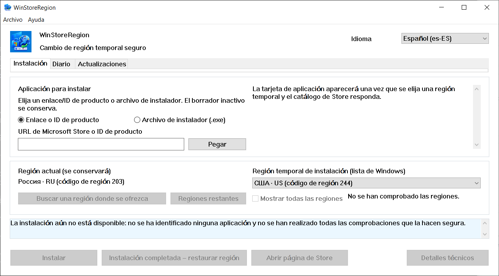

# WinStoreRegion


[](https://github.com/kroxiksut/win-store-region/actions/workflows/ci.yml)


Utilidad de Windows que cambia temporalmente la región del sistema operativo
durante una instalación, entrega el proceso de instalación al mecanismo propio
de Microsoft Store y restaura la región una vez que se confirma el
resultado real.

Un único archivo portable `WinStoreRegion.exe`, aproximadamente 2 MB, disponible
para x64, ARM64 y x86 de 32 bits. No requiere ni solicita derechos de
administrador. Solo la compilación x64 se ha ejecutado —véase [qué se ha
verificado realmente](#qué-se-ha-verificado-realmente).

[العربية](README.ar.md) · [English](README.md) · **Español** · [فارسی](README.fa.md) · [日本語](README.ja.md) · [한국어](README.ko.md) · [Português](README.pt-BR.md) · [Русский](README.ru.md) · [Türkçe](README.tr.md) · [简体中文](README.zh-CN.md) · [繁體中文](README.zh-TW.md) · [Cambios](CHANGELOG.md)

> **Este documento es una traducción automática que ningún hispanohablante ha revisado.** El idioma utilizado es español europeo. El proyecto no revisa traducciones; por lo tanto, es más probable que contenga errores que el [inglés](README.md), que es la versión de autoridad. Si encuentra algún error, le agradeceremos que abra un problema (_issue_) o una solicitud de extracción (_pull request_).



Los nombres de las regiones proceden de Windows en el idioma que Windows utiliza
para referirse a ellas —por eso el campo se etiqueta como «Lista de Windows», y
por eso la ventana anterior todavía muestra las regiones en ruso. La captura se
tomó en un Windows ruso con escala del 125 %.

## Contenido

- [Por qué existe](#por-qué-existe)
- [Qué hace y qué no hace](#qué-hace-y-qué-no-hace)
- [Qué se ha verificado realmente](#qué-se-ha-verificado-realmente)
- [Requisitos](#requisitos)
- [Cómo utilizarlo](#cómo-utilizarlo)
- [Iniciarlo desde la línea de comandos](#iniciarlo-desde-la-línea-de-comandos)
- [Cuando Microsoft Store no sirve su región](#cuando-microsoft-store-no-sirve-su-región)
- [Encontrar una región por mercado](#encontrar-una-región-por-mercado)
- [La pestaña Actualizaciones](#la-pestaña-actualizaciones)
- [El diario de operaciones](#el-diario-de-operaciones)
- [Dónde se almacenan los datos](#dónde-se-almacenan-los-datos)
- [Cuando algo va mal](#cuando-algo-va-mal)
- [Límites conocidos y problemas abiertos](#límites-conocidos-y-problemas-abiertos)
- [Traducciones](#traducciones)
- [Compilar desde el código fuente](#compilar-desde-el-código-fuente)
- [Licencia](#licencia)
- [Avisos legales](#avisos-legales)

## Por qué existe

La región de Windows es una configuración, no un lugar de residencia, y ambas se
desvían constantemente. Alguien puede vivir en los Estados Unidos y ejecutar un
Windows en ruso con la región configurada como Rusia: Microsoft Store no
le ofrecerá entonces las aplicaciones disponibles en su país real —los servicios
de transmisión y similares.

Microsoft documenta el cambio de país o región como un procedimiento ordinario:
[Change your country or region in Microsoft Store](https://support.microsoft.com/en-us/account-billing/change-your-country-or-region-in-microsoft-store-5895e006-34f4-10f7-16b1-999e40adb048).
WinStoreRegion automatiza exactamente ese procedimiento y nada más: se cambia una
configuración de Windows, Microsoft Store realiza la instalación y la
configuración se restaura. Lo que cambia es la ruta de entrega de una aplicación,
no el mecanismo. Se puede acceder al mismo artículo desde el programa: **Ayuda →
Microsoft: cambiar el país o la región**.

Realizado manualmente, el procedimiento es: cambiar la región en Configuración,
esperar a que Microsoft Store lo note, encontrar la aplicación, iniciar la instalación,
recordar restaurar la región y no confundir cuál era. Ese último paso es donde
surge el problema: una región es fácil dejar extranjera, y una operación
interrumpida a mitad de camino no deja rastro. Esta utilidad realiza los mismos
pasos, pero escribe la región original en el disco **antes** de cambiar nada y la
restaura incluso después de un bloqueo o reinicio.

## Qué hace y qué no hace

Hace:

- escribir la región actual de Windows en el disco **antes** de cambiar nada;
- cambiar la región y confirmar el cambio releyéndola;
- buscar la aplicación en el catálogo **bajo la región temporal**;
- preguntar al catálogo, antes de tocar la región, si este dispositivo puede
  recibir el producto en absoluto;
- iniciar la instalación a través del mecanismo ordinario y mostrar su progreso;
- restaurar la región original sin esperar a que termine la instalación, pero
  solo después de que la instalación haya comenzado demostrablemente;
- confirmar la finalización por la aparición del paquete de la aplicación, no
  por un código de retorno;
- obtener el instalador de Microsoft Store para un producto cuando el
  mecanismo ordinario no puede instalarlo, y ejecutar ese instalador bajo la
  región temporal;
- mantener un diario de operaciones local y un registro de diagnóstico;
- restaurar la región en el siguiente inicio si la sesión anterior se cortó.

No hace:

- cambiar la región de su cuenta de Microsoft;
- cambiar su dirección IP ni falsificar su ubicación de red;
- descargar paquetes de Microsoft Store desde servidores no oficiales;
- modificar Windows o Microsoft Store, parchear nada ni eludir nada;
- prometer derrotar toda restricción: la disponibilidad la decide Microsoft Store de
  Microsoft, no esta utilidad;
- proceder de Microsoft.

Las consecuencias de que la región difiera durante un tiempo son responsabilidad
del usuario: el contenido y las suscripciones comprados en una región pueden
comportarse de manera diferente en otra. La utilidad no lo oculta y no promete
nada al respecto.

## Qué se ha verificado realmente

Esta sección existe porque «funciona» es una afirmación, y las afirmaciones en
este proyecto deben nombrar su evidencia.

El ciclo completo se ha ejecutado de principio a fin tanto en Windows 10 como en
Windows 11: la región se registró antes de cualquier cambio, se cambió y se
confirmó releyéndola, la aplicación se buscó bajo la región temporal, se instaló
con progreso, la región se restauró temprano y se confirmó la finalización por la
aparición del paquete de la aplicación en lugar de un código de retorno. La ruta
de entrega, el instalador de Microsoft Store obtenido por ID de producto con su firma
y firmante verificados, y el rechazo de un producto que el catálogo dice que este
dispositivo no puede recibir, se han ejercido del mismo modo. Todas las ejecuciones
fallidas hasta ahora han terminado con la región restaurada y el registro de
recuperación borrado.

Qué versiones de Windows son no es cuestión de pruebas sino de lo que el código
requiere: el manifiesto declara Windows 10 y Windows 11, y el límite inferior
dentro de ese rango es Windows 10 1809, establecido por App Installer. Véase
[Requisitos](#requisitos).

No verificado, y declarado como tal:

- **Sin ejecución en una máquina que no sea la del desarrollador** desde que se
  completaron las rutas impulsadas por botones.
- **Si el instalador de Microsoft Store actualiza una aplicación ya instalada.** Por lo
  tanto, la pestaña Actualizaciones lista y explica, pero no ofrece una
  actualización de un clic. Véase [Límites conocidos](#límites-conocidos-y-problemas-abiertos).
- **Apariencia a escala del 150 %.** La disposición se verifica aritméticamente
  al 100–200 %, lo que no puede decir si un título cabe dentro de un botón.
- **Las compilaciones ARM64 y x86 de 32 bits en dispositivos reales.** Las tres
  arquitecturas se compilan en cada inserción y se publican con cada versión, por
  lo que se compilan. Ninguna de esas dos se ha iniciado nunca en un dispositivo
  real. Se ofrecen porque una máquina que pueda ejecutarlas es la única forma en
  que eso cambiará, no porque algo aquí diga que funcionan.

## Requisitos

- **Windows 10 versión 1809 (compilación 17763) o posterior, o cualquier Windows
  11.** El límite lo establece App Installer, que lleva la interfaz COM de
  instalación y él mismo requiere 1809; todo lo demás que este programa llama es
  más antiguo —`GetDpiForWindow` necesita 1607 y el escalado por monitor v2
  necesita 1703. El manifiesto declara compatibilidad con Windows 10 y 11.
  Probado en Windows 10 22H2 y, anteriormente en desarrollo, en Windows 11.
- x64, ARM64 o x86 de 32 bits. Cada versión los contiene a todos tres. En un
  dispositivo ARM64, la compilación x64 también se ejecuta bajo emulación de
  Windows, que es la ruta que al menos se ha ejercido en hardware x64.
- **App Installer** (`Microsoft.DesktopAppInstaller`) —la instalación se realiza
  a través de ella. Sin ella, la utilidad lo dice y ofrece abrir su página en la
  Microsoft Store.
- **Microsoft Store** (`Microsoft.WindowsStore`).
- El directorio desde el que se ejecuta el `.exe` debe ser escribible: en el
  primer inicio, aparece una copia de `Microsoft.Management.Deployment.winmd`
  junto al programa, tomada del App Installer instalado. Sin él, las interfaces
  COM de instalación no están disponibles. El programa no se copia a sí mismo en
  otro lugar para evitar esto —reporta la condición incumplida en su lugar.
- Sin derechos de administrador.

**El archivo binario no está firmado, y Windows lo dirá.** En la primera ejecución,
SmartScreen muestra «Windows protegió su PC» y oculta el botón de ejecución detrás
de **Más información → Ejecutar de todas formas**. Esto es lo que Windows hace con
cualquier ejecutable que no lleva una firma Authenticode ni reputación de descarga;
no es una declaración sobre este archivo en particular. De esto se derivan dos
cosas, y ambas son suyas para sopesar:

- La advertencia solo se elimina firmando la versión con un certificado de firma
  de código. Nada en la compilación puede suprimirla, y nada aquí lo intenta.
- Lo que se puede verificar es la identidad. Cada compilación publica el SHA-256
  del binario que produjo —en el resumen de ejecución y en un archivo junto al
  binario dentro del artefacto— y la ejecución en sí es pública. Compare lo que
  tiene con `Get-FileHash .\WinStoreRegion.exe -Algorithm SHA256` y el archivo es
  o bien el que esa ejecución construyó o no lo es.

Un archivo descargado de un navegador también lleva una marca que mantiene a
SmartScreen involucrado después de la extracción. `Unblock-File .\WinStoreRegion.exe`
en PowerShell, o **Propiedades → Desbloquear**, elimina esa marca. Desbloquee el
archivo comprimido antes de extraerlo y los archivos dentro saldrán limpios.

## Cómo utilizarlo

1. Nombre la aplicación en la pestaña **Instalación**: un enlace de Microsoft Store de
   Microsoft o un ID de producto. También se puede soltar un archivo instalador
   de Microsoft Store (`.exe`) en la ventana; se verifica que tenga una firma de
   Microsoft de confianza y se ejecuta bajo la región temporal, pero no se puede
   identificar —tal archivo no contiene un ID de producto legible, por lo que la
   aplicación que instala es su afirmación, no un hecho que este programa pueda
   verificar.
2. Elija una región temporal. Tan pronto como se analiza el ID de producto, la
   utilidad pregunta a la fuente sobre la tarjeta de la aplicación bajo esa
   región —el nombre, el editor y la forma de entrega son visibles antes de que
   nada cambie.
3. Si la aplicación no se ofrece en la región elegida, presione **Encontrar una
   región donde se ofrezca la instalación**. Se consultan alrededor de cuarenta
   mercados principales y la lista se reduce a los que realmente la ofrecen.
   **Regiones restantes** completa el barrido; **Mostrar todas las regiones**
   restaura la lista completa.
4. Presione **Instalar**. A partir de aquí, la utilidad trabaja por su cuenta:
   cambia la región, confirma el cambio releyéndola, encuentra la aplicación,
   entrega la instalación a Microsoft Store, muestra el progreso y restaura la región.
5. El resultado aparece en la pestaña **Diario**.

Deliberadamente no hay un botón «cancelar instalación». Windows posee la
instalación: se puede detener o la aplicación se puede eliminar en Microsoft Store de
Microsoft o en **Configuración → Aplicaciones**. El diálogo que se muestra al
cerrar la ventana durante una operación lo dice.

La interfaz funciona desde el teclado, respeta el escalado de pantalla y cambia
entre los idiomas que contiene sin necesidad de reinicio.

## Iniciarlo desde la línea de comandos

No hay modo sin interfaz. La línea de comandos solo decide con qué se abrirá la
ventana —una entrada de aplicación opcional, rellenada previamente en la pestaña
Instalación. No inicia nada: la región no se toca y la instalación no comienza
hasta que presione el botón.

```powershell
# Abrir la ventana sin nada rellenado.
.\WinStoreRegion.exe

# Abrirla con un ID de producto ya en el campo.
.\WinStoreRegion.exe 9WZDNCRFJ3PZ

# Una dirección web de Microsoft Store hace lo mismo.
.\WinStoreRegion.exe https://apps.microsoft.com/detail/9WZDNCRFJ3PZ

# También lo hace el URI ms-windows-store.
.\WinStoreRegion.exe "ms-windows-store://pdp/?productid=9WZDNCRFJ3PZ"

# Entrecomille una dirección que contenga & — PowerShell la trata como su propio operador.
.\WinStoreRegion.exe "https://apps.microsoft.com/detail/9WZDNCRFJ3PZ?hl=es-ES"

# Imprimir el uso y salir sin abrir una ventana.
.\WinStoreRegion.exe --help
.\WinStoreRegion.exe -h
```

Lo que sea que se pase solo se *almacena* en el campo. Se analiza en el momento
en que se abre la ventana, por lo que un valor que no sea un ID de producto o una
dirección de Microsoft Store se reporta en la ventana en lugar de en el símbolo del
sistema.

Códigos de salida, ya que un script puede necesitarlos:

| Código | Significado |
|---|---|
| `0` | La ventana se ejecutó y se cerró, o `--help` imprimió el uso. |
| `1` | No se pudo iniciar la interfaz gráfica. |
| `2` | La línea de comandos era incorrecta. |

Solo dos cosas son lo suficientemente incorrectas para el código `2`, y ambas se
nombran a sí mismas antes de repetir el uso en la salida de error estándar:

```powershell
PS> .\WinStoreRegion.exe --install
Unknown option: --install

Usage:
...

PS> .\WinStoreRegion.exe 9WZDNCRFJ3PZ 9N1SV6841F0B
Only one application input is allowed.

Usage:
...
```

Dos detalles merece la pena saber. El ejecutable es un programa con ventana, por
lo que se conecta a la consola que lo lanzó para imprimir estos mensajes;
iniciado sin una —desde el diálogo Ejecutar o un acceso directo— muestra el
mismo texto en un cuadro de diálogo en su lugar. Y el texto de la línea de
comandos es **inglés en cada idioma de interfaz**: el idioma de interfaz se
elige dentro de la ventana, que no existe todavía cuando se leen los argumentos,
y adivinar desde el idioma del sistema respondería en un idioma que nadie
seleccionó.

## Cuando Microsoft Store no sirve su región

Algunos productos que el mecanismo ordinario no puede instalar ni siquiera bajo
la región correcta. Cuando eso sucede, la ventana ofrece una segunda ruta:
**Descargar el instalador de Microsoft Store**.

La utilidad solicita a Microsoft el mismo instalador firmado que una persona
recibiría de la página web de Microsoft Store, direccionado por ID de producto. Ese
archivo se trata exactamente como uno que eligió manualmente —la misma compuerta
de firma, la misma confirmación que muestra nombre, editor y SHA-256, la misma
transacción de región.

Tres cosas merece la pena saber sobre esta ruta, todas medidas en lugar de
asumidas:

- La descarga no depende de su región, por lo que el archivo se obtiene mientras
  la máquina aún tiene su propia región. Solo ejecutarlo necesita la temporal.
- El instalador abre una ventana propia y **no instala silenciosamente**. Usted
  termina la instalación allí, y solo entonces presiona **Restaurar región**.
- Porque Microsoft Store posee ese trabajo y no reporta nada hacia atrás,
  esta ruta nunca puede afirmar que se instaló una aplicación. El diario la
  registra como *entregada al instalador*, que es lo que realmente sucedió.

Los instaladores descargados no se conservan. Se eliminan cuando finaliza el
handoff y de nuevo en el siguiente inicio, porque el archivo siempre se puede
obtener nuevamente y una carpeta de instaladores de Microsoft Store no es algo que
alguien pidiera acumular.

## Encontrar una región por mercado

El catálogo de Microsoft Store solo responde sobre la región en vigor en
este momento, por lo que una aplicación ausente de su región principal
normalmente ni aparece en absoluto antes de que cambie la región. La utilidad
evita esto preguntando a la fuente por mercado, y distingue tres respuestas:
ofrecido, no ofrecido, y sin respuesta. El tercero nunca se presenta como un
rechazo —un mercado que no se pudo alcanzar bien podría ser el que necesita.

El conjunto de cuarenta mercados es deliberadamente incompleto, y la utilidad lo
dice. La lista completa es alrededor de doscientas cincuenta solicitudes, por lo
que se ejecuta como un segundo paso y solo en un comando explícito.

La respuesta de la fuente es una referencia, no permiso para instalar: dentro de
la operación la aplicación se busca de nuevo bajo la región realmente en vigor.

## La pestaña Actualizaciones

Microsoft Store no actualizará una aplicación que no sirve en su región
actual. La pestaña Actualizaciones encuentra esas: lista las aplicaciones de la
Microsoft Store instaladas cuyo producto la fuente rechaza en su región mientras lo
ofrece en otro, con la versión instalada junto a la que ofrece el catálogo.

Lo que la pestaña deliberadamente **no** afirma es que se lanzó una actualización.
Dos hechos se interponen, ambos medidos:

- `winget` no puede actualizar un producto de Microsoft Store en absoluto. Cuando se le
  pregunta, responde «no aplicable actualización», porque la fuente `msstore`
  reporta la versión como `Unknown`.
- Los dos números de versión no siempre son comparables. El catálogo numera un
  paquete independientemente del paquete dentro de él, y los editores cambian sus
  esquemas de numeración. La versión mostrada es la que realmente aterrizaría en
  esta máquina, leída desde dentro del paquete en lugar de su nombre.

Por lo tanto, la pestaña muestra ambos números y declara lo que es demostrable:
Microsoft Store de esta región no sirve este producto. Actuar en una entrada lleva su
ID de producto a la pestaña Instalación e inicia la búsqueda de región; actualizar
no es una operación separada, y cada compuerta se queda donde ya estaba.

Los resultados de escaneo se recuerdan entre ejecuciones y se muestran con la hora
en que se tomaron, solo para la misma región.

## El diario de operaciones

La pestaña **Diario** muestra lo que se instaló: aplicación, ID de producto, tipo,
la región bajo la cual se encontró la aplicación, fecha, versión y resultado. Las
operaciones incompletas e inciertas se destacan —son las que necesitan atención.

Solo se ofrecen acciones seguras para una entrada seleccionada: abrir la página de
la aplicación en Microsoft Store, llevar el ID de producto a un nuevo borrador de
instalación, copiar el ID de producto, eliminar la entrada local. Ninguno de
ellos inicia una instalación o cambia una región.

## Dónde se almacenan los datos

Todo se encuentra en el perfil del usuario, bajo `%LOCALAPPDATA%\WinStoreRegion`:

| Archivo | Propósito |
|---|---|
| `journal.json` | historial de operaciones: qué, cuándo, bajo qué región, con qué resultado |
| `pending-restore.json` | el registro de recuperación; existe solo mientras una región está temporalmente cambiada |
| `updates-scan.json` | el último escaneo de actualizaciones, por lo que reabrirla ventana no cuesta red |
| `installers\` | un instalador de Microsoft Store que se entrega ahora mismo; se vacía cuando se realiza |
| `logs\winstoreregion.log` | registro de diagnóstico rotatorio |

No hay telemetría. El registro no registra ni el contenido del portapapeles, ni
texto escrito, ni rutas de archivo completas: un archivo elegido se registra por
nombre y SHA-256.

## Cuando algo va mal

La región permanece temporal exactamente hasta una restauración confirmada. Si el
proceso murió o la máquina se reinició, el siguiente inicio encuentra el registro
de recuperación, lo dice, y ofrece poner la región original nuevamente o mantener
la actual. Ninguna nueva instalación comienza hasta que se resuelva ese registro.

Una instalación iniciada por una ejecución anterior sobrevive a la muerte del
proceso: un servicio de Windows la realiza. Al iniciar, la utilidad lo nota y
reanuda la observación en lugar de tratar la operación como abandonada.

Cada operación se escribe en el registro de diagnóstico: inicio, registro de
recuperación, el cambio de región con ambos valores y el resultado de relectura,
la búsqueda, la respuesta del instalador con sus códigos, fases de instalación,
la restauración y el resultado. **Ayuda → Abrir registro de diagnóstico** abre la
carpeta; **Ayuda → Copiar detalles** coloca el bloque técnico del error actual en
el portapapeles.

## Límites conocidos y problemas abiertos

- Solo se instalan aplicaciones que Microsoft Store entrega como paquetes de Microsoft Store
  de Microsoft. Las aplicaciones con su propio instalador Win32 están fuera del
  alcance: no se puede probar la finalización para ellas, y una instalación que
  nadie puede verificar no debe ofrecerse.
- La pestaña Actualizaciones no tiene un botón de actualización de un clic. Si el
  instalador de Microsoft Store actualiza una aplicación que ya está instalada no se ha
  medido, y un botón que podría no hacer nada es peor que no tener botón.
- **Defecto abierto:** el 21.08.2026 Windows cerró la ventana como si no
  respondiera después de cinco operaciones fallidas seguidas. La transacción de
  región no fue afectada —se restauró en cada una de ellas— por lo que el fallo
  está en la interfaz, no en el modelo. No se ha reproducido desde entonces, y la
  compilación en la que sucedió antecede a varias correcciones; la causa aún no
  se conoce y no se adivina aquí.
- Once idiomas de interfaz: árabe, inglés, español, persa, japonés, coreano,
  portugués, ruso, turco y chino en ambos escritos. Inglés y ruso son del
  propio mantenedor; los otros nueve son borradores hechos por máquina que ningún
  hablante nativo ha revisado, y cada archivo lo dice en la parte superior. Árabe
  y persa giran toda la ventana, porque así es como se leen. Cada uno de ellos
  tiene también este documento traducido, y cada uno de esos archivos enlaza con
  todos los demás.
- Una instancia del programa se ejecuta a la vez.

## Traducciones

Un idioma es un archivo. `lang/ru.toml`, `lang/en.toml` y lo que sea que agregue:
copie uno, traduzca los valores, abra una solicitud de extracción. No hay Rust que
escribir —la compilación lee ese directorio y genera la lista de idiomas, el
selector y las tablas, por lo que `lang/zh.toml` es todo lo que se necesita para
ofrecer chino.

Un idioma que se lee de derecha a izquierda lo dice en un campo, `direction = "rtl"`,
y la ventana se gira por sí sola para él: los paneles, los títulos, los botones,
las columnas de la tabla y las barras de desplazamiento cambian de lado. Árabe
llegó primero y persa lo siguió al precio de un archivo y nada de código en
absoluto, que es la única afirmación que se hace aquí; hebreo costaría lo mismo.

**Un idioma nuevo se aprueba sin revisión lingüística**, porque nadie aquí puede
leerlo. Lo que se verifica es la estructura, y la compilación lo hace: una clave
faltante, una clave desconocida, una lista de longitud incorrecta, o una cadena
cuyos `{placeholders}` difieren del original, todo rompe la compilación. Después
de la aprobación, el mantenedor tiene como objetivo publicar una versión que
incluya el idioma.

Como no hay revisión, una regla importa más que el resto. Muchas cadenas aquí son
deliberadamente cuidadosas —dicen que una finalización fue *no probada*, que una
respuesta vino de un solo mercado, que un conjunto está incompleto. Esas salvedades
son lo que hace que esta aplicación sea digna de confianza, y una traducción tiene
que mantenerlas incluso donde una oración más audaz se lee mejor.

Por la misma razón, los idiomas ya enviados son los más propensos a estar
equivocados. **Si lee uno y algo está mal, le agradeceremos que abra un problema**
—una traducción incorrecta, un título cortado, una salvedad perdida, o una
redacción que es simplemente poco natural. Nombre el idioma y la clave; una
redacción sugerida es bienvenida pero no requerida. Una solicitud de extracción
hace el mismo trabajo, y un problema es la barra más baja a propósito.

Los traductores se nombran en el campo `authors` del archivo de idioma, y ese
nombre aparece en **Ayuda → Acerca de** junto al idioma, bajo el autor y la
licencia de la aplicación misma. El crédito se genera desde el archivo, por lo
que no puede desviarse del trabajo al que pertenece.

Una traducción es una contribución como cualquier otra: aceptada bajo
**GPL-3.0-or-later** y ninguna otra licencia, siendo los derechos de autor suyos
y sin derecho a relicenciar otorgado a nadie.

Un archivo de idioma cubre todo lo que está en pantalla —títulos, estados,
diagnósticos y diálogos por igual. Lo único que no cubre es la línea de comandos,
que es inglesa en cada idioma, porque los argumentos se leen antes de que se haya
elegido un idioma. La lista de verificación completa está en
[CONTRIBUTING.md](CONTRIBUTING.md#translations).

## Compilar desde el código fuente

Rust estable 1.85 o más nuevo para `x86_64-pc-windows-msvc`.

```
cargo build --release
cargo test
cargo clippy --all-targets
cargo fmt --all --check
```

Otras arquitecturas se compilan desde las mismas fuentes con un destino añadido;
la máquina necesita el componente de herramientas de compilación MSVC coincidente.
El manifiesto de la aplicación es independiente de la arquitectura, por lo que
nada más cambia:

```
rustup target add aarch64-pc-windows-msvc
cargo build --release --target aarch64-pc-windows-msvc

rustup target add i686-pc-windows-msvc
cargo build --release --target i686-pc-windows-msvc
```

Ninguna de estas se ha ejecutado en un dispositivo real de su arquitectura. Ambas
se publican con cada versión de todas formas, porque una máquina que pueda
ejecutarlas es la única forma en que eso cambiará. Se compilan, y eso es todo lo
que se afirma.

Algunas pruebas se marcan `#[ignore]`: cambian la región de Windows, instalan
aplicaciones o llegan a la red. Los que cambian la región solo se ejecutan en una
máquina de prueba dedicada.

## Licencia

GPL-3.0-or-later.

## Avisos legales

Este proyecto es independiente de Microsoft: no afiliado con ella, no respaldado
ni apoyado por ella. Los nombres Microsoft, Windows, Microsoft Store y WinGet
se utilizan solo para describir con precisión la compatibilidad y el propósito.
Los logotipos de Microsoft y la apariencia distintiva no se utilizan.

WinStoreRegion no cambia la región de una cuenta de Microsoft, no cambia su
dirección IP, no descarga paquetes de Microsoft Store desde servidores no
oficiales y no garantiza que toda restricción de disponibilidad pueda evitarse.
