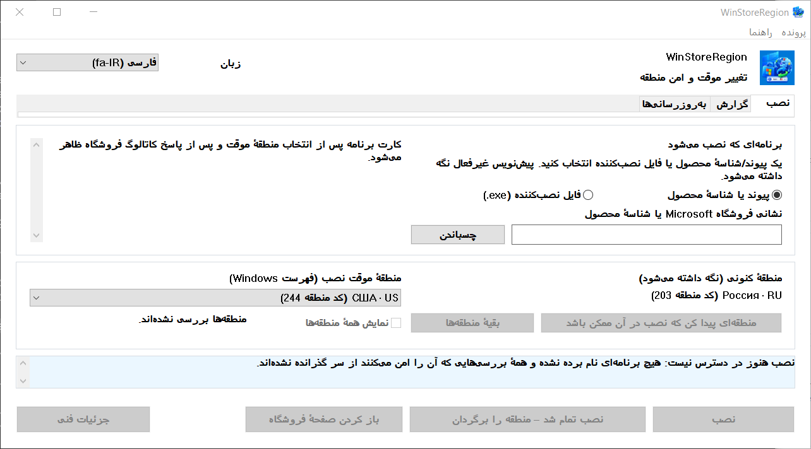

# WinStoreRegion


[](https://github.com/kroxiksut/win-store-region/actions/workflows/ci.yml)


ابزاری برای Windows که منطقهٔ Windows را به‌اندازهٔ یک نصب عوض می‌کند، نصب را به سازوکار خودِ فروشگاه Microsoft می‌سپارد، و پس از دیدن نتیجهٔ واقعی منطقه را برمی‌گرداند.

یک `WinStoreRegion.exe` قابل حمل، حدود ۲ مگابایت، منتشرشده برای x64 و ARM64 و x86 ۳۲‑بیتی. نه به دسترسی مدیر نیاز دارد و نه آن را می‌خواهد. تنها ساخت x64 واقعاً اجرا شده است — [آنچه واقعاً راستی‌آزمایی شده](#آنچه-واقعاً-راستی‌آزمایی-شده) را ببینید.

[العربية](README.ar.md) · [English](README.md) · [Español](README.es-ES.md) · **فارسی** · [日本語](README.ja.md) · [한국어](README.ko.md) · [Português](README.pt-BR.md) · [Русский](README.ru.md) · [Türkçe](README.tr.md) · [简体中文](README.zh-CN.md) · [繁體中文](README.zh-TW.md)

[تاریخچهٔ تغییرات](CHANGELOG.md)

> **این سند ترجمهٔ ماشینی است و هیچ فارسی‌زبانی آن را بازخوانی نکرده است.** این پروژه هیچ ترجمه‌ای را بازخوانی نمی‌کند و این یکی حتی مترجم هم نداشته، پس احتمال خطایش از متن انگلیسی بیشتر است. اگر ایرادی دیدید issue یا pull request باز کنید. مرجع، نسخهٔ [English](README.md) است.



نام منطقه‌ها از خود Windows می‌آید، به همان زبانی که Windows آن‌ها را می‌نامد — به همین سبب آن فیلد برچسب «فهرست Windows» دارد، و به همین سبب نام منطقه‌ها در پنجرهٔ بالا هنوز روسی است. این تصویر روی Windows روسی با بزرگ‌نمایی ۱۲۵٪ گرفته شده است.

## فهرست

- [چرا این برنامه هست](#چرا-این-برنامه-هست)
- [چه می‌کند و چه نمی‌کند](#چه-می‌کند-و-چه-نمی‌کند)
- [آنچه واقعاً راستی‌آزمایی شده](#آنچه-واقعاً-راستی‌آزمایی-شده)
- [نیازمندی‌ها](#نیازمندی‌ها)
- [چگونه کار می‌کند](#چگونه-کار-می‌کند)
- [اجرا از خط فرمان](#اجرا-از-خط-فرمان)
- [وقتی فروشگاه به منطقهٔ شما خدمت نمی‌دهد](#وقتی-فروشگاه-به-منطقهٔ-شما-خدمت-نمی‌دهد)
- [یافتن منطقه بر پایهٔ بازار](#یافتن-منطقه-بر-پایهٔ-بازار)
- [زبانهٔ به‌روزرسانی‌ها](#زبانهٔ-به‌روزرسانی‌ها)
- [گزارش عملیات](#گزارش-عملیات)
- [داده‌ها کجا نگه داشته می‌شوند](#داده‌ها-کجا-نگه-داشته-می‌شوند)
- [وقتی چیزی خطا می‌رود](#وقتی-چیزی-خطا-می‌رود)
- [محدودیت‌های شناخته‌شده و مسائل باز](#محدودیت‌های-شناخته‌شده-و-مسائل-باز)
- [ترجمه‌ها](#ترجمه‌ها)
- [ساخت از کد منبع](#ساخت-از-کد-منبع)
- [پروانه](#پروانه)
- [آگهی‌های حقوقی](#آگهی‌های-حقوقی)

## چرا این برنامه هست

منطقهٔ Windows یک تنظیم است، نه محل زندگی، و این دو دائم از هم فاصله می‌گیرند. کسی می‌تواند در ایالات متحده زندگی کند و Windows روسی با منطقهٔ روسیه داشته باشد: آن‌وقت فروشگاه Microsoft برنامه‌های در دسترس کشور واقعی‌اش را به او ارائه نمی‌کند — سرویس‌های پخش و مانند آن.

‏Microsoft تغییر کشور یا منطقه را رویه‌ای عادی مستند کرده است: [کشور یا منطقهٔ خود را در فروشگاه Microsoft تغییر دهید](https://support.microsoft.com/en-us/account-billing/change-your-country-or-region-in-microsoft-store-5895e006-34f4-10f7-16b1-999e40adb048). ‏WinStoreRegion دقیقاً همین را خودکار می‌کند و نه چیزی فراتر از آن: یک تنظیم Windows عوض می‌شود، فروشگاه Microsoft نصب را انجام می‌دهد، و تنظیم برمی‌گردد. آنچه عوض می‌شود مسیر تحویل یک برنامه است، نه سازوکار آن. همان مقاله از درون برنامه باز می‌شود: **راهنما ← Microsoft: تغییر کشور یا منطقهٔ شما**.

دستی که انجام شود، رویه این است: منطقه را در تنظیمات عوض کن، منتظر بمان تا فروشگاه متوجه شود، برنامه را پیدا کن، نصب را آغاز کن، یادت باشد منطقه را برگردانی، و اشتباه به یاد نیاوری که چه بوده. دردسر در همان گام آخر است: منطقه به‌آسانی بیگانه می‌ماند، و عملیاتی که در میانه قطع شود هیچ ردی به جا نمی‌گذارد. این ابزار همان گام‌ها را برمی‌دارد، اما پیش از آنکه چیزی را عوض کند منطقهٔ اصلی را روی دیسک می‌نویسد، و آن را حتی پس از فروپاشی یا راه‌اندازی دوباره برمی‌گرداند.

## چه می‌کند و چه نمی‌کند

می‌کند:

- منطقهٔ کنونی Windows را **پیش از** هر تغییری روی دیسک می‌نویسد؛
- منطقه را عوض می‌کند و تعویض را با خواندن دوباره تأیید می‌کند؛
- برنامه را **زیر منطقهٔ موقت** در کاتالوگ جست‌وجو می‌کند؛
- پیش از دست‌زدن به منطقه از کاتالوگ می‌پرسد که آیا اصلاً می‌شود این محصول را به این دستگاه داد؛
- نصب را از راه سازوکار معمول آغاز می‌کند و پیشرفتش را نشان می‌دهد؛
- منطقهٔ اصلی را بی‌آنکه منتظر پایان نصب بماند برمی‌گرداند، اما تنها پس از آنکه نصب به‌روشنی آغاز شده باشد؛
- پایان کار را با پیدا شدن بستهٔ برنامه تأیید می‌کند، نه با کد بازگشت؛
- وقتی سازوکار معمول نمی‌تواند نصب کند، نصب‌کنندهٔ خود Microsoft را برای آن محصول می‌گیرد و آن را زیر منطقهٔ موقت اجرا می‌کند؛
- یک گزارش محلی عملیات و یک گزارش تشخیصی نگه می‌دارد؛
- اگر نشست پیشین نیمه‌کاره مانده باشد، در اجرای بعدی منطقه را برمی‌گرداند.

نمی‌کند:

- منطقهٔ حساب Microsoft شما را عوض نمی‌کند؛
- نشانی IP شما را عوض نمی‌کند و موقعیت شبکه‌ای‌تان را جعل نمی‌کند؛
- بسته‌های فروشگاه را از سرورهای غیررسمی نمی‌گیرد؛
- ‏Windows یا فروشگاه Microsoft را دستکاری نمی‌کند، چیزی را وصله نمی‌زند و از چیزی نمی‌گذرد؛
- قول نمی‌دهد هر محدودیتی را بشکند: اینکه چه چیزی در دسترس است را فروشگاه Microsoft تعیین می‌کند، نه این ابزار؛
- از Microsoft نیامده است.

پیامدهای اینکه منطقه مدتی متفاوت باشد بر عهدهٔ خود کاربر است: محتوا و اشتراکی که در یک منطقه خریده شده ممکن است در منطقه‌ای دیگر جور دیگری رفتار کند. این ابزار آن را پنهان نمی‌کند و دربارهٔ آن قولی نمی‌دهد.

## آنچه واقعاً راستی‌آزمایی شده

این بخش هست چون «کار می‌کند» یک ادعاست، و در این پروژه انتظار می‌رود ادعاها دلیلشان را نام ببرند.

تمام چرخه روی Windows 10 و روی Windows 11 سرتاسر اجرا شده است: ثبت منطقه پیش از هر تغییر، تعویض و تأیید آن با خواندن دوباره، جست‌وجوی برنامه زیر منطقهٔ موقت، نصب همراه با پیشرفت، برگرداندن زودهنگام منطقه، و تأیید پایان کار با پیدا شدن بستهٔ برنامه به‌جای کد بازگشت. مسیر تحویل، نصب‌کنندهٔ فروشگاه که با شناسهٔ محصول گرفته و امضا و امضاکننده‌اش بررسی شد، و رد کردن محصولی که کاتالوگ می‌گوید این دستگاه نمی‌تواند دریافتش کند، همگی به همین شکل آزموده شده‌اند. هر اجرای ناموفق تا امروز با منطقهٔ برگردانده‌شده و رکورد بازیابی پاک‌شده پایان یافته است.

اینکه آن‌ها کدام نسخه‌های Windows‌اند، مسئلهٔ آزمایش نیست بلکه مسئلهٔ چیزی است که کد لازم دارد: مانیفست Windows 10 و Windows 11 را اعلام می‌کند و کف این بازه Windows 10 1809 است که App Installer تعیینش می‌کند. [نیازمندی‌ها](#نیازمندی‌ها) را ببینید.

آنچه راستی‌آزمایی نشده و همین‌جا گفته می‌شود:

- **هیچ اجرایی روی دستگاهی جز دستگاه توسعه‌دهنده**، از وقتی مسیرهای دکمه‌ای کامل شدند.
- **اینکه نصب‌کنندهٔ فروشگاه برنامهٔ از پیش نصب‌شده را به‌روز می‌کند یا نه.** به همین سبب زبانهٔ به‌روزرسانی‌ها فهرست می‌کند و توضیح می‌دهد، و به‌روزرسانی یک‌کلیکی ارائه نمی‌دهد. [محدودیت‌های شناخته‌شده](#محدودیت‌های-شناخته‌شده-و-مسائل-باز) را ببینید.
- **ظاهر در بزرگ‌نمایی ۱۵۰٪.** چیدمان میان ۱۰۰ تا ۲۰۰ درصد به‌صورت حسابی بررسی می‌شود، و آن نمی‌گوید که یک عنوان درون دکمه‌اش جا می‌شود یا نه.
- **ساخت‌های ARM64 و x86 ۳۲‑بیتی روی دستگاه واقعی.** هر سه معماری با هر push ساخته می‌شوند و با هر انتشار منتشر می‌شوند، یعنی کامپایل می‌شوند. هیچ‌کدام از آن دو هرگز روی دستگاه واقعی اجرا نشده است. ارائه می‌شوند چون تنها راه تغییر این وضع، دستگاهی است که بتواند اجرایشان کند، نه چون چیزی اینجا می‌گوید کار می‌کنند.

## نیازمندی‌ها

- **‏Windows 10 نسخهٔ 1809 (بیلد 17763) یا جدیدتر، یا هر Windows 11.** کف را App Installer تعیین می‌کند که واسط COM نصب را با خود دارد و خودش 1809 می‌خواهد؛ هرچه دیگر این برنامه صدا می‌زند قدیمی‌تر است — `GetDpiForWindow` به 1607 نیاز دارد و بزرگ‌نمایی نسل دوم هر نمایشگر به 1703. مانیفست پشتیبانی از Windows 10 و 11 را اعلام می‌کند. روی Windows 10 22H2 آزموده شده و پیش‌تر در جریان توسعه روی Windows 11.
- ‏x64 یا ARM64 یا x86 ۳۲‑بیتی. هر انتشار هر سه را دارد. روی دستگاه ARM64 ساخت x64 هم زیر شبیه‌سازی Windows اجرا می‌شود، و همان مسیری است که دست‌کم روی سخت‌افزار x64 آزموده شده.
- **‏App Installer** (`Microsoft.DesktopAppInstaller`) — نصب از راه آن انجام می‌شود. بدون آن، ابزار همین را می‌گوید و پیشنهاد می‌کند صفحه‌اش در فروشگاه باز شود.
- **فروشگاه Microsoft** (`Microsoft.WindowsStore`).
- پوشه‌ای که `.exe` از آن اجرا می‌شود باید نوشتنی باشد: در نخستین اجرا، نسخه‌ای از `Microsoft.Management.Deployment.winmd` کنار برنامه پدیدار می‌شود که از App Installer نصب‌شده برداشته شده است. بدون آن، واسط‌های COM نصب در دسترس نیستند. برنامه برای دور زدن این موضوع خودش را جای دیگری کپی نمی‌کند — به‌جایش شرط برآورده‌نشده را گزارش می‌کند.
- بدون دسترسی مدیر.

**فایل اجرایی امضا ندارد و Windows این را خواهد گفت.** در نخستین اجرا SmartScreen پیام «Windows از رایانهٔ شما محافظت کرد» را نشان می‌دهد و دکمهٔ اجرا را پشت **اطلاعات بیشتر ← در هر صورت اجرا شود** پنهان می‌کند. ‏Windows با هر فایل اجرایی که امضای Authenticode و اعتبار دریافت نداشته باشد همین کار را می‌کند؛ این حکمی دربارهٔ این فایل به‌طور خاص نیست. از این دو چیز برمی‌آید و سنجش هر دو با شماست:

- این هشدار تنها با امضای انتشار به گواهی امضای کد برداشته می‌شود. هیچ‌چیز در ساخت نمی‌تواند خفه‌اش کند و هیچ‌چیز اینجا هم تلاش نمی‌کند.
- آنچه به‌جایش می‌شود بررسی کرد، هویت است. هر ساخت SHA-256 فایلی را که تولید کرده منتشر می‌کند — در خلاصهٔ اجرا، و در فایلی کنار خود فایل اجرایی درون بسته — و خود آن اجرا عمومی است. آنچه دارید را با `Get-FileHash .\WinStoreRegion.exe -Algorithm SHA256` بسنجید؛ یا همان است که آن اجرا ساخته، یا نیست.

فایلی که از مرورگر گرفته شود نشانه‌ای هم با خود دارد که SmartScreen را حتی پس از استخراج درگیر نگه می‌دارد. `Unblock-File .\WinStoreRegion.exe` در PowerShell، یا **ویژگی‌ها ← رفع انسداد**، آن نشانه را برمی‌دارد. اگر پیش از استخراج، بایگانی را رفع انسداد کنید، فایل‌های درونش پاک بیرون می‌آیند.

## چگونه کار می‌کند

۱. در زبانهٔ **نصب** برنامه را نام ببرید: یک پیوند فروشگاه Microsoft یا یک شناسهٔ محصول. یک فایل نصب‌کنندهٔ فروشگاه (`.exe`) را هم می‌توان روی پنجره رها کرد؛ از نظر داشتن امضای معتبر Microsoft بررسی می‌شود و زیر منطقهٔ موقت اجرا می‌شود، اما شناسایی‌شدنی نیست — چنین فایلی شناسهٔ محصول خواندنی ندارد، پس اینکه چه برنامه‌ای نصب می‌کند ادعای شماست، نه واقعیتی که این برنامه بتواند بررسی کند.
۲. یک منطقهٔ موقت انتخاب کنید. همین که شناسهٔ محصول تجزیه شود، ابزار کارت برنامه را زیر آن منطقه از منبع می‌خواهد — نام، ناشر و نوع تحویل پیش از هر تغییری دیده می‌شوند.
۳. اگر برنامه در منطقهٔ انتخاب‌شده ارائه نمی‌شود، **منطقه‌ای پیدا کن که نصب در آن ممکن باشد** را بزنید. حدود چهل بازار بزرگ پرسیده می‌شوند و فهرست به آن‌هایی که واقعاً ارائه‌اش می‌کنند تنگ می‌شود. **بقیهٔ منطقه‌ها** جاروب را کامل می‌کند؛ **نمایش همهٔ منطقه‌ها** فهرست کامل را برمی‌گرداند.
۴. **نصب** را بزنید. از اینجا ابزار خودش کار می‌کند: منطقه را عوض می‌کند، تغییر را با خواندن دوباره تأیید می‌کند، برنامه را پیدا می‌کند، نصب را به فروشگاه می‌سپارد، پیشرفت را نشان می‌دهد و منطقه را برمی‌گرداند.
۵. نتیجه در زبانهٔ **گزارش** پدیدار می‌شود.

عمداً هیچ دکمهٔ «لغو نصب» وجود ندارد. نصب از آنِ Windows است: در فروشگاه Microsoft یا در **تنظیمات ← برنامه‌ها** می‌توان متوقفش کرد یا برنامه را برداشت. گفت‌وگویی که هنگام بستن پنجره در میانهٔ عملیات نشان داده می‌شود همین را می‌گوید.

رابط با صفحه‌کلید کار می‌کند، بزرگ‌نمایی نمایشگر را رعایت می‌کند، و میان زبان‌هایی که با خود دارد بدون راه‌اندازی دوباره جابه‌جا می‌شود.

## اجرا از خط فرمان

حالت بدون رابط وجود ندارد. خط فرمان تنها تعیین می‌کند پنجره با چه چیزی باز شود — یک ورودی اختیاری برنامه که از پیش در زبانهٔ نصب گذاشته می‌شود. چیزی را آغاز نمی‌کند: تا دکمه را نزنید، منطقه دست نمی‌خورد و هیچ نصبی شروع نمی‌شود.

```powershell
# پنجره را باز کن، بدون آنکه چیزی پر شود.
.\WinStoreRegion.exe

# با شناسهٔ محصول که از پیش در فیلد است بازش کن.
.\WinStoreRegion.exe 9WZDNCRFJ3PZ

# نشانی وب فروشگاه هم همین کار را می‌کند.
.\WinStoreRegion.exe https://apps.microsoft.com/detail/9WZDNCRFJ3PZ

# نشانی ms-windows-store هم همین‌طور.
.\WinStoreRegion.exe "ms-windows-store://pdp/?productid=9WZDNCRFJ3PZ"

# نشانی حاوی & را در گیومه بگذارید — PowerShell آن را عملگر خودش می‌داند.
.\WinStoreRegion.exe "https://apps.microsoft.com/detail/9WZDNCRFJ3PZ?hl=en-us"

# کاربرد را چاپ کن و بدون باز کردن پنجره خارج شو.
.\WinStoreRegion.exe --help
.\WinStoreRegion.exe -h
```

هرچه داده شود تنها در فیلد *ذخیره* می‌شود. لحظه‌ای که پنجره باز می‌شود تجزیه می‌گردد، پس مقداری که نه شناسهٔ محصول است و نه نشانی فروشگاه، در پنجره گزارش می‌شود نه در خط فرمان.

کدهای خروج، چون شاید اسکریپتی به آن‌ها نیاز داشته باشد:

| کد | معنا |
|---|---|
| `0` | پنجره اجرا شد و بسته شد، یا `--help` کاربرد را چاپ کرد. |
| `1` | رابط گرافیکی راه نیفتاد. |
| `2` | خط فرمان نادرست بود. |

تنها دو چیز آن‌قدر نادرست‌اند که کد `2` بگیرند، و هر دو پیش از تکرار کاربرد روی خروجی خطا، خودشان را نام می‌برند:

```powershell
PS> .\WinStoreRegion.exe --install
Unknown option: --install

Usage:
...

PS> .\WinStoreRegion.exe 9WZDNCRFJ3PZ 9N1SV6841F0B
Only one application input is allowed.

Usage:
...
```

دو نکته ارزش دانستن دارد. فایل اجرایی برنامه‌ای پنجره‌ای است، پس برای چاپ این پیام‌ها به کنسولی که اجرایش کرده می‌چسبد؛ اگر بدون کنسول اجرا شود — از کادر Run یا از یک میان‌بر — همان متن را در کادر گفت‌وگو نشان می‌دهد. و متن خط فرمان **در هر زبان رابط، انگلیسی است**: زبان رابط درون پنجره انتخاب می‌شود، و هنگام خواندن آرگومان‌ها آن پنجره هنوز وجود ندارد؛ حدس‌زدن از روی زبان سامانه یعنی پاسخ‌دادن به زبانی که کسی برنگزیده است.

## وقتی فروشگاه به منطقهٔ شما خدمت نمی‌دهد

بعضی محصول‌ها را سازوکار معمول حتی زیر منطقهٔ درست هم نمی‌تواند نصب کند. آن‌وقت پنجره راه دومی پیش می‌گذارد: **دریافت نصب‌کنندهٔ فروشگاه**.

ابزار همان نصب‌کنندهٔ امضاشده‌ای را که یک نفر از صفحهٔ وب فروشگاه می‌گرفت، با نشانی شناسهٔ محصول از Microsoft می‌خواهد. سپس آن فایل دقیقاً مثل فایلی که خودتان دستی برگزیده باشید رفتار می‌بیند — همان دروازهٔ امضا، همان تأییدی که نام و ناشر و SHA-256 را نشان می‌دهد، همان تراکنش منطقه.

سه چیز دربارهٔ این مسیر ارزش دانستن دارد و هر سه اندازه‌گیری شده‌اند نه فرض:

- دریافت به منطقهٔ شما وابسته نیست، پس فایل در حالی گرفته می‌شود که دستگاه هنوز منطقهٔ خودتان را دارد. تنها اجرای آن به منطقهٔ موقت نیاز دارد.
- نصب‌کننده پنجرهٔ خودش را باز می‌کند و **بی‌صدا نصب نمی‌کند**. شما نصب را همان‌جا تمام می‌کنید و تنها آن‌وقت **منطقه را برگردان** را می‌زنید.
- چون آن کار از آنِ فروشگاه Microsoft است و چیزی گزارش نمی‌کند، این مسیر هرگز نمی‌تواند ادعا کند برنامه‌ای نصب شد. گزارش آن را *سپرده‌شده به نصب‌کننده* ثبت می‌کند، که همان چیزی است که واقعاً رخ داد.

نصب‌کننده‌های دریافتی نگه داشته نمی‌شوند. پایان تحویل حذف می‌شوند و در اجرای بعدی دوباره، چون آن فایل همیشه از نو گرفتنی است و پوشه‌ای پر از نصب‌کنندهٔ فروشگاه چیزی نیست که کسی خواسته باشد انبار کند.

## یافتن منطقه بر پایهٔ بازار

کاتالوگ فروشگاه Microsoft تنها دربارهٔ منطقه‌ای که هم‌اکنون برقرار است پاسخ می‌دهد، پس برنامه‌ای که در منطقهٔ خانگی شما نیست، معمولاً پیش از تغییر منطقه اصلاً پدیدار نمی‌شود. ابزار این را با پرسیدن از منبع، بازار به بازار، دور می‌زند، و سه پاسخ را از هم جدا می‌کند: ارائه می‌شود، ارائه نمی‌شود، و پاسخی نیست. سومی هرگز به‌عنوان رد ارائه نمی‌شود — بازاری که نشد به آن رسید، چه‌بسا همان باشد که لازم دارید.

مجموعهٔ چهل بازاری عمداً کامل نیست و ابزار همین را می‌گوید. فهرست کامل حدود دویست و پنجاه درخواست است، پس گام دوم به شمار می‌آید و تنها با فرمان صریح اجرا می‌شود.

پاسخ منبع یک مرجع است نه اجازهٔ نصب: درون عملیات، برنامه دوباره زیر منطقه‌ای که واقعاً برقرار است جست‌وجو می‌شود.

## زبانهٔ به‌روزرسانی‌ها

فروشگاه Microsoft برنامه‌ای را که در منطقهٔ کنونی شما به آن خدمت نمی‌دهد به‌روز نمی‌کند. زبانهٔ به‌روزرسانی‌ها همان‌ها را پیدا می‌کند: برنامه‌های نصب‌شدهٔ فروشگاه را فهرست می‌کند که منبع محصولشان را در منطقهٔ شما رد می‌کند و جای دیگر ارائه می‌دهد، با نسخهٔ نصب‌شده کنار نسخه‌ای که کاتالوگ ارائه می‌کند.

آنچه این زبانه عمداً ادعا **نمی‌کند** این است که به‌روزرسانی‌ای منتشر شده. دو واقعیت سر راه‌اند و هر دو اندازه‌گیری شده‌اند:

- ‏`winget` اصلاً نمی‌تواند محصول فروشگاه را به‌روز کند. اگر از او خواسته شود، پاسخ می‌دهد «به‌روزرسانی قابل اعمالی نیست»، چون منبع `msstore` نسخه را `Unknown` گزارش می‌کند.
- دو شمارهٔ نسخه همیشه قابل مقایسه نیستند. کاتالوگ بسته‌بندی را مستقل از بستهٔ درونش شماره می‌زند و ناشران هم شیوهٔ شماره‌گذاری‌شان را عوض می‌کنند. نسخه‌ای که نشان داده می‌شود همانی است که واقعاً روی این دستگاه می‌نشیند، خوانده‌شده از درون بسته‌بندی نه از نامش.

پس این زبانه هر دو شماره را نشان می‌دهد و آنچه را اثبات‌پذیر است می‌گوید: فروشگاه این منطقه به این محصول خدمت نمی‌دهد. اقدام روی یک رکورد، شناسهٔ محصولش را به زبانهٔ نصب می‌برد و جست‌وجوی منطقه را آغاز می‌کند؛ به‌روزرسانی گونهٔ جداگانه‌ای از عملیات نیست و هر دروازه سر جای خودش می‌ماند.

نتیجهٔ جاروب میان اجراها به یاد می‌ماند و همراه زمانی که گرفته شده نشان داده می‌شود، و تنها برای همان منطقه.

## گزارش عملیات

زبانهٔ **گزارش** نشان می‌دهد چه نصب شد: برنامه، شناسهٔ محصول، نوع، منطقه‌ای که برنامه زیر آن پیدا شد، تاریخ، نسخه و نتیجه. عملیات ناتمام و نامطمئن برجسته‌اند — همان‌ها هستند که به توجه نیاز دارند.

برای رکورد انتخاب‌شده تنها کنش‌های امن ارائه می‌شوند: باز کردن صفحهٔ فروشگاه برنامه، بردن شناسهٔ محصول به یک پیش‌نویس نصب تازه، رونوشت شناسهٔ محصول، حذف رکورد محلی. هیچ‌کدام نصبی را آغاز نمی‌کند و منطقه‌ای را عوض نمی‌کند.

## داده‌ها کجا نگه داشته می‌شوند

همه‌چیز در نمایهٔ کاربر است، زیر `%LOCALAPPDATA%\WinStoreRegion`:

| فایل | کارکرد |
|---|---|
| `journal.json` | تاریخچهٔ عملیات: چه، کِی، زیر کدام منطقه، با چه نتیجه‌ای |
| `pending-restore.json` | رکورد بازیابی؛ تنها تا وقتی هست که منطقه موقتاً عوض شده باشد |
| `updates-scan.json` | آخرین جاروب به‌روزرسانی‌ها، تا باز کردن دوبارهٔ پنجره شبکه نخواهد |
| `installers\` | نصب‌کنندهٔ فروشگاهی که هم‌اکنون در حال تحویل است؛ پس از پایان خالی می‌شود |
| `logs\winstoreregion.log` | گزارش تشخیصی چرخشی |

هیچ داده‌ای از راه دور فرستاده نمی‌شود. گزارش نه محتوای کلیپ‌بورد را ثبت می‌کند، نه متن تایپ‌شده را و نه مسیر کامل فایل‌ها: فایل انتخاب‌شده با نام و SHA-256 ثبت می‌شود.

## وقتی چیزی خطا می‌رود

منطقه دقیقاً تا یک بازگرداندن تأییدشده موقت می‌ماند. اگر فرایند مُرد یا دستگاه راه‌اندازی دوباره شد، اجرای بعدی رکورد بازیابی را پیدا می‌کند، این را می‌گوید، و پیشنهاد می‌دهد منطقهٔ اصلی را برگرداند یا کنونی را نگه دارد. تا آن رکورد تعیین تکلیف نشود، هیچ نصب تازه‌ای آغاز نمی‌شود.

نصبی که اجرای پیشین آغاز کرده باشد، مرگ فرایند را دوام می‌آورد: آن را یک سرویس Windows انجام می‌دهد. ابزار هنگام آغاز متوجه می‌شود و به‌جای آنکه عملیات را رهاشده بشمارد، مشاهده را از سر می‌گیرد.

هر عملیات در گزارش تشخیصی نوشته می‌شود: آغاز، رکورد بازیابی، تعویض منطقه با هر دو مقدار و نتیجهٔ خواندن دوباره، جست‌وجو، پاسخ نصب‌کننده با کدهایش، مرحله‌های نصب، بازگرداندن و نتیجه. **راهنما ← باز کردن گزارش تشخیصی** پوشه را باز می‌کند؛ **راهنما ← رونوشت جزئیات** بلوک فنی خطای کنونی را در کلیپ‌بورد می‌گذارد.

## محدودیت‌های شناخته‌شده و مسائل باز

- تنها برنامه‌هایی نصب می‌شوند که فروشگاه آن‌ها را به‌صورت بستهٔ فروشگاه Microsoft تحویل می‌دهد. برنامه‌هایی که نصب‌کنندهٔ Win32 خودشان را دارند بیرون از دامنه‌اند: پایان کارشان اثبات‌پذیر نیست، و نصبی که کسی نتواند راستی‌آزمایی‌اش کند نباید ارائه شود.
- زبانهٔ به‌روزرسانی‌ها دکمهٔ به‌روزرسانی یک‌کلیکی ندارد. اینکه نصب‌کنندهٔ فروشگاه برنامهٔ از پیش نصب‌شده را به‌روز می‌کند یا نه اندازه‌گیری نشده، و دکمه‌ای که شاید هیچ نکند از نبود دکمه بدتر است.
- **نقص باز:** در ۲۱‏.۰۸‏.۲۰۲۶ ‏Windows پس از پنج عملیات ناموفق پشت سر هم، پنجره را به‌عنوان پاسخ‌ندهنده بست. تراکنش منطقه آسیب ندید — در هر پنج مورد برگردانده شد — پس عیب در رابط است نه در مدل. از آن پس تکرار نشده و ساختی که در آن رخ داد از چند اصلاح قدیمی‌تر است؛ علت هنوز دانسته نیست و اینجا حدس زده نمی‌شود.
- یازده زبان رابط: عربی، انگلیسی، اسپانیایی، فارسی، ژاپنی، کره‌ای، پرتغالی، روسی، ترکی، و چینی به هر دو خط. انگلیسی و روسی را خود نگهدارندهٔ پروژه نوشته است؛ نُه تای دیگر پیش‌نویس ماشینی‌اند که هیچ زبان‌داری آن‌ها را نخوانده، و هر فایل این را در آغاز خود می‌گوید. عربی و فارسی تمام پنجره را برمی‌گردانند، چون این‌گونه خوانده می‌شوند. هر کدام از آن‌ها README ترجمه‌شده هم دارد، و هر یک از آن فایل‌ها به همهٔ بقیه پیوند می‌دهد.
- در هر زمان یک نمونه از برنامه اجرا می‌شود.

## ترجمه‌ها

یک زبان یک فایل است. `lang/ru.toml`، `lang/en.toml`، و هرچه شما بیفزایید: یکی را کپی کنید، مقدارها را ترجمه کنید، یک pull request باز کنید. هیچ Rust‌ای برای نوشتن نیست — ساخت آن پوشه را می‌خواند و فهرست زبان‌ها و انتخابگر و جدول‌ها را تولید می‌کند، پس `lang/zh.toml` تنها چیزی است که برای ارائهٔ چینی لازم است.

زبانی که از راست به چپ خوانده می‌شود این را با یک فیلد می‌گوید، `direction = "rtl"`، و پنجره خودش را برای آن برمی‌گرداند: پنل‌ها، عنوان‌ها، دکمه‌ها، ستون‌های جدول و نوارهای پیمایش همه سمتشان را عوض می‌کنند. عربی نخست آمد و فارسی پشت سرش، به بهای یک فایل و بدون یک خط کد — ادعای اینجا تمامش همین است؛ عبری هم همان‌قدر خرج برمی‌دارد.

**زبان تازه بدون بازخوانی زبانی پذیرفته می‌شود**، چون اینجا کسی نیست که بتواند بخواندش. آنچه بررسی می‌شود ساختار است و آن را ساخت انجام می‌دهد: کلید جاافتاده، کلید ناشناخته، فهرستی با طول نادرست، یا رشته‌ای که `{جانگهدارها}` یش با اصل فرق دارد — همه ساخت را می‌شکنند. پس از پذیرش، نگهدارنده می‌کوشد انتشاری با آن زبان منتشر کند.

چون بازخوانی‌ای در کار نیست، یک قاعده از بقیه مهم‌تر است. بسیاری از رشته‌های اینجا عمداً محتاط‌اند — می‌گویند که پایان کار *اثبات نشده*، که پاسخ از یک بازار آمده، که مجموعه کامل نیست. همان احتیاط‌ها است که اعتماد به این برنامه را امن می‌کند، و ترجمه باید نگهشان دارد، حتی جایی که جملهٔ قاطع‌تر خوش‌خوان‌تر است.

به همین سبب، زبان‌هایی که هم‌اکنون منتشر می‌شوند محتمل‌ترین‌ها برای خطا هستند. **اگر یکی را خواندید و چیزی درست نبود، لطفاً یک issue باز کنید** — ترجمهٔ نادرست، عنوانی که بریده شده، احتیاطی که گم شده، یا صرفاً عبارتی که طبیعی نیست. زبان و کلید را نام ببرید؛ پیشنهاد عبارت خوش‌آمد است اما لازم نیست. یک pull request همان کار را می‌کند، و issue عمداً آستانهٔ پایین‌تری دارد.

نام مترجمان در فیلد `authors` فایل زبان می‌آید، و آن نام در **راهنما ← درباره** کنار همان زبان، زیر پدیدآورنده و پروانهٔ خود برنامه دیده می‌شود. این اعتبار از خود فایل تولید می‌شود، پس نمی‌تواند از کاری که به آن تعلق دارد جدا بیفتد.

ترجمه هم مثل هر مشارکت دیگری است: زیر **GPL-3.0-or-later** و نه هیچ پروانهٔ دیگری پذیرفته می‌شود، حق نشر از آنِ خودتان می‌ماند و حق صدور پروانهٔ دوباره به کسی داده نمی‌شود.

یک فایل زبان همه‌چیز روی صفحه را می‌پوشاند — عنوان‌ها، وضعیت‌ها، تشخیص‌ها و گفت‌وگوها یکسان. تنها چیزی که نمی‌پوشاند خط فرمان است که در هر زبان انگلیسی است، چون آرگومان‌ها پیش از انتخاب زبان خوانده می‌شوند. سیاههٔ کامل در [CONTRIBUTING.md](CONTRIBUTING.md#translations) است.

## ساخت از کد منبع

‏Rust پایدار ۱٫۸۵ یا جدیدتر برای `x86_64-pc-windows-msvc`.

```
cargo build --release
cargo test
cargo clippy --all-targets
cargo fmt --all --check
```

معماری‌های دیگر از همین منبع با افزودن یک هدف ساخته می‌شوند؛ دستگاه به مؤلفهٔ متناظر ابزارهای ساخت MSVC نیاز دارد. مانیفست برنامه نسبت به معماری خنثی است، پس چیز دیگری عوض نمی‌شود:

```
rustup target add aarch64-pc-windows-msvc
cargo build --release --target aarch64-pc-windows-msvc

rustup target add i686-pc-windows-msvc
cargo build --release --target i686-pc-windows-msvc
```

هیچ‌یک از این دو روی دستگاه واقعی معماری خودش اجرا نشده است. با این حال با هر انتشار منتشر می‌شوند، چون تنها راه تغییر این وضع دستگاهی است که بتواند اجرایشان کند. کامپایل می‌شوند، و ادعا همین است و بس.

بعضی آزمون‌ها `#[ignore]` خورده‌اند: منطقهٔ Windows را عوض می‌کنند، برنامه نصب می‌کنند، یا به شبکه می‌روند. آن‌هایی که منطقه را عوض می‌کنند تنها روی یک دستگاه آزمون اختصاصی اجرا می‌شوند.

## پروانه

GPL-3.0-or-later.

## آگهی‌های حقوقی

این پروژه از Microsoft مستقل است: نه وابسته به آن، نه مورد تأیید آن و نه پشتیبانی‌شده از سوی آن. نام‌های Microsoft، Windows، فروشگاه Microsoft و WinGet تنها برای توصیف دقیق سازگاری و هدف به کار رفته‌اند. از نشان‌ها و هویت بصری Microsoft استفاده نشده است.

‏WinStoreRegion منطقهٔ حساب Microsoft را عوض نمی‌کند، نشانی IP شما را عوض نمی‌کند، بسته‌های فروشگاه Microsoft را از سرورهای غیررسمی نمی‌گیرد، و ضمانت نمی‌کند که هر محدودیت دسترسی را بتوان دور زد.
