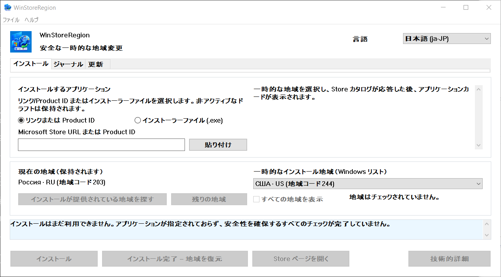

# WinStoreRegion


[](https://github.com/kroxiksut/win-store-region/actions/workflows/ci.yml)


Windows リージョンを 1 回のインストール期間だけ切り替え、インストールを Microsoft Store 自体の仕組みに譲り、実際の結果を確認してからリージョンを戻す Windows ユーティリティです。

約 2 MB の portable な `WinStoreRegion.exe` で、x64、ARM64、32 ビット x86 向けに公開されています。管理者権を必要としたり要求したりしません。x64 ビルドだけが実際に実行されています。詳細は[実際に検証されたもの](#実際に検証されたもの)を参照してください。

[العربية](README.ar.md) · [English](README.md) · [Español](README.es-ES.md) · [فارسی](README.fa.md) · **日本語** · [한국어](README.ko.md) · [Português](README.pt-BR.md) · [Русский](README.ru.md) · [Türkçe](README.tr.md) · [简体中文](README.zh-CN.md) · [繁體中文](README.zh-TW.md)

[変更履歴](CHANGELOG.md)

> **本ドキュメントは機械翻訳であり、日本語の母語話者による校正を受けていません。** 本プロジェクトはいかなる翻訳も審査しないため、本文書は英語版よりもさらに誤りの可能性が高くあります。誤りを見つけた場合は、issue または pull request を開いてください。最終的な根拠は [English](README.md) です。



リージョン名は Windows 自体から取得され、Windows がそれらを呼ぶ言語で表示されます。そのため、フィールドは「Windows リスト」というラベルが付けられ、上記のスクリーンショットでは、ロシア語 Windows で 125% スケーリングで撮影された場合、リージョンがロシア語で表示されているのです。

## 目次

- [存在する理由](#存在する理由)
- [何ができ、何ができないか](#何ができ何ができないか)
- [実際に検証されたもの](#実際に検証されたもの)
- [要件](#要件)
- [使用方法](#使用方法)
- [コマンドラインから起動する](#コマンドラインから起動する)
- [Store がお客様のリージョンにサービスを提供しない場合](#store-がお客様のリージョンにサービスを提供しない場合)
- [市場別にリージョンを探す](#市場別にリージョンを探す)
- [更新タブ](#更新タブ)
- [操作ジャーナル](#操作ジャーナル)
- [データの保存場所](#データの保存場所)
- [何か問題が発生した場合](#何か問題が発生した場合)
- [既知の制限と未解決の問題](#既知の制限と未解決の問題)
- [翻訳](#翻訳)
- [ソースからのビルド](#ソースからのビルド)
- [ライセンス](#ライセンス)
- [法的表示](#法的表示)

## 存在する理由

Windows リージョンは設定であり、居住地ではなく、両者は常に乖離しています。ある人が米国に住んでいながら、ロシア Windows を実行し、リージョンをロシアに設定されている場合、Microsoft Store は実際の国で利用可能なアプリケーション（ストリーミング サービスなど）を提供しません。

Microsoft は国またはリージョンの変更を通常の手順として記録しています：[Microsoft Store で国またはリージョンを変更する](https://support.microsoft.com/en-us/account-billing/change-your-country-or-region-in-microsoft-store-5895e006-34f4-10f7-16b1-999e40adb048)。WinStoreRegion はその手順を自動化するだけです。Windows の設定が変更され、Microsoft Store がインストールを実行し、設定が戻ります。変更されるのはアプリケーションの配信経路であり、仕組み自体ではありません。同じ記事はプログラムから開きます。**ヘルプ → Microsoft：国またはリージョンを変更する**。

手作業で行う場合の手順は、設定でリージョンを変更し、Store が気付くのを待ち、アプリケーションを探し、インストールを開始し、リージョンを戻し忘れないようにし、それが何であったか誤って覚えないようにすることです。最後のステップが問題なのです。リージョンを海外のままにするのは簡単であり、途中で中断された操作はトレースが残りません。このユーティリティは同じステップを実行しますが、何かを変更する前にオリジナルのリージョンをディスクに書き込み、クラッシュまたは再起動後でも復元します。

## 何ができ、何ができないか

実行内容：

- 何かを変更する**前に**現在の Windows リージョンをディスクに書き込みます
- リージョンを切り替え、読み直して切り替えを確認します
- **一時的なリージョン下で**カタログでアプリケーションを検索します
- リージョンに触れる前に、このデバイスが製品を提供できるかどうかをカタログに問い合わせます
- 通常の仕組みを介してインストールを開始し、その進行状況を表示します
- インストールが明らかに開始された後でのみ、インストール終了を待たずにオリジナルのリージョンを復元します
- リターンコードではなく、アプリケーション パッケージの出現によって完了を確認します
- 通常の仕組みがインストールできない場合、製品の Microsoft 独自 Store インストーラーをフェッチし、一時的なリージョン下で実行します
- ローカル操作ジャーナルと診断ログを保持します
- 前回のセッションが途中で打ち切られた場合、次の開始時にリージョンを復元します

実行しない内容：

- Microsoft アカウントのリージョンは変更しません
- IP アドレスの変更や、ネットワーク位置の偽装は行いません
- 非公式サーバーから Store パッケージをダウンロードすることはありません
- Windows や Microsoft Store を改変せず、何かにパッチを当てることも、何かを回避することもありません
- あらゆる制限を突破すると約束することはありません。何が利用できるかを決めるのは Microsoft Store であって、このユーティリティではありません
- Microsoft の製品ではありません

リージョンが一時的に異なることの影響は、ユーザー自身のものです。あるリージョンで購入されたコンテンツとサブスクリプションは、別のリージョンで異なる動作をする場合があります。ユーティリティはこれを隠さず、これについて何も約束しません。

## 実際に検証されたもの

このセクションは、「機能します」は主張であり、このプロジェクトの主張は証拠を提示することが期待されるので存在します。

完全なサイクルは Windows 10 と Windows 11 でエンド・ツー・エンドで実行されています。リージョンは何かを変更する前に記録され、読み直して切り替えが確認され、アプリケーションは一時的なリージョン下で検索され、進行状況付きでインストールされ、リージョンは早期に復元され、完了はリターンコードではなくアプリケーション パッケージの出現によって確認されました。ハンドオフ パス、Product ID でフェッチされた Store インストーラーの署名と署名者がチェックされ、このデバイスが受け取ることができないとカタログが言っている製品の拒否もすべて同様に実行されています。これまでのすべての失敗した実行は、リージョンが復元され、回復レコードが削除されてで終了しました。

これらがどの Windows バージョンであるかは、テストの問題ではなく、コードが必要とするものによります。マニフェストは Windows 10 と Windows 11 をサポートすることを宣言し、その範囲内の下限は App Installer によって設定されます。これは Windows 10 1809 です。[要件](#要件)を参照してください。

検証されていないものは、以下のとおりです。

- **開発者のマシン以外で実行されたことはありません**（ボタンドリブン パスが完成してから）。
- **Store インストーラーがすでにインストールされているアプリケーションを更新するかどうか。** したがって、更新タブはリストして説明しますが、ワンクリック更新は提供しません。[既知の制限](#既知の制限と未解決の問題)を参照してください。
- **150% スケーリングでの外観。** レイアウトは 100～200% で算術的にチェックされていますが、キャプションがボタン内に収まるかどうかは判断できません。
- **ARM64 と 32 ビット x86 ビルドが実際のデバイスでの動作。** 3 つのアーキテクチャはすべてプッシュのたびにビルドされ、すべてのリリースで公開されるため、コンパイルできます。これら 2 つはまだ実際のデバイスで開始されていません。これらを提供するのは、これらを実行できるマシンが唯一の変更方法だからであり、ここで誰かが機能することを言っているからではありません。

## 要件

- **Windows 10 バージョン 1809（ビルド 17763）以降、または任意の Windows 11。** 下限は App Installer によって設定されます。App Installer はインストール COM インターフェイスを担当し、1809 を必要とします。このプログラムが呼び出す他のすべて は古いもので、`GetDpiForWindow` は 1607 を必要とし、モニターごとの v2 スケーリングは 1703 を必要とします。マニフェストは Windows 10 と 11 のサポートを宣言します。Windows 10 22H2 と開発初期段階の Windows 11 でテストされています。
- x64、ARM64、または 32 ビット x86。各リリースはすべて 3 つを備えています。ARM64 デバイスでは、x64 ビルドは Windows エミュレーション下でも実行されます。これは、少なくとも x64 ハードウェアで実行されたパスです。
- **App Installer**（`Microsoft.DesktopAppInstaller`）— インストールはこれを通じて実行されます。これがなければ、ユーティリティはそう述べ、その Store ページを開くことを提案します。
- **Microsoft Store**（`Microsoft.WindowsStore`）。
- `.exe` が実行されるディレクトリは書き込み可能である必要があります。最初の起動時に、`Microsoft.Management.Deployment.winmd` のコピーがプログラムの横に表示されます。インストール済みの App Installer から取得します。これがなければ、インストール COM インターフェイスは利用できません。プログラムはこれを回避するために自身を別の場所にコピーしません。代わりに、満たされていない条件を報告します。
- 管理者権は不要です。

**バイナリは署名されていないため、Windows はそのように表示します。** 最初の実行時に SmartScreen は「Windows は PC を保護しています」と表示し、実行ボタンを「詳細情報 → 実行する」の背後に隠します。これは、Windows が Authenticode 署名を持たず、ダウンロード レピュテーションもない実行可能ファイルに対して行うことです。このファイル特有のステートメントではありません。これに伴い、2 つの事柄が続き、両方ともあなたの判断です。

- 警告が削除されるのは、コード署名証明書でリリースに署名した場合だけです。ビルドの何もそれを抑制できず、ここでも試みていません。
- 代わりに確認できるのは、アイデンティティです。すべてのビルドはそれが生成したバイナリの SHA-256 を公開しています。実行サマリー内、およびアーティファクト内のバイナリの横にあるファイルで。実行自体は公開されています。`Get-FileHash .\WinStoreRegion.exe -Algorithm SHA256` で、あなたが持っているものをチェックしてください。それはそのビルド実行が作成したものであるか、そうではないかのいずれかです。

ブラウザからダウンロードされたファイルは、展開後も SmartScreen を関与させるマークを帯びています。PowerShell で `Unblock-File .\WinStoreRegion.exe` を実行するか、**プロパティ → ロック解除**でそのマークを削除できます。ファイルを展開する前にアーカイブのロックを解除すれば、内部のファイルはクリーンな状態で出てきます。

## 使用方法

1. **インストール**タブでアプリケーションに名前を付けます。Microsoft Store リンクまたは Product ID です。Store インストーラー ファイル（`.exe`）をウィンドウにドロップすることもできます。これは Microsoft の信頼できる署名をチェックされ、一時的なリージョン下で実行されますが、識別することはできません。そのようなファイルは可読の Product ID を持たないため、インストールするアプリケーションはあなたの主張であり、このプログラムが確認できる事実ではありません。
2. 一時的なリージョンを選択します。Product ID が解析されると、ユーティリティはソースにそのリージョン下のアプリケーション カードを問い合わせます。名前、パブリッシャー、配信方式は、何かを変更する前に表示されます。
3. 選択したリージョンでアプリケーションが提供されていない場合、**インストールが提供されるリージョンを見つける**を押します。約 40 の主要市場が問い合わせられ、リストは実際に提供している市場に絞られます。**その他のリージョン**がスイープを完了します。**すべてのリージョンを表示**が完全なリストを復元します。
4. **インストール**を押します。ここからユーティリティは自動で動作します。リージョンを切り替え、読み直して変更を確認し、アプリケーションを探し、インストールを Store に譲り、進行状況を表示し、リージョンを復元します。
5. 結果は**ジャーナル**タブに表示されます。

意図的に「インストールをキャンセル」ボタンはありません。Windows がインストールを所有しています。Microsoft Store または**設定 → アプリ**で停止または削除できます。ウィンドウを操作中に閉じるときに表示されるダイアログはそう述べています。

インターフェイスはキーボードから動作し、表示スケーリングを尊重し、再起動なしにそれが持つ言語間で切り替わります。

## コマンドラインから起動する

ヘッドレス モードはありません。コマンド ラインはウィンドウが開くときに何を表示するかだけを決定します。1 つのオプションのアプリケーション入力で、インストール タブにプリフィルされます。何も開始しません。リージョンは触れられず、ボタンを押すまでインストールは開始されません。

```powershell
# ウィンドウを何も入力せずに開く。
.\WinStoreRegion.exe

# Product ID をフィールドに入力した状態で開く。
.\WinStoreRegion.exe 9WZDNCRFJ3PZ

# Store ウェブ アドレスも同じ。
.\WinStoreRegion.exe https://apps.microsoft.com/detail/9WZDNCRFJ3PZ

# ms-windows-store URI も同じ。
.\WinStoreRegion.exe "ms-windows-store://pdp/?productid=9WZDNCRFJ3PZ"

# & を含むアドレスを引用符で囲む - PowerShell はそれを独自の演算子として扱う。
.\WinStoreRegion.exe "https://apps.microsoft.com/detail/9WZDNCRFJ3PZ?hl=en-us"

# 使用方法を出力してウィンドウを開かずに終了する。
.\WinStoreRegion.exe --help
.\WinStoreRegion.exe -h
```

渡されたもの何でも、フィールドに*保存*されるだけです。ウィンドウが開いたときに解析されるため、Product ID または Store アドレスではない値はプロンプトではなくウィンドウで報告されます。

終了コード（スクリプトが必要とする場合）：

| コード | 意味 |
|---|---|
| `0` | ウィンドウが実行されて閉じられたか、`--help` が使用方法を出力しました。 |
| `1` | グラフィカル インターフェイスを開始できませんでした。 |
| `2` | コマンド ラインが間違っていました。 |

コード `2` に値するほど間違っているのは 2 つだけであり、両方とも標準エラーで使用方法を繰り返す前に自分自身を名前付けます。

```powershell
PS> .\WinStoreRegion.exe --install
Unknown option: --install

Usage:
...

PS> .\WinStoreRegion.exe 9WZDNCRFJ3PZ 9N1SV6841F0B
Only one application input is allowed.

Usage:
...
```

2 つの詳細は知る価値があります。実行可能ファイルはウィンドウ化されたプログラムであるため、これらのメッセージを出力するために、これを起動したコンソールにアタッチされます。コンソールなしで開始された場合（実行ダイアログまたはショートカットから）、同じテキストをダイアログ ボックスに代わりに表示します。コマンド ラインのテキストは**すべてのインターフェイス言語で英語です**。インターフェイス言語はウィンドウ内で選択され、引数が読み取られたときはまだ存在しません。システム言語から推測すると、誰も選択していない言語で返答されます。

## Store がお客様のリージョンにサービスを提供しない場合

通常の仕組みでも正しいリージョンの下でもインストールできない製品があります。それが起こったとき、ウィンドウは 2 番目のパス、**Store インストーラーをダウンロード**することを提案します。

ユーティリティは Microsoft に、その人が Store ウェブ ページから受け取る同じ署名されたインストーラーを Product ID で取得することを要求します。その後、ファイルは手作業で選択したものとまったく同じように扱われます。同じ署名ゲート、同じ確認は名前、パブリッシャー、SHA-256 を表示し、同じリージョン トランザクションです。

このパスについては、すべて測定されたものではなく、想定される 3 つのことは知る価値があります。

- ダウンロードはお客様のリージョンに依存しないため、ファイルはマシンがまだお客様のリージョンを保持している間にフェッチされます。実行するだけで一時的なものが必要です。
- インストーラーは独自のウィンドウを開き、**サイレント インストールされません**。そこでインストールを完了し、その後初めて**リージョンを復元**を押します。
- Microsoft Store がその作業を所有し、何も返さないため、このパスはアプリケーションがインストールされたことを主張することはできません。ジャーナルは*インストーラーに渡される*と記録し、これが実際に起こったことです。

ダウンロードされたインストーラーは保持されません。ハンドオフが終了したときに削除され、再度次の開始時に削除されます。ファイルは常に新しく取得でき、Store インストーラーのフォルダーは誰も蓄積することを要求していません。

## 市場別にリージョンを探す

Microsoft Store カタログは現在有効なリージョンについてのみ応答するため、ホーム リージョンにないアプリケーションは通常、リージョンが変更される前に完全に表示されません。ユーティリティは市場ごとにソースに問い合わせてこれを回避し、3 つの応答を区別します。提供、提供なし、応答なし。3 番目は拒否として提示されません。到達できなかった市場は、あなたが必要とするものかもしれません。

40 の市場のセットは意図的に不完全であり、ユーティリティはそう述べています。完全なリストは約 250 のリクエストであり、それは 2 番目のステップとして実行され、明確なコマンドでのみです。

ソースの応答はリファレンスであり、インストールのための許可ではありません。操作内で、アプリケーションは実際に有効なリージョン下で再度検索されます。

## 更新タブ

Microsoft Store は現在のリージョンで提供していないアプリケーションを更新しません。更新タブがそれらを見つけます。インストール済みの Store アプリケーションをリストし、そのソースが拒否するのに対し、他の場所では提供しています。お客様のリージョン。インストール済みバージョンの横には、カタログが提供するバージョンがあります。

タブが意図的に**主張しない**ことは、更新がリリースされたということです。2 つの事実がこれに対抗し、両方とも測定されます。

- `winget` は Store 製品をすべて更新することはできません。要求されると、「適用できる更新がない」と答えます。`msstore` ソースは、バージョンを`Unknown`として報告するためです。
- 2 つのバージョン番号は常に比較可能ではありません。カタログは内部のパッケージとは独立してバンドルに番号を付け、パブリッシャーは番号付けスキームを変更します。表示されるバージョンは実際にこのマシンに到着するもので、その名前からではなくバンドル内から読み取られます。

したがって、タブは両方の数字を表示し、証明可能なものを述べます。このリージョンの Store はこの製品を提供しません。エントリに対して行動することは、Product ID をインストール タブに持ち込み、リージョン検索を開始します。更新は別の種類の操作ではなく、すべてのゲートは既にある場所に留まります。

スキャン結果は実行間で記憶され、実施時刻と共に表示されます（同じリージョンのみの場合）。

## 操作ジャーナル

**ジャーナル**タブは、何がインストールされたかを表示します。アプリケーション、Product ID、タイプ、アプリケーションが見つかったリージョン、日付、バージョン、結果。未完了および不確実な操作が目立ちます。これらは注意が必要なものです。

選択されたエントリに対して提供される安全なアクション のみが提供されます。アプリケーションの Store ページを開く、Product ID を新しいインストール ドラフトに持ち込む、Product ID をコピー、ローカル エントリを削除します。どれもインストールを開始したり、リージョンを変更したりしません。

## データの保存場所

すべてのデータはユーザー プロファイル内の `%LOCALAPPDATA%\WinStoreRegion` に保存されます。

| ファイル | 用途 |
|---|---|
| `journal.json` | 操作履歴。何、いつ、どのリージョン下で、どの結果で |
| `pending-restore.json` | 回復レコード。リージョンが一時的に変更されている場合のみ存在 |
| `updates-scan.json` | 最後の更新スキャン。ウィンドウを再度開くのにネットワークが不要に |
| `installers\` | 現在ハンドオフされている Store インストーラー。完了時にクリア |
| `logs\winstoreregion.log` | ローテーション診断ログ |

テレメトリはありません。ログは、クリップボードの内容、入力テキスト、完全なファイル パスを記録しません。選択されたファイルは名前と SHA-256 で記録されます。

## 何か問題が発生した場合

リージョンは復元の確認まで一時的なままです。プロセスが終了したか、マシンが再起動した場合、次の開始時に回復レコードが見つかり、それが述べられ、オリジナルのリージョンを戻すか、現在のものを保持するかを提案されます。そのレコードが解決されるまで、新しいインストールは開始されません。

前の実行によって開始されたインストールは、プロセスの終了から存続します。Windows サービスがそれを実行します。起動時に、ユーティリティはそれに気付き、観察を再開するのではなく、操作が放棄されたものとして扱わずに再開します。

すべての操作は診断ログに書き込まれます。起動、回復レコード、リージョン切り替え、両方の値と読み直し結果、検索、インストーラーの応答とそのコード、インストール フェーズ、復元、結果。**ヘルプ → 診断ログを開く**でフォルダーを開きます。**ヘルプ → 詳細情報をコピー**で現在のエラーのテクニカル ブロックをクリップボードに入れます。

## 既知の制限と未解決の問題

- Store が Microsoft Store パッケージとして配信するアプリケーションのみがインストールされます。独自の Win32 インストーラーを持つアプリケーションはスコープ外です。完了を証明することはできず、誰も検証できないインストールは提供すべきではありません。
- 更新タブにはワンクリック更新ボタンはありません。Store インストーラーがすでにインストールされているアプリケーションを更新するかどうかは測定されていません。何もしないかもしれないボタンは、ボタンがないよりも悪いです。
- **未解決の欠陥**。2026 年 8 月 21 日に、Windows は連続した 5 つの失敗した操作の後、反応しないのでウィンドウを閉じました。リージョン トランザクションは影響を受けません。それはすべての中で復元されました。故障はインターフェイスにあり、モデルではありません。それ以降は再現されていません。それが起こったビルドは複数の修正よりも前のものです。原因はまだ不明であり、ここで推測されていません。
- 11 の界面言語。アラビア語、英語、スペイン語、ペルシア語、日本語、韓国語、ポルトガル語、ロシア語、トルコ語、および両方のスクリプトの中国語。英語とロシア語はメンテナンス担当者によって書かれています。他の 9 つは機械生成ドラフトであり、母語話者によってチェックされていません。各ファイルは上部でそう述べています。アラビア語とペルシア語はそのように読まれるため、ウィンドウ全体を反転させます。いずれの言語にも翻訳された README があり、そのどれもが残りすべてへのリンクを持っています。
- プログラムの 1 つのインスタンスが一度に実行されます。

## 翻訳

1 つの言語は 1 つのファイルです。`lang/ru.toml`、`lang/en.toml`、および追加するもの。1 つをコピーしてその値を翻訳し、pull request を開きます。書き込む Rust はありません。ビルドはそのディレクトリを読み込み、言語リスト、チューザー、テーブルを生成するため、`lang/ja.toml` は日本語を提供するために必要なすべてです。

右から左に読む言語は、1 つのフィールド `direction = "rtl"` でそう述べられ、ウィンドウはそれ自体を反転します。パネル、キャプション、ボタン、テーブル列、スクロール バーはすべて反対側に変わります。アラビア語が最初に来て、ペルシア語が続きました。1 つのファイルのコスト。Rust はまったくなく。これがここで言っていることです。ヘブライ語にも同じコストがかかります。

**新しい言語は言語学的レビューなしで承認されます**。ここで読める人はいません。チェックされるのは構造であり、ビルドがそれを行います。キーの欠落、不明なキー、間違った長さのリスト、またはオリジナルと異なる`{プレースホルダー}`を持つ文字列はすべてビルドが失敗します。承認後、メンテナンス担当者は言語を携帯するリリースを公開することを目指しています。

レビューがないため、1 つのルールが他のすべてより重要です。ここの多くの文字列は意図的に慎重です。完了が*証明されなかった*、答えが 1 つの市場から来た、セットが不完全であることを述べています。これらのヘッジはこのアプリケーションを信頼するのに安全にしているもので、翻訳はそれらを保持する必要があります。たとえ大胆な文が読みやすくても。

同じ理由で、既に発送された言語が最も誤りの可能性が高い。**1 つを読んで何かがおかしいと思ったら、issue を開いてください**。誤訳、クリップされたキャプション、失われたヘッジ、または単に不自然な言葉遣い。言語とキーに名前を付けます。提案されたワーディングは歓迎ですが、必須ではありません。pull request は同じことを行い、issue はより低いバーです。

翻訳者は言語ファイルの `authors` フィールドで指名され、その名前は**ヘルプ → について**で言語の横に表示されます。アプリケーション自体の作者とライセンスの下で。クレジットはファイルから生成されるため、そのクレジットが属する作業から漂流することはできません。

翻訳は他のような貢献です。**GPL-3.0-or-later** の下で受け入れられ、他のライセンスはありません。著作権はあなたのものに留まり、誰にも再ライセンス権は与えられません。

言語ファイルは、画面上のすべてをカバーします。キャプション、ステータス、診断、ダイアログなど。カバーしない 1 つのことは、コマンド ラインです。これはすべての言語で英語です。言語が選択される前に引数が読み取られるためです。完全なチェックリストは [CONTRIBUTING.md](CONTRIBUTING.md#translations) にあります。

## ソースからのビルド

x86_64-pc-windows-msvc 用の Stable Rust 1.85 以降。

```
cargo build --release
cargo test
cargo clippy --all-targets
cargo fmt --all --check
```

他のアーキテクチャは同じソースからターゲットが追加されてビルドされます。マシンには対応する MSVC ビルド ツール コンポーネントが必要です。アプリケーション マニフェストはアーキテクチャ ニュートラルであるため、他に何も変わりません。

```
rustup target add aarch64-pc-windows-msvc
cargo build --release --target aarch64-pc-windows-msvc

rustup target add i686-pc-windows-msvc
cargo build --release --target i686-pc-windows-msvc
```

これらのどちらもそのアーキテクチャの実際のデバイスで実行されたことはありません。それでも、すべてのリリースで公開されます。それらを実行できるマシンが唯一の変更方法だからです。コンパイルでき、それがすべての主張です。

一部のテストは `#[ignore]` でマークされています。Windows リージョンを変更したり、アプリケーションをインストールしたり、ネットワークに到達したりします。リージョンを変更するものは専用のテスト マシンでのみ実行されます。

## ライセンス

GPL-3.0-or-later。

## 法的表示

このプロジェクトは Microsoft から独立しています。Microsoft に所属しておらず、Microsoft に承認も支援もされていません。Microsoft、Windows、Microsoft Store、WinGet の名前は、互換性と目的を正確に説明するためにのみ使用されます。Microsoft ロゴとトレード ドレスは使用されていません。

WinStoreRegion は Microsoft アカウントのリージョンを変更せず、IP アドレスを変更せず、非公式サーバーから Microsoft Store パッケージをダウンロードせず、すべての可用性制限を回避できることを保証しません。
