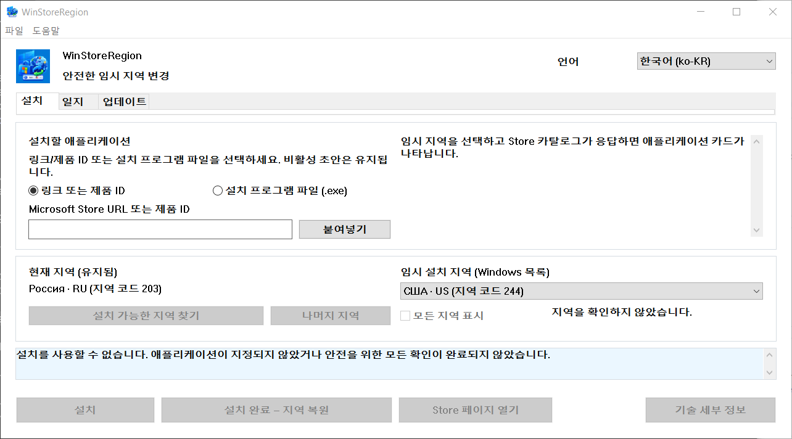

# WinStoreRegion


[](https://github.com/kroxiksut/win-store-region/actions/workflows/ci.yml)


Windows 지역을 일시적으로 변경하여 설치를 진행하고, Microsoft Store 자체 메커니즘으로 설치를 수행한 후, 설치 결과를 확인하여 원래 지역으로 복원하는 Windows 유틸리티입니다.

약 2 MB 크기의 휴대용 `WinStoreRegion.exe`로, x64, ARM64, 32비트 x86 세 가지 아키텍처로 배포됩니다. 관리자 권한이 필요하지 않으며 요청하지도 않습니다. x64 빌드만 실제로 실행되었습니다. [실제로 검증된 내용](#실제로-검증된-내용)을 참조하십시오.

[العربية](README.ar.md) · [English](README.md) · [Español](README.es-ES.md) · [فارسی](README.fa.md) · [日本語](README.ja.md) · **한국어** · [Português](README.pt-BR.md) · [Русский](README.ru.md) · [Türkçe](README.tr.md) · [简体中文](README.zh-CN.md) · [繁體中文](README.zh-TW.md) · [변경 내역](CHANGELOG.md)

> **본 문서는 기계 번역이며 한국어 모국어 사용자가 검수하지 않았습니다.** 본 프로젝트는 어떤 번역도 검토하지 않으므로, 이 번역은 영문 원본보다 오류가 있을 가능성이 높습니다. 오류를 발견하면 issue를 열거나 pull request를 제출해 주십시오. [English](README.md)가 권위 있는 버전입니다.



지역 이름은 Windows 자신이 사용하는 언어로 Windows에서 나옵니다. 그렇기 때문에 필드가 "Windows 목록"으로 표시되며, 위의 창도 여전히 러시아어로 지역을 표시합니다. 스크린샷은 125% 배율의 러시아어 Windows에서 캡처되었습니다.

## 목차

- [왜 이것이 존재하는가](#왜-이것이-존재하는가)
- [이것이 하는 것과 하지 않는 것](#이것이-하는-것과-하지-않는-것)
- [실제로 검증된 내용](#실제로-검증된-내용)
- [요구 사항](#요구-사항)
- [사용 방법](#사용-방법)
- [명령줄에서 시작하기](#명령줄에서-시작하기)
- [Store가 귀하의 지역을 지원하지 않을 때](#store가-귀하의-지역을-지원하지-않을-때)
- [시장별로 지역 찾기](#시장별로-지역-찾기)
- [업데이트 탭](#업데이트-탭)
- [작업 일지](#작업-일지)
- [데이터가 저장되는 위치](#데이터가-저장되는-위치)
- [문제가 발생했을 때](#문제가-발생했을-때)
- [알려진 제한 사항 및 미해결 문제](#알려진-제한-사항-및-미해결-문제)
- [번역](#번역)
- [소스에서 빌드](#소스에서-빌드)
- [라이선스](#라이선스)
- [법적 공지](#법적-공지)

## 왜 이것이 존재하는가

Windows 지역은 거주지가 아니라 설정이며, 둘은 계속 달라집니다. 누군가가 미국에 살면서 러시아어 Windows를 실행하고 지역을 러시아로 설정할 수 있습니다. 이 경우 Microsoft Store는 실제 거주국에서 사용 가능한 애플리케이션(예: 스트리밍 서비스)을 제공하지 않습니다.

Microsoft는 국가 또는 지역 변경을 일반적인 절차로 문서화하고 있습니다: [Microsoft Store에서 국가 또는 지역 변경](https://support.microsoft.com/en-us/account-billing/change-your-country-or-region-in-microsoft-store-5895e006-34f4-10f7-16b1-999e40adb048). WinStoreRegion은 정확히 이 절차를 자동화합니다: Windows 설정이 변경되고, Microsoft Store가 설치를 수행하며, 설정이 다시 변경됩니다. 변경되는 것은 애플리케이션의 전달 경로이지, 메커니즘이 아닙니다. 같은 문서가 프로그램에서 열립니다: **도움말 → Microsoft: 국가 또는 지역 변경**.

수동으로 이 절차를 수행하면: 설정에서 지역을 변경하고, Store가 인식할 때까지 기다리고, 애플리케이션을 찾고, 설치를 시작하고, 지역을 다시 변경하는 것을 기억하고, 원래 지역이 무엇인지 잘못 기억하지 않아야 합니다. 마지막 단계가 문제입니다: 지역을 외국으로 놔두기는 쉽고, 중간에 중단된 작업은 흔적이 남지 않습니다. 이 유틸리티는 같은 단계를 수행하지만, 무엇이든 변경하기 전에 원래 지역을 디스크에 기록하고, 충돌이나 재부팅 후에도 복원합니다.

## 이것이 하는 것과 하지 않는 것

이것이 하는 것:

- 무엇이든 변경하기 **전에** 현재 Windows 지역을 디스크에 기록합니다;
- 지역을 전환하고 다시 읽어서 전환을 확인합니다;
- **임시 지역 아래**에서 카탈로그에서 애플리케이션을 찾습니다;
- 지역을 건드리기 전에 카탈로그에 이 장치가 해당 제품을 받을 수 있는지 묻습니다;
- 일반적인 메커니즘으로 설치를 시작하고 진행 상황을 표시합니다;
- 설치가 끝날 때까지 기다리지 않고 원래 지역을 복원하지만, 설치가 명확하게 시작된 후에만 복원합니다;
- 반환 코드가 아니라 애플리케이션 패키지가 나타나서 완료를 확인합니다;
- 일반적인 메커니즘이 설치할 수 없을 때 제품에 대해 Microsoft의 자체 Store 설치 프로그램을 가져오고 임시 지역에서 실행합니다;
- 로컬 작업 일지 및 진단 로그를 유지합니다;
- 이전 세션이 중단되었으면 다음 시작 시 지역을 복원합니다.

이것이 하지 않는 것:

- Microsoft 계정의 지역을 변경하지 않습니다;
- IP 주소를 변경하거나 네트워크 위치를 속이지 않습니다;
- 비공식 서버에서 Store 패키지를 다운로드하지 않습니다;
- Windows 또는 Microsoft Store를 수정하거나 패치하거나 우회하지 않습니다;
- 모든 제한을 극복할 것을 약속하지 않습니다: 무엇을 사용할 수 있을지는 Microsoft Store가 결정하며, 이 유틸리티가 아닙니다;
- Microsoft에서 오지 않습니다.

지역이 일시적으로 다른 결과는 사용자의 몫입니다: 한 지역에서 구매한 콘텐츠와 구독은 다른 지역에서 다르게 동작할 수 있습니다. 유틸리티는 이를 숨기지 않으며 이에 대해 아무것도 약속하지 않습니다.

## 실제로 검증된 내용

이 섹션이 존재하는 이유는 "작동한다"는 것이 주장이고, 이 프로젝트의 주장은 증거를 제시해야 하기 때문입니다.

전체 사이클이 Windows 10과 Windows 11에서 엔드투엔드로 실행되었습니다: 무엇이든 변경되기 전에 지역을 기록하고, 다시 읽어서 전환을 확인하고, 임시 지역 아래에서 애플리케이션을 찾고, 진행 상황을 표시하여 설치하고, 지역을 일찍 복원하고, 반환 코드가 아니라 애플리케이션 패키지가 나타나서 완료를 확인합니다. handoff 경로, 제품 ID로 가져온 Store 설치 프로그램의 서명과 서명자를 확인하는 것, 그리고 카탈로그가 이 장치가 받을 수 없다고 말하는 제품을 거부하는 것 모두 같은 방식으로 실행되었습니다. 지금까지 모든 실패한 실행은 지역이 복원되고 복구 기록이 지워진 상태로 끝났습니다.

어느 Windows 버전인지는 테스트 문제가 아니라 코드가 요구하는 것입니다: 매니페스트는 Windows 10과 Windows 11을 선언하며, 해당 범위 내의 하한은 App Installer에 의해 설정되는 Windows 10 1809입니다. [요구 사항](#요구-사항)을 참조하십시오.

검증되지 않으며 명시된 내용:

- **개발자의 머신 이외의 다른 머신에서 실행되지 않았습니다** (버튼 기반 경로가 완료된 이후).
- **Store 설치 프로그램이 이미 설치된 애플리케이션을 업데이트하는지 여부.** 따라서 업데이트 탭은 나열하고 설명하지만 한 번 클릭 업데이트를 제공하지 않습니다. [알려진 제한 사항](#알려진-제한-사항-및-미해결-문제)을 참조하십시오.
- **150% 배율에서의 모양.** 레이아웃은 100-200%에서 산술적으로 확인되며, 캡션이 버튼 내에 맞는지 판단할 수 없습니다.
- **ARM64 및 32비트 x86 빌드가 실제 장치에서 실행되는 것.** 세 가지 아키텍처 모두 모든 푸시에서 빌드되고 모든 릴리스와 함께 게시되므로 컴파일됩니다. 이 두 가지 중 어느 것도 실제 장치에서 시작된 적이 없습니다. 이것이 변할 수 있는 유일한 방법이 그것들을 실행할 수 있는 머신이기 때문에 제공되며, 여기서 작동한다고 말하는 이유가 아닙니다.

## 요구 사항

- **Windows 10 버전 1809 (빌드 17763) 이상 또는 Windows 11.** 하한은 App Installer에 의해 설정되며, App Installer는 설치 COM 인터페이스를 제공하고 1809가 필요합니다. 이 프로그램이 호출하는 다른 모든 것은 더 오래되었습니다. `GetDpiForWindow`는 1607이 필요하고 모니터당 v2 배율은 1703이 필요합니다. 매니페스트는 Windows 10 및 11 지원을 선언합니다. Windows 10 22H2 및 개발 초기 단계의 Windows 11에서 테스트되었습니다.
- x64, ARM64 또는 32비트 x86. 각 릴리스에는 세 가지 모두가 포함됩니다. ARM64 장치에서 x64 빌드는 Windows 에뮬레이션에서도 실행되며, 이는 x64 하드웨어에서 최소한 실행된 경로입니다.
- **App Installer** (`Microsoft.DesktopAppInstaller`) — 설치가 이를 통해 실행됩니다. 없으면 유틸리티가 이를 말하고 해당 Store 페이지를 열도록 제안합니다.
- **Microsoft Store** (`Microsoft.WindowsStore`).
- `.exe`가 실행되는 디렉토리는 쓰기 가능해야 합니다: 처음 시작 시 `Microsoft.Management.Deployment.winmd` 사본이 프로그램 옆에 나타나며, 설치된 App Installer에서 가져옵니다. 없으면 설치 COM 인터페이스를 사용할 수 없습니다. 프로그램은 이를 해결하기 위해 자신을 다른 곳으로 복사하지 않으므로, 대신 미충족 조건을 보고합니다.
- 관리자 권한이 필요하지 않습니다.

**이진 파일은 서명되지 않으며, Windows가 이를 말할 것입니다.** 처음 실행 시 SmartScreen은 "Windows가 PC를 보호했습니다"라고 표시하고 실행 버튼을 **자세한 정보 → 어쨌든 실행** 뒤에 숨깁니다. 이는 Windows가 Authenticode 서명이 없고 다운로드 평판이 없는 모든 실행 파일에 대해 수행합니다. 이는 이 파일에 대한 특정 진술이 아닙니다. 이로부터 두 가지가 따르며, 둘 다 당신이 판단할 수 있습니다:

- 경고는 코드 서명 인증서로 릴리스에 서명하는 것으로만 제거됩니다. 빌드에서 아무것도 이를 억제할 수 없으며, 여기서도 시도하지 않습니다.
- 확인할 수 있는 것은 신원입니다. 모든 빌드는 생성한 이진 파일의 SHA-256을 게시합니다(실행 요약 및 아티팩트 내 이진 파일 옆 파일에서), 실행 자체는 공개입니다. `Get-FileHash .\WinStoreRegion.exe -Algorithm SHA256`으로 보유한 것을 비교하면 해당 실행이 빌드한 것이거나 그렇지 않습니다.

브라우저에서 다운로드한 파일도 추출 후 SmartScreen을 관련시키는 표시를 합니다. PowerShell에서 `Unblock-File .\WinStoreRegion.exe`를 사용하거나 **속성 → 차단 해제**를 사용하면 해당 표시를 제거합니다. 아카이브를 추출하기 전에 차단을 해제하면 내부 파일이 깨끗하게 나옵니다.

## 사용 방법

1. **설치** 탭에서 애플리케이션을 명명합니다: Microsoft Store 링크 또는 제품 ID. Store 설치 프로그램 파일 (`.exe`)도 창에 끌어다 놓을 수 있습니다. 신뢰할 수 있는 Microsoft 서명이 있는지 확인하고 임시 지역에서 실행되지만, 식별될 수 없습니다. 이러한 파일에는 읽을 수 있는 제품 ID가 없으므로, 설치하는 애플리케이션은 당신의 주장이지 이 프로그램이 확인할 수 있는 사실이 아닙니다.
2. 임시 지역을 선택합니다. 제품 ID가 파싱되면 유틸리티는 해당 지역 아래의 애플리케이션 카드에 대해 소스에 요청합니다. 이름, 게시자 및 전달 종류가 무엇이든 변경되기 전에 표시됩니다.
3. 애플리케이션이 선택한 지역에 제공되지 않으면 **설치가 제공되는 지역 찾기**를 누릅니다. 약 40개의 주요 시장이 질문을 받고 목록은 실제로 제공하는 시장으로 좁혀집니다. **나머지 지역**이 스캔을 완료하며, **모든 지역 표시**가 전체 목록을 복원합니다.
4. **설치**를 누릅니다. 여기서 유틸리티가 자체적으로 작동합니다: 지역을 전환하고, 다시 읽어서 변경을 확인하고, 애플리케이션을 찾고, 설치를 Store에 넘기고, 진행 상황을 표시하고, 지역을 복원합니다.
5. 결과는 **일지** 탭에 나타납니다.

의도적으로 "설치 취소" 버튼이 없습니다. Windows가 설치를 소유합니다: Microsoft Store 또는 **설정 → 앱**에서 중지하거나 제거할 수 있습니다. 작업 중에 창을 닫을 때 표시되는 대화 상자가 그렇게 말합니다.

인터페이스는 키보드에서 작동하며, 디스플레이 배율을 준수하고, 다시 시작하지 않고도 가진 언어 간에 전환됩니다.

## 명령줄에서 시작하기

헤드리스 모드가 없습니다. 명령줄은 창이 열리는 것만 결정합니다. 선택적 애플리케이션 입력 하나이며, 설치 탭에 미리 채워집니다. 아무것도 시작하지 않습니다: 지역을 건드리지 않으며 버튼을 누를 때까지 설치가 시작되지 않습니다.

```powershell
# 아무 것도 채워지지 않은 창을 엽니다.
.\WinStoreRegion.exe

# 필드에 이미 제품 ID를 채워 엽니다.
.\WinStoreRegion.exe 9WZDNCRFJ3PZ

# Store 웹 주소도 같은 결과입니다.
.\WinStoreRegion.exe https://apps.microsoft.com/detail/9WZDNCRFJ3PZ

# ms-windows-store URI도 같습니다.
.\WinStoreRegion.exe "ms-windows-store://pdp/?productid=9WZDNCRFJ3PZ"

# & 를 포함하는 주소를 인용하십시오 — PowerShell은 이를 자신의 연산자로 처리합니다.
.\WinStoreRegion.exe "https://apps.microsoft.com/detail/9WZDNCRFJ3PZ?hl=en-us"

# 사용법을 인쇄하고 창을 열지 않고 종료합니다.
.\WinStoreRegion.exe --help
.\WinStoreRegion.exe -h
```

전달되는 것은 필드에 *저장*될 뿐입니다. 창이 열릴 때 파싱되므로 제품 ID 또는 Store 주소가 아닌 값은 프롬프트가 아니라 창에서 보고됩니다.

종료 코드이며, 스크립트가 원할 수 있습니다:

| 코드 | 의미 |
|---|---|
| `0` | 창이 실행되고 닫혔거나, `--help`가 사용법을 인쇄했습니다. |
| `1` | 그래픽 인터페이스를 시작할 수 없었습니다. |
| `2` | 명령줄이 잘못되었습니다. |

코드 `2`로 충분히 잘못된 것은 두 가지뿐이며, 둘 다 표준 오류에 사용법을 반복하기 전에 자신을 명명합니다:

```powershell
PS> .\WinStoreRegion.exe --install
Unknown option: --install

Usage:
...

PS> .\WinStoreRegion.exe 9WZDNCRFJ3PZ 9N1SV6841F0B
Only one application input is allowed.

Usage:
...
```

알아야 할 두 가지 세부 사항이 있습니다. 실행 파일은 창 있는 프로그램이므로 이 메시지를 인쇄하기 위해 실행한 콘솔에 연결됩니다. 없이 시작됩니다(실행 대화 상자 또는 바로 가기에서). 대신 대화 상자에 같은 텍스트를 표시합니다. 그리고 명령줄 텍스트는 **모든 인터페이스 언어에서 영어입니다**: 인터페이스 언어는 창 내에서 선택되며, 아직 존재하지 않을 때 인수가 읽혀지므로 시스템 언어에서 추측하면 아무도 선택하지 않은 언어로 대답합니다.

## Store가 귀하의 지역을 지원하지 않을 때

일부 제품은 올바른 지역에서도 일반적인 메커니즘이 설치할 수 없습니다. 그런 일이 발생하면 창은 두 번째 경로를 제공합니다: **Store 설치 프로그램 다운로드**.

유틸리티는 사람이 Store 웹 페이지에서 받을 서명된 설치 프로그램과 같은 것을 Microsoft에 요청합니다(제품 ID로 주소 지정). 그 파일은 수동으로 선택한 것과 정확히 같은 방식으로 처리됩니다. 같은 서명 게이트, 이름, 게시자 및 SHA-256을 표시하는 같은 확인, 같은 지역 트랜잭션입니다.

이 경로에 대해 알아야 할 세 가지는 측정된 것이지 가정한 것이 아닙니다:

- 다운로드는 지역에 의존하지 않으므로 머신이 여전히 자신의 지역을 보유하고 있을 때 파일을 가져옵니다. 실행하는 것만 임시 것이 필요합니다.
- 설치 프로그램은 자신의 창을 열고 **자동으로 설치되지 않습니다**. 그곳에서 설치를 완료하고, 그 다음만 **지역 복원**을 누릅니다.
- Microsoft Store가 그 작업을 소유하고 아무것도 다시 보고하지 않기 때문에, 이 경로는 애플리케이션이 설치되었다고 주장할 수 없습니다. 일지는 이를 *설치 프로그램에 넘김*으로 기록하며, 이는 실제로 일어난 일입니다.

다운로드된 설치 프로그램은 유지되지 않습니다. handoff가 끝날 때 삭제되고 다음 시작 시 다시 삭제됩니다. 파일을 항상 새로 가져올 수 있고 Store 설치 프로그램 폴더는 누구도 누적하도록 요청하지 않았기 때문입니다.

## 시장별로 지역 찾기

Microsoft Store 카탈로그는 현재 적용되는 지역에 대해서만 답변합니다. 따라서 홈 지역에서 없는 애플리케이션은 일반적으로 지역이 변경되기 전에 전혀 나타나지 않습니다. 유틸리티는 시장당 소스에 요청하여 이를 해결하고, 세 가지 답변을 구분합니다: 제공됨, 제공 안 함, 답변 없음. 세 번째는 거부로 제시되지 않습니다. 도달할 수 없었던 시장이 필요한 것일 수 있습니다.

40개 시장의 집합은 의도적으로 불완전하며, 유틸리티가 이를 말합니다. 전체 목록은 약 250개의 요청이므로 두 번째 단계로 실행되며 명확한 명령에서만 실행됩니다.

소스의 답변은 참조이며 설치 허가가 아닙니다: 작업 내에서 애플리케이션은 실제로 적용 중인 지역 아래에서 다시 조회됩니다.

## 업데이트 탭

Microsoft Store는 현재 지역에서 제공하지 않는 애플리케이션을 업데이트하지 않습니다. 업데이트 탭이 이를 찾습니다: 설치된 Store 애플리케이션 중 제품이 귀하의 지역에서는 거부되지만 다른 곳에서는 제공되는 것을 나열하며, 설치된 버전 옆에 카탈로그가 제공하는 버전이 있습니다.

탭이 의도적으로 **주장하지 않는** 것은 업데이트가 릴리스되었다는 것입니다. 측정된 두 가지 사실이 방해합니다:

- `winget`은 Store 제품을 업데이트할 수 없습니다. 요청받으면 "적용 가능한 업데이트 없음"이라고 답변합니다. `msstore` 소스가 버전을 `Unknown`으로 보고하기 때문입니다.
- 두 버전 번호가 항상 비교 가능한 것은 아닙니다. 카탈로그는 번들을 내부의 패키지와 독립적으로 번호 매기며, 게시자는 번호 매기기 방식을 변경합니다. 표시되는 버전은 이름에서가 아니라 번들 내부에서 읽은 이 머신에 실제로 도착할 버전입니다.

따라서 탭은 두 숫자를 표시하고 증명 가능한 것을 설명합니다: 이 지역의 Store은 이 제품을 제공하지 않습니다. 항목에 대해 작동하면 제품 ID를 설치 탭으로 옮기고 지역 검색을 시작합니다. 업데이트는 별도의 작업 종류가 아니며, 모든 게이트는 이미 있는 곳에 있습니다.

스캔 결과는 실행 간에 기억되고 촬영 시간과 함께 표시되며, 같은 지역에만 해당합니다.

## 작업 일지

**일지** 탭은 설치된 것을 표시합니다: 애플리케이션, 제품 ID, 종류, 애플리케이션이 발견된 지역, 날짜, 버전 및 결과. 미완료 및 불확실한 작업이 눈에 띕니다. 이는 주의가 필요한 것입니다.

선택한 항목에 대해 안전한 작동만 제공됩니다: 애플리케이션의 Store 페이지 열기, 제품 ID를 새 설치 초안으로 이동, 제품 ID 복사, 로컬 항목 삭제. 어느 것도 설치를 시작하거나 지역을 변경하지 않습니다.

## 데이터가 저장되는 위치

모든 것이 사용자 프로필 아래 `%LOCALAPPDATA%\WinStoreRegion`에 있습니다:

| 파일 | 목적 |
|---|---|
| `journal.json` | 작업 이력: 무엇, 언제, 어느 지역 아래, 어떤 결과 |
| `pending-restore.json` | 복구 기록; 지역이 임시로 변경되는 동안만 존재 |
| `updates-scan.json` | 마지막 업데이트 스캔이므로 창을 다시 열어도 네트워크 비용이 들지 않습니다 |
| `installers\` | 현재 넘기는 중인 Store 설치 프로그램; handoff가 끝나면 비워집니다 |
| `logs\winstoreregion.log` | 회전 진단 로그 |

원격 분석이 없습니다. 로그는 클립보드 내용, 입력된 텍스트, 전체 파일 경로를 기록하지 않습니다: 선택된 파일은 이름 및 SHA-256으로 기록됩니다.

## 문제가 발생했을 때

지역은 확인된 복원까지 임시로 유지됩니다. 프로세스가 죽었거나 머신이 재부팅되면, 다음 시작 시 복구 기록을 찾고 이를 말하고 원래 지역을 다시 놓거나 현재 지역을 유지하도록 제안합니다. 해당 기록이 해결될 때까지 새 설치가 시작되지 않습니다.

이전 실행으로 시작된 설치는 프로세스의 죽음에서 살아남습니다: Windows 서비스가 이를 수행합니다. 시작 시 유틸리티가 주의하고 작업이 버려진 것으로 취급하지 않고 관찰을 재개합니다.

모든 작업이 진단 로그에 기록됩니다: 시작, 복구 기록, 두 값 및 읽기 확인 결과가 포함된 지역 전환, 조회, 설치 프로그램의 답변 및 해당 코드, 설치 단계, 복원 및 결과. **도움말 → 진단 로그 열기**가 폴더를 엽니다. **도움말 → 세부 사항 복사**가 현재 오류의 기술 블록을 클립보드에 넣습니다.

## 알려진 제한 사항 및 미해결 문제

- Store가 Microsoft Store 패키지로 전달하는 애플리케이션만 설치됩니다. 자신의 Win32 설치 프로그램이 있는 애플리케이션은 범위를 벗어났습니다: 이들의 완료를 증명할 수 없으며, 아무도 검증할 수 없는 설치는 제공되지 않아야 합니다.
- 업데이트 탭에는 한 번 클릭 업데이트 버튼이 없습니다. Store 설치 프로그램이 이미 설치된 애플리케이션을 업데이트하는지는 측정되지 않았으며, 아무것도 하지 않을 수 있는 버튼은 버튼이 없는 것보다 더 나쁩니다.
- **미해결 결함**: 2026년 8월 21일 Windows는 빠르게 연속된 5개의 실패한 작업 후 창을 응답 없음으로 닫았습니다. 지역 트랜잭션은 영향을 받지 않았습니다. 모든 작업에서 복원되었습니다. 그래서 결함은 인터페이스에 있고 모델에 있지 않습니다. 이후 반복되지 않았으며, 결함이 발생한 빌드는 여러 수정보다 이전입니다. 원인은 아직 알려지지 않았으며 여기서 추측하지 않습니다.
- 11개 인터페이스 언어: 아랍어, 영어, 스페인어, 페르시아어, 일본어, 한국어, 포르투갈어, 러시아어, 터키어, 두 가지 스크립트의 중국어. 영어와 러시아어는 유지 관리자의 것입니다. 다른 9개는 기계 제작 초안이며 모국어 사용자가 확인하지 않았으며 각 파일이 상단에서 이를 말합니다. 아랍어와 페르시아어는 전체 창을 한바퀴 돌립니다. 이들이 읽는 방식이기 때문입니다. 각 언어마다 번역된 README도 있으며, 그 파일들은 저마다 나머지 전부를 가리킵니다.
- 프로그램의 한 인스턴스가 한 번에 실행됩니다.

## 번역

한 언어는 하나의 파일입니다. `lang/ru.toml`, `lang/en.toml` 및 추가할 항목: 하나를 복사하고, 값을 번역하고, pull request를 엽니다. 쓸 Rust가 없습니다. 빌드가 디렉토리를 읽고 언어 목록, 선택기 및 표를 생성하므로, `lang/zh.toml`이 중국어를 제공하는 데 필요한 전부입니다.

오른쪽에서 왼쪽으로 읽는 언어는 한 필드 `direction = "rtl"`에서 이를 말하며, 창이 자체적으로 한바퀴 돕니다: 패널, 캡션, 버튼, 표 열 및 스크롤바 모두 변을 바꿉니다. 아랍어가 먼저 나왔고 페르시아어가 뒤따랐으며 비용은 하나의 파일과 전혀 Rust가 없었습니다. 여기서 주장하는 것입니다. 히브리어도 같은 비용을 들 것입니다.

**새 언어는 언어학적 검토 없이 승인됩니다**. 아무도 여기서 읽을 수 없기 때문입니다. 확인되는 것은 구조이며, 빌드가 수행합니다: 누락된 키, 알 수 없는 키, 잘못된 길이 목록 또는 `{자리 표시자}`가 원본과 다른 문자열은 모두 빌드가 실패합니다. 승인 후 유지 관리자는 언어를 운반하는 릴리스를 게시하는 것을 목표로 합니다.

검토가 없기 때문에 한 규칙이 나머지보다 중요합니다. 많은 문자열은 의도적으로 신중합니다. 완료가 *증명되지 않았다*, 답변이 단일 시장에서 나왔다, 집합이 불완전하다고 말합니다. 이 주의 사항들이 이 애플리케이션을 신뢰할 수 있게 만드는 것이며, 번역은 더 굵은 문장이 더 잘 읽혀도 그들을 유지해야 합니다.

같은 이유로 이미 배송된 언어가 가장 오류일 가능성이 높습니다. **하나를 읽고 뭔가 이상하면 issue를 열어주세요**. 오역, 잘린 캡션, 잃어버린 주의 사항, 또는 자연스럽지 않은 어구입니다. 언어 및 키를 명명하십시오. 제안된 표현은 환영하지만 필수가 아닙니다. Pull request도 같은 작업을 수행하며 issue가 목표의 낮은 표준입니다.

번역자는 언어 파일의 `authors` 필드에 명명되며, 해당 이름은 **도움말 → 정보**에서 언어 옆에 나타나며, 응용 프로그램 자체의 작성자 및 라이선스 아래입니다. 크레딧이 파일에서 생성되므로 속한 작업에서 표류할 수 없습니다.

번역은 다른 기여와 같습니다: **GPL-3.0-or-later** 아래 승인되며 다른 라이선스가 아니며, 저작권은 귀하의 것이며 누구도 재라이선스 권리가 없습니다.

언어 파일은 화면의 모든 것을 포함합니다. 캡션, 상태, 진단 및 대화 상자입니다. 포함하지 않는 한 가지는 명령줄이며, 모든 언어에서 영어입니다. 인수가 언어가 선택되기 전에 읽혀지기 때문입니다. 완전한 체크리스트는 [CONTRIBUTING.md](CONTRIBUTING.md#translations)에 있습니다.

## 소스에서 빌드

`x86_64-pc-windows-msvc`용 안정적인 Rust 1.85 이상.

```
cargo build --release
cargo test
cargo clippy --all-targets
cargo fmt --all --check
```

다른 아키텍처는 추가된 대상을 사용하여 같은 소스에서 빌드합니다. 머신은 일치하는 MSVC 빌드 도구 구성 요소가 필요합니다. 응용 프로그램 매니페스트는 아키텍처 중립이므로 다른 것은 변하지 않습니다:

```
rustup target add aarch64-pc-windows-msvc
cargo build --release --target aarch64-pc-windows-msvc

rustup target add i686-pc-windows-msvc
cargo build --release --target i686-pc-windows-msvc
```

이들 중 어느 것도 아키텍처의 실제 장치에서 실행되지 않았습니다. 그러나 모든 릴리스와 함께 게시됩니다. 그것들을 실행할 수 있는 머신이 이를 변경하는 유일한 방법이기 때문입니다. 그들은 컴파일되며 이것이 주장되는 전부입니다.

일부 테스트는 `#[ignore]`로 표시됩니다: 이들은 Windows 지역을 변경하거나, 애플리케이션을 설치하거나, 네트워크에 도달합니다. 지역을 변경하는 것들은 전용 테스트 머신에서만 실행됩니다.

## 라이선스

GPL-3.0-or-later.

## 법적 공지

이 프로젝트는 Microsoft와 독립적입니다: 제휴되지 않으며, 그로부터 승인되거나 지원되지 않습니다. 이름 Microsoft, Windows, Microsoft Store 및 WinGet은 호환성 및 목적을 정확히 설명하기 위해서만 사용됩니다. Microsoft 로고 및 상업용 패장은 사용되지 않습니다.

WinStoreRegion은 Microsoft 계정의 지역을 변경하지 않으며, IP 주소를 변경하지 않으며, 비공식 서버에서 Microsoft Store 패키지를 다운로드하지 않으며, 모든 가용성 제한을 해결할 수 있음을 보장하지 않습니다.
