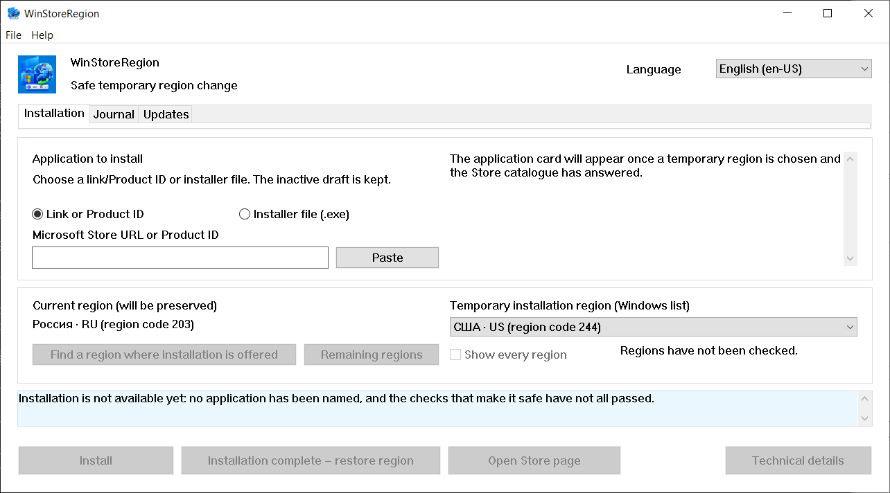

# WinStoreRegion


[](https://github.com/kroxiksut/win-store-region/actions/workflows/ci.yml)


A Windows utility that switches the Windows region for the length of one
installation, hands the installation to Microsoft Store's own mechanism, and
puts the region back once it has seen the actual result.

One portable `WinStoreRegion.exe`, about 2 MB, published for x64, ARM64 and
32-bit x86. It neither needs nor requests administrator rights. Only the x64
build has ever been run — see [what is verified](#what-has-actually-been-verified).

[العربية](README.ar.md) · **English** · [Español](README.es-ES.md) · [فارسی](README.fa.md) · [日本語](README.ja.md) · [한국어](README.ko.md) · [Português](README.pt-BR.md) · [Русский](README.ru.md) · [Türkçe](README.tr.md) · [简体中文](README.zh-CN.md) · [繁體中文](README.zh-TW.md)

[Changelog](CHANGELOG.md)



Region names come from Windows itself, in the language Windows uses for them —
which is why the field is labelled "Windows list", and why the window above
still names its regions in Russian. The screenshot was taken on a Russian
Windows at 125% scaling.

## Contents

- [Why this exists](#why-this-exists)
- [What it does and does not do](#what-it-does-and-does-not-do)
- [What has actually been verified](#what-has-actually-been-verified)
- [Requirements](#requirements)
- [Using it](#using-it)
- [Starting it from the command line](#starting-it-from-the-command-line)
- [When the Store will not serve your region](#when-the-store-will-not-serve-your-region)
- [Finding a region by market](#finding-a-region-by-market)
- [The Updates tab](#the-updates-tab)
- [The operation journal](#the-operation-journal)
- [Where data is kept](#where-data-is-kept)
- [When something goes wrong](#when-something-goes-wrong)
- [Known limits and open issues](#known-limits-and-open-issues)
- [Translations](#translations)
- [Building from source](#building-from-source)
- [License](#license)
- [Legal notices](#legal-notices)

## Why this exists

The Windows region is a setting, not a place of residence, and the two drift
apart constantly. Someone can live in the United States and run a Russian
Windows with the region set to Russia: Microsoft Store will then not offer the
applications available in their actual country — the streaming services and the
like.

Microsoft documents changing the country or region as an ordinary procedure:
[Change your country or region in Microsoft Store](https://support.microsoft.com/en-us/account-billing/change-your-country-or-region-in-microsoft-store-5895e006-34f4-10f7-16b1-999e40adb048).
WinStoreRegion automates exactly that and nothing beyond it: a Windows setting
changes, Microsoft Store performs the installation, and the setting goes back.
What changes is the delivery route of an application, not the mechanism. The
same article opens from the program: **Help → Microsoft: change your country or
region**.

Done by hand the procedure is: change the region in Settings, wait for the Store
to notice, find the application, start the installation, remember to put the
region back, and not misremember what it was. That last step is where the
trouble is: a region is easy to leave foreign, and an operation interrupted
half-way leaves no trace. This utility performs the same steps, but it writes
the original region to disk before it changes anything, and restores it even
after a crash or a restart.

## What it does and does not do

It does:

- write the current Windows region to disk **before** changing anything;
- switch the region and confirm the switch by reading it back;
- look the application up in the catalogue **under the temporary region**;
- ask the catalogue, before touching the region, whether this device can be
  served the product at all;
- start the installation through the ordinary mechanism and show its progress;
- restore the original region without waiting for the installation to end, but
  only after the installation has demonstrably started;
- confirm completion by the application's package appearing, not by a return
  code;
- fetch Microsoft's own Store installer for a product when the ordinary
  mechanism cannot install it, and run that installer under the temporary
  region;
- keep a local operation journal and a diagnostic log;
- restore the region on the next start if the previous session was cut short.

It does not:

- change the region of your Microsoft account;
- change your IP address or spoof your network location;
- download Store packages from unofficial servers;
- modify Windows or Microsoft Store, patch anything, or bypass anything;
- promise to defeat every restriction: what is available is decided by Microsoft
  Store, not by this utility;
- come from Microsoft.

The consequences of the region differing for a while are the user's own:
content and subscriptions bought in one region may behave differently in
another. The utility does not hide this and promises nothing about it.

## What has actually been verified

This section exists because "it works" is a claim, and claims in this project
are expected to name their evidence.

The whole cycle has been exercised end to end on Windows 10 and on Windows 11:
the region recorded before anything changes, switched and confirmed by reading
it back, the application looked up under the temporary region, installed with
progress, the region restored early, and completion confirmed by the
application's package appearing rather than by a return code. The handoff path,
the Store installer fetched by Product ID with its signature and signer checked,
and the refusal of a product the catalogue says this device cannot receive have
all been exercised the same way. Every failing run so far ended with the region
restored and the recovery record cleared.

Which versions of Windows those are is not a matter of testing but of what the
code requires: the manifest declares Windows 10 and Windows 11, and the floor
inside that range is Windows 10 1809, set by App Installer. See
[Requirements](#requirements).

Not verified, and stated as such:

- **No run on a machine other than the developer's** since the button-driven
  paths were completed.
- **Whether the Store installer updates an already installed application.** The
  Updates tab therefore lists and explains, and does not offer a one-click
  update. See [Known limits](#known-limits-and-open-issues).
- **Appearance at 150% scaling.** The layout is checked arithmetically at
  100–200%, which cannot tell whether a caption fits inside a button.
- **The ARM64 and 32-bit x86 builds on real devices.** All three architectures
  are built on every push and published with every release, so they compile.
  Neither of those two has ever been started on an actual device. They are
  offered because a machine that can run them is the only way that will change,
  not because anything here says they work.
## Requirements

- **Windows 10 version 1809 (build 17763) or later, or any Windows 11.** The
  floor is set by App Installer, which carries the installation COM interface
  and itself requires 1809; everything else this program calls is older —
  `GetDpiForWindow` needs 1607 and per-monitor v2 scaling needs 1703. The
  manifest declares Windows 10 and 11 support. Tested on Windows 10 22H2 and,
  earlier in development, on Windows 11.
- x64, ARM64 or 32-bit x86. Each release carries all three. On an ARM64 device
  the x64 build also runs under Windows emulation, which is the path that has at
  least been exercised on x64 hardware.
- **App Installer** (`Microsoft.DesktopAppInstaller`) — the installation runs
  through it. Without it the utility says so and offers to open its Store page.
- **Microsoft Store** (`Microsoft.WindowsStore`).
- The directory the `.exe` runs from must be writable: on first start a copy of
  `Microsoft.Management.Deployment.winmd` appears beside the program, taken from
  the installed App Installer. Without it the installation COM interfaces are
  unavailable. The program does not copy itself elsewhere to work around this —
  it reports the unmet condition instead.
- No administrator rights.

**The binary is not signed, and Windows will say so.** On first run SmartScreen
shows "Windows protected your PC" and hides the run button behind **More info →
Run anyway**. That is what Windows does with any executable that carries no
Authenticode signature and no download reputation; it is not a statement about
this file in particular. Two things follow, and both are yours to weigh:

- The warning is removed only by signing the release with a code-signing
  certificate. Nothing in the build can suppress it, and nothing here tries to.
- What can be checked instead is identity. Every build publishes the SHA-256 of
  the binary it produced — in the run summary, and in a file beside the binary
  inside the artifact — and the run itself is public. Compare what you have with
  `Get-FileHash .\WinStoreRegion.exe -Algorithm SHA256` and the file is either
  the one that run built or it is not.

A file downloaded from a browser also carries a mark that keeps SmartScreen
involved after extraction. `Unblock-File .\WinStoreRegion.exe` in PowerShell, or
**Properties → Unblock**, removes that mark. Unblock the archive before
extracting it and the files inside come out clean.

## Using it

1. Name the application on the **Installation** tab: a Microsoft Store link or a
   Product ID. A Store installer file (`.exe`) can also be dropped on the
   window; it is checked for a trusted Microsoft signature and run under the
   temporary region, but it cannot be identified — such a file carries no
   readable Product ID, so the application it installs is your claim, not a
   fact this program can check.
2. Choose a temporary region. As soon as the Product ID is parsed, the utility
   asks the source for the application's card under that region — name,
   publisher and delivery kind are visible before anything changes.
3. If the application is not offered in the chosen region, press **Find a region
   where installation is offered**. About forty major markets are asked, and the
   list narrows to those that actually offer it. **Remaining regions** completes
   the sweep; **Show every region** restores the full list.
4. Press **Install**. From here the utility works on its own: it switches the
   region, confirms the change by reading it back, finds the application, hands
   the installation to the Store, shows progress, and restores the region.
5. The outcome appears on the **Journal** tab.

There is deliberately no "cancel installation" button. Windows owns the
installation: it can be stopped or the application removed in Microsoft Store or
in **Settings → Apps**. The dialog shown when closing the window during an
operation says so.

The interface works from the keyboard, honours display scaling, and switches
between the languages it carries without a restart.

## Starting it from the command line

There is no headless mode. The command line only decides what the window opens
with — one optional application input, prefilled into the Installation tab. It
starts nothing: the region is not touched and no installation begins until you
press the button.

```powershell
# Open the window with nothing filled in.
.\WinStoreRegion.exe

# Open it with a Product ID already in the field.
.\WinStoreRegion.exe 9WZDNCRFJ3PZ

# A Store web address does the same.
.\WinStoreRegion.exe https://apps.microsoft.com/detail/9WZDNCRFJ3PZ

# So does the ms-windows-store URI.
.\WinStoreRegion.exe "ms-windows-store://pdp/?productid=9WZDNCRFJ3PZ"

# Quote an address containing & — PowerShell treats it as its own operator.
.\WinStoreRegion.exe "https://apps.microsoft.com/detail/9WZDNCRFJ3PZ?hl=en-us"

# Print the usage and exit without opening a window.
.\WinStoreRegion.exe --help
.\WinStoreRegion.exe -h
```

Whatever is passed is only *stored* in the field. It is parsed the moment the
window opens, so a value that is not a Product ID or a Store address is reported
in the window rather than at the prompt.

Exit codes, since a script may want them:

| Code | Meaning |
|---|---|
| `0` | The window ran and closed, or `--help` printed the usage. |
| `1` | The graphical interface could not be started. |
| `2` | The command line was wrong. |

Only two things are wrong enough for code `2`, and both name themselves before
repeating the usage on standard error:

```powershell
PS> .\WinStoreRegion.exe --install
Unknown option: --install

Usage:
...

PS> .\WinStoreRegion.exe 9WZDNCRFJ3PZ 9N1SV6841F0B
Only one application input is allowed.

Usage:
...
```

Two details are worth knowing. The executable is a windowed program, so it
attaches to the console that launched it to print these messages; started
without one — from the Run dialog or a shortcut — it shows the same text in a
dialog box instead. And the command-line text is **English in every interface
language**: the interface language is chosen inside the window, which does not
exist yet when the arguments are read, and guessing from the system language
would answer in a language nobody selected.

## When the Store will not serve your region

Some products the ordinary mechanism cannot install even under the right region.
When that happens the window offers a second path: **Download the Store
installer**.

The utility asks Microsoft for the same signed installer a person would receive
from the Store web page, addressed by Product ID. That file is then treated
exactly like one you picked by hand — the same signature gate, the same
confirmation showing name, publisher and SHA-256, the same region transaction.

Three things are worth knowing about this path, all measured rather than assumed:

- The download does not depend on your region, so the file is fetched while the
  machine still holds your own region. Only running it needs the temporary one.
- The installer opens a window of its own and **does not install silently**. You
  finish the installation there, and only then press **Restore region**.
- Because Microsoft Store owns that work and reports nothing back, this path can
  never claim an application was installed. The journal records it as *handed to
  the installer*, which is what actually happened.

Downloaded installers are not kept. They are deleted when the handoff ends and
again at the next start, because the file can always be fetched afresh and a
folder of Store installers is not something anyone asked to accumulate.

## Finding a region by market

The Microsoft Store catalogue answers only about the region in force right now,
so an application absent from your home region usually does not appear at all
before the region changes. The utility works around this by asking the source
per market, and it distinguishes three answers: offered, not offered, and no
answer. The third is never presented as a refusal — a market that could not be
reached may well be the one you need.

The set of forty markets is deliberately incomplete, and the utility says so.
The full list is some two hundred and fifty requests, so it runs as a second
step and only on an explicit command.

The source's answer is a reference, not permission to install: inside the
operation the application is looked up again under the region actually in force.

## The Updates tab

Microsoft Store will not update an application it does not serve in your current
region. The Updates tab finds those: it lists the installed Store applications
whose product the source refuses in your region while offering it elsewhere,
with the installed version beside the version the catalogue offers.

What the tab deliberately does **not** claim is that an update was released.
Two facts stand in the way, both measured:

- `winget` cannot update a Store product at all. Asked to, it answers "no
  applicable update", because the `msstore` source reports the version as
  `Unknown`.
- The two version numbers are not always comparable. The catalogue numbers a
  bundle independently of the package inside it, and publishers change their
  numbering schemes. The version shown is the one that would actually land on
  this machine, read from inside the bundle rather than from its name.

So the tab shows both numbers and states what is provable: this region's Store
will not serve this product. Acting on an entry carries its Product ID to the
Installation tab and starts the region search; updating is not a separate kind
of operation, and every gate stays where it already is.

Scan results are remembered between runs and shown with the time they were
taken, for the same region only.

## The operation journal

The **Journal** tab shows what was installed: application, Product ID, kind, the
region the application was found under, date, version and outcome. Unfinished
and uncertain operations stand out — those are the ones that need attention.

Only safe actions are offered for a selected entry: open the application's Store
page, carry the Product ID into a new installation draft, copy the Product ID,
delete the local entry. None of them starts an installation or changes a region.

## Where data is kept

Everything lives in the user profile, under `%LOCALAPPDATA%\WinStoreRegion`:

| File | Purpose |
|---|---|
| `journal.json` | operation history: what, when, under which region, with what outcome |
| `pending-restore.json` | the recovery record; exists only while a region is temporarily changed |
| `updates-scan.json` | the last Updates scan, so reopening the window costs no network |
| `installers\` | a Store installer being handed off right now; emptied when it is done |
| `logs\winstoreregion.log` | rotating diagnostic log |

There is no telemetry. The log records neither clipboard contents, nor typed
text, nor full file paths: a chosen file is recorded by name and SHA-256.

## When something goes wrong

The region stays temporary exactly until a confirmed restore. If the process
died or the machine rebooted, the next start finds the recovery record, says so,
and offers to put the original region back or keep the current one. No new
installation begins until that record is resolved.

An installation started by a previous run survives the death of the process: a
Windows service performs it. On start the utility notices and resumes observing
rather than treating the operation as abandoned.

Every operation is written to the diagnostic log: start, recovery record, the
region switch with both values and the read-back result, the lookup, the
installer's answer with its codes, installation phases, the restore and the
outcome. **Help → Open diagnostic log** opens the folder; **Help → Copy details**
puts the technical block of the current error on the clipboard.

## Known limits and open issues

- Only applications the Store delivers as Microsoft Store packages are
  installed. Applications with their own Win32 installer are out of scope:
  completion cannot be proven for them, and an installation nobody can verify
  should not be offered.
- The Updates tab has no one-click update button. Whether the Store installer
  updates an application that is already installed has not been measured, and a
  button that might do nothing is worse than no button.
- **Open defect:** on 21.08.2026 Windows closed the window as unresponsive after
  five failing operations in quick succession. The region transaction was
  unaffected — it was restored in every one of them — so the fault is in the
  interface, not in the model. It has not reproduced since, and the build it
  happened on predates several fixes; the cause is not yet known and is not
  guessed at here.
- Eleven interface languages: Arabic, English, Spanish, Persian, Japanese,
  Korean, Portuguese, Russian, Turkish, and Chinese in both scripts. English
  and Russian are the maintainer's own; the other nine are machine-made drafts
  that no native reader has checked, and each file says so at the top. Arabic
  and Persian turn the whole window around, because that is how they read. Each
  of them has this document translated as well, and every one of those links to
  all the others.
- One instance of the program runs at a time.

## Translations

A language is a file. `lang/ru.toml`, `lang/en.toml`, and whatever you add:
copy one, translate the values, open a pull request. There is no Rust to write —
the build reads that directory and generates the language list, the chooser and
the tables, so `lang/zh.toml` is all it takes to offer Chinese.

A language that reads right to left says so in one field, `direction = "rtl"`,
and the window turns itself around for it: the panels, the captions, the
buttons, the table columns and the scrollbars all change sides. Arabic came
first and Persian followed for the price of one file and no code at all, which
is the whole claim being made here; Hebrew would cost the same.

**A new language is approved without a linguistic review**, because nobody here
can read it. What is checked is structure, and the build does it: a missing key,
an unknown key, a list of the wrong length, or a string whose `{placeholders}`
differ from the original all fail the build. After approval the maintainer aims
to publish a release carrying the language.

Because there is no review, one rule matters more than the rest. Many strings
here are deliberately careful — they say that a completion was *not proven*,
that an answer came from a single market, that a set is incomplete. Those hedges
are what makes this application safe to trust, and a translation has to keep
them even where a bolder sentence reads better.

The same reason makes the languages already shipping the ones most likely to be
wrong. **If you read one and something is off, please open an issue** — a
mistranslation, a clipped caption, a hedge that got lost, or wording that is
merely unnatural. Name the language and the key; a suggested wording is welcome
but not required. A pull request does the same job, and an issue is the lower
bar on purpose.

Translators are named in the `authors` field of the language file, and that name
appears in **Help → About** beside the language, under the author and licence of
the application itself. The credit is generated from the file, so it cannot
drift away from the work it belongs to.

A translation is a contribution like any other: accepted under
**GPL-3.0-or-later** and no other licence, with the copyright staying yours and
no right to relicense granted to anyone.

A language file covers everything on screen — captions, statuses, diagnostics
and dialogs alike. The one thing it does not cover is the command line, which is
English in every language, because arguments are read before a language has been
chosen. The full checklist is in
[CONTRIBUTING.md](CONTRIBUTING.md#translations).

## Building from source

Stable Rust 1.85 or newer for `x86_64-pc-windows-msvc`.

```
cargo build --release
cargo test
cargo clippy --all-targets
cargo fmt --all --check
```

Other architectures build from the same sources with a target added; the machine
needs the matching MSVC build-tools component. The application manifest is
architecture-neutral, so nothing else changes:

```
rustup target add aarch64-pc-windows-msvc
cargo build --release --target aarch64-pc-windows-msvc

rustup target add i686-pc-windows-msvc
cargo build --release --target i686-pc-windows-msvc
```

Neither of these has been run on a real device of its architecture. Both are
published with every release all the same, because a machine that can run them
is the only way that changes. They compile, and that is all that is claimed.

Some tests are marked `#[ignore]`: they change the Windows region, install
applications, or reach the network. The ones that change the region are run only
on a dedicated test machine.

## License

GPL-3.0-or-later.

## Legal notices

This project is independent of Microsoft: not affiliated with, endorsed by, or
supported by it. The names Microsoft, Windows, Microsoft Store and WinGet are
used only to describe compatibility and purpose accurately. Microsoft logos and
trade dress are not used.

WinStoreRegion does not change the region of a Microsoft account, does not
change your IP address, does not download Microsoft Store packages from
unofficial servers, and does not guarantee that every availability restriction
can be worked around.
