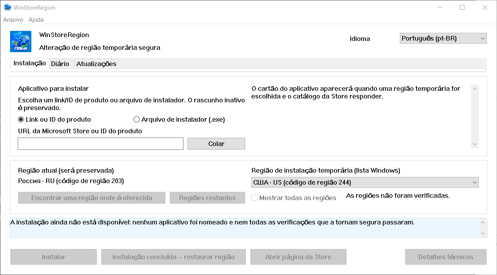

# WinStoreRegion


[](https://github.com/kroxiksut/win-store-region/actions/workflows/ci.yml)


Um utilitário para Windows que muda temporariamente a região do Windows, entrega
a instalação para o mecanismo próprio da Microsoft Store e depois devolve a
região assim que recebe o resultado real.

Um único arquivo portável `WinStoreRegion.exe`, cerca de 2 MB, publicado para x64,
ARM64 e x86 de 32 bits. Não requer nem solicita direitos de administrador. Apenas
a compilação x64 foi executada — veja [o que foi realmente verificado](#o-que-foi-realmente-verificado).

[العربية](README.ar.md) · [English](README.md) · [Español](README.es-ES.md) · [فارسی](README.fa.md) · [日本語](README.ja.md) · [한국어](README.ko.md) · **Português** · [Русский](README.ru.md) · [Türkçe](README.tr.md) · [简体中文](README.zh-CN.md) · [繁體中文](README.zh-TW.md)

[Alterações](CHANGELOG.md)

> **Aviso de tradução:** Este documento é uma tradução automática que nenhum
> falante de português verificou. O texto original e autorizado está em
> [English](README.md). Este documento está em português brasileiro.
> O projeto não revisa traduções, portanto é mais provável estar incorreto que
> o original em inglês. Se você encontrar um erro, abra uma
> [issue](https://github.com/kroxiksut/win-store-region/issues) ou um
> [pull request](https://github.com/kroxiksut/win-store-region/pulls).



Os nomes de regiões vêm do próprio Windows, no idioma que o Windows usa para
nomeá-los — por isso o campo é rotulado "lista do Windows", e por isso a janela
acima ainda nomeia suas regiões em russo. A captura foi tirada em um Windows
russo com escala de 125%.

## Conteúdo

- [Por que existe](#por-que-existe)
- [O que faz e o que não faz](#o-que-faz-e-o-que-não-faz)
- [O que foi realmente verificado](#o-que-foi-realmente-verificado)
- [Requisitos](#requisitos)
- [Como usar](#como-usar)
- [Iniciando pela linha de comando](#iniciando-pela-linha-de-comando)
- [Quando a Store não atende sua região](#quando-a-store-não-atende-sua-região)
- [Encontrando uma região por mercado](#encontrando-uma-região-por-mercado)
- [A aba Atualizações](#a-aba-atualizações)
- [O diário de operações](#o-diário-de-operações)
- [Onde os dados são armazenados](#onde-os-dados-são-armazenados)
- [Quando algo sai errado](#quando-algo-sai-errado)
- [Limitações conhecidas e problemas abertos](#limitações-conhecidas-e-problemas-abertos)
- [Traduções](#traduções)
- [Compilando do código-fonte](#compilando-do-código-fonte)
- [Licença](#licença)
- [Avisos legais](#avisos-legais)

## Por que existe

A região do Windows é uma configuração, não um local de residência, e os dois se
afastam constantemente. Alguém pode viver nos Estados Unidos e usar um Windows
russo com a região configurada para a Rússia: a Microsoft Store não oferecerá
então os aplicativos disponíveis em seu país real — os serviços de streaming e
similares.

Microsoft documenta a mudança do país ou região como um procedimento comum:
[Change your country or region in Microsoft Store](https://support.microsoft.com/en-us/account-billing/change-your-country-or-region-in-microsoft-store-5895e006-34f4-10f7-16b1-999e40adb048).
WinStoreRegion automatiza exatamente isso e nada além: uma configuração do Windows
muda, a Microsoft Store realiza a instalação e a configuração volta. O que muda é
a rota de entrega de um aplicativo, não o mecanismo. O mesmo artigo abre a partir
do programa: **Ajuda → Microsoft: alterar seu país ou região**.

Feito manualmente, o procedimento é: alterar a região nas Configurações, aguardar
a Store perceber, encontrar o aplicativo, iniciar a instalação, lembrar de
reconfigurar a região e não esquecer qual era. Esse último passo é onde está o
problema: é fácil deixar uma região estrangeira, e uma operação interrompida no
meio não deixa rastro. Este utilitário executa os mesmos passos, mas escreve a
região original em disco antes de alterar qualquer coisa e a restaura mesmo após
um travamento ou reinicialização.

## O que faz e o que não faz

Faz:

- escreve a região atual do Windows em disco **antes** de alterar qualquer coisa;
- muda a região e confirma a mudança lendo-a de volta;
- procura o aplicativo no catálogo **sob a região temporária**;
- pergunta ao catálogo, antes de tocar na região, se este dispositivo pode
  receber o produto;
- inicia a instalação através do mecanismo comum e mostra seu progresso;
- restaura a região original sem aguardar o término da instalação, mas
  apenas depois que a instalação tenha demonstravelmente começado;
- confirma a conclusão pelo aparecimento do pacote do aplicativo, não por um
  código de retorno;
- busca o instalador próprio da Store da Microsoft para um produto quando o
  mecanismo comum não consegue instalá-lo e executa esse instalador sob a
  região temporária;
- mantém um diário de operações local e um log de diagnóstico;
- restaura a região na próxima inicialização se a sessão anterior foi cortada.

Não faz:

- não altera a região de sua conta Microsoft;
- não altera seu endereço IP ou falsifica sua localização de rede;
- não faz download de pacotes da Store de servidores não oficiais;
- não modifica o Windows ou a Microsoft Store, não aplica patches ou bypasses;
- não promete derrotar todas as restrições: o que está disponível é decidido por
  Microsoft Store, não por este utilitário;
- não vem da Microsoft.

As consequências de a região diferir por um tempo são do próprio usuário:
conteúdo e assinaturas compradas em uma região podem se comportar diferentemente
em outra. O utilitário não oculta isso e não promete nada sobre isso.

## O que foi realmente verificado

Esta seção existe porque "funciona" é uma afirmação, e afirmações neste projeto
devem nomear suas evidências.

O ciclo completo foi executado de ponta a ponta no Windows 10 e no Windows 11:
a região foi registrada antes de qualquer coisa mudar, foi mudada e confirmada
lendo-a de volta, o aplicativo foi procurado sob a região temporária, instalado
com progresso mostrado, a região foi restaurada cedo e a conclusão foi confirmada
pelo aparecimento do pacote do aplicativo em vez de um código de retorno. O
caminho de handoff, o instalador da Store buscado por Product ID com sua assinatura
e signatário verificados, e a recusa de um produto que o catálogo diz que este
dispositivo não pode receber, tudo foi exercitado da mesma forma. Todas as
execuções falhadas até agora terminaram com a região restaurada e o registro de
recuperação limpo.

Quais versões do Windows são essas não é uma questão de testes, mas do que o
código requer: o manifesto declara Windows 10 e Windows 11, e o piso dentro dessa
faixa é Windows 10 1809, definido por App Installer. Veja [Requisitos](#requisitos).

Não verificado e declarado como tal:

- **Nenhuma execução em uma máquina diferente da do desenvolvedor** desde que os
  caminhos controlados por botão foram concluídos.
- **Se o instalador da Store atualiza um aplicativo já instalado.** A aba
  Atualizações portanto lista e explica, mas não oferece uma atualização com um
  clique. Veja [Limitações conhecidas](#limitações-conhecidas-e-problemas-abertos).
- **Aparência em escala de 150%.** O layout é verificado aritmeticamente em
  100–200%, o que não pode dizer se uma legenda cabe dentro de um botão.
- **As compilações ARM64 e x86 de 32 bits em dispositivos reais.** Todas as três
  arquiteturas são compiladas a cada push e publicadas a cada versão, portanto
  compilam. Nenhuma das duas foi nunca iniciada em um dispositivo real. São
  oferecidas porque uma máquina que pode executá-las é a única forma de isso
  mudar, não porque algo aqui diga que funcionam.

## Requisitos

- **Windows 10 versão 1809 (compilação 17763) ou posterior, ou qualquer Windows 11.**
  O piso é definido por App Installer, que carrega a interface COM de instalação
  e ele próprio requer 1809; tudo o mais que este programa chama é mais antigo —
  `GetDpiForWindow` precisa de 1607 e per-monitor v2 scaling precisa de 1703. O
  manifesto declara suporte para Windows 10 e 11. Testado em Windows 10 22H2 e,
  anteriormente no desenvolvimento, em Windows 11.
- x64, ARM64 ou x86 de 32 bits. Cada versão carrega todas as três. Em um
  dispositivo ARM64, a compilação x64 também é executada sob emulação do Windows,
  que é o caminho que foi pelo menos exercitado em hardware x64.
- **App Installer** (`Microsoft.DesktopAppInstaller`) — a instalação é executada
  através dele. Sem ele, o utilitário diz e oferece abrir sua página na Store.
- **Microsoft Store** (`Microsoft.WindowsStore`).
- O diretório a partir do qual o `.exe` é executado deve ser gravável: na primeira
  inicialização, uma cópia de `Microsoft.Management.Deployment.winmd` aparece ao
  lado do programa, tirada do App Installer instalado. Sem ela, as interfaces COM
  de instalação não estão disponíveis. O programa não se copia para outro lugar
  para contornar isso — ele relata a condição não atendida.
- Sem direitos de administrador.

**O binário não é assinado e o Windows dirá isso.** Na primeira execução,
SmartScreen mostra "Windows protegeu seu PC" e oculta o botão de execução atrás
de **Mais informações → Executar mesmo assim**. É o que o Windows faz com qualquer
executável que não tenha uma assinatura Authenticode e nenhuma reputação de
download; não é uma afirmação sobre este arquivo em particular. Duas coisas se
seguem, e ambas são suas para pesar:

- O aviso é removido apenas assinando a versão com um certificado de assinatura
  de código. Nada na compilação pode suprimi-lo, e nada aqui tenta.
- O que pode ser verificado é a identidade. Cada compilação publica o SHA-256 do
  binário que produziu — no resumo da execução e em um arquivo ao lado do binário
  dentro do artefato — e a execução em si é pública. Compare o que você tem com
  `Get-FileHash .\WinStoreRegion.exe -Algorithm SHA256` e o arquivo é ou não o
  que essa execução produziu.

Um arquivo baixado de um navegador também carrega uma marca que mantém SmartScreen
envolvido após a extração. `Unblock-File .\WinStoreRegion.exe` no PowerShell, ou
**Propriedades → Desbloquear**, remove essa marca. Desbloqueie o arquivo antes de
extraí-lo e os arquivos saem limpos.

## Como usar

1. Nomeie o aplicativo na aba **Instalação**: um link da Microsoft Store ou um
   Product ID. Um arquivo instalador da Store (`.exe`) também pode ser descartado
   na janela; é verificado quanto a uma assinatura Microsoft confiável e executado
   sob a região temporária, mas não pode ser identificado — tal arquivo não carrega
   um Product ID legível, então o aplicativo que instala é sua afirmação, não um
   fato que este programa pode verificar.
2. Escolha uma região temporária. Assim que o Product ID é analisado, o utilitário
   pergunta à fonte pela carta do aplicativo sob essa região — nome, editor e tipo
   de entrega são visíveis antes de qualquer coisa mudar.
3. Se o aplicativo não é oferecido na região escolhida, pressione **Encontrar uma
   região onde a instalação é oferecida**. Cerca de quarenta mercados principais
   são consultados e a lista se reduz àqueles que realmente oferecem. **Regiões
   restantes** completa a varredura; **Mostrar todas as regiões** restaura a lista
   completa.
4. Pressione **Instalar**. A partir daqui o utilitário funciona por conta própria:
   muda a região, confirma a mudança lendo-a de volta, encontra o aplicativo,
   entrega a instalação à Store, mostra o progresso e restaura a região.
5. O resultado aparece na aba **Diário**.

Deliberadamente não há botão "cancelar instalação". Windows possui a instalação:
pode ser interrompida ou o aplicativo removido na Microsoft Store ou em
**Configurações → Aplicativos**. A caixa de diálogo mostrada ao fechar a janela
durante uma operação diz isso.

A interface funciona a partir do teclado, respeita o scaling de exibição e muda
entre os idiomas que carrega sem reiniciar.

## Iniciando pela linha de comando

Não há modo headless. A linha de comando apenas decide com o que a janela abrirá
— uma entrada de aplicativo opcional, preenchida na aba Instalação. Isso não
inicia nada: a região não é tocada e nenhuma instalação começa até você pressionar
o botão.

```powershell
# Abrir a janela sem nada preenchido.
.\WinStoreRegion.exe

# Abrir com um Product ID já no campo.
.\WinStoreRegion.exe 9WZDNCRFJ3PZ

# Um endereço da web da Store faz o mesmo.
.\WinStoreRegion.exe https://apps.microsoft.com/detail/9WZDNCRFJ3PZ

# O URI ms-windows-store também.
.\WinStoreRegion.exe "ms-windows-store://pdp/?productid=9WZDNCRFJ3PZ"

# Cite um endereço contendo & — PowerShell o trata como seu próprio operador.
.\WinStoreRegion.exe "https://apps.microsoft.com/detail/9WZDNCRFJ3PZ?hl=en-us"

# Imprima o uso e saia sem abrir uma janela.
.\WinStoreRegion.exe --help
.\WinStoreRegion.exe -h
```

Seja o que for que seja passado apenas é *armazenado* no campo. É analisado no
momento em que a janela abre, portanto um valor que não é um Product ID ou um
endereço da Store é relatado na janela em vez do prompt.

Códigos de saída, já que um script pode querer:

| Código | Significado |
|---|---|
| `0` | A janela foi executada e fechada, ou `--help` imprimiu o uso. |
| `1` | A interface gráfica não pôde ser iniciada. |
| `2` | A linha de comando estava errada. |

Apenas duas coisas são erradas o bastante para o código `2`, e ambas se nomeiam
antes de repetir o uso no erro padrão:

```powershell
PS> .\WinStoreRegion.exe --install
Unknown option: --install

Usage:
...

PS> .\WinStoreRegion.exe 9WZDNCRFJ3PZ 9N1SV6841F0B
Only one application input is allowed.

Usage:
...
```

Dois detalhes valem a pena ser conhecidos. O executável é um programa de janela,
portanto se conecta ao console que o iniciou para imprimir essas mensagens;
iniciado sem um — a partir do diálogo Executar ou de um atalho — mostra o mesmo
texto em uma caixa de diálogo. E o texto da linha de comando é **inglês em cada
idioma de interface**: o idioma de interface é escolhido dentro da janela, que
ainda não existe quando os argumentos são lidos, e adivinhar no idioma do sistema
responderia em um idioma que ninguém selecionou.

## Quando a Store não atende sua região

Alguns produtos que o mecanismo comum não consegue instalar nem sob a região
correta. Quando isso acontece, a janela oferece um segundo caminho: **Baixar o
instalador da Store**.

O utilitário pede à Microsoft o mesmo instalador assinado que uma pessoa receberia
da página da web da Store, endereçado por Product ID. Esse arquivo é então tratado
exatamente como um que você escolheu manualmente — o mesmo gate de assinatura, a
mesma confirmação mostrando nome, editor e SHA-256, a mesma transação de região.

Três coisas valem a pena saber sobre este caminho, todas medidas em vez de presumidas:

- O download não depende de sua região, portanto o arquivo é buscado enquanto a
  máquina ainda mantém sua própria região. Apenas executá-lo precisa do temporário.
- O instalador abre uma janela própria e **não instala silenciosamente**. Você
  conclui a instalação lá, e apenas então pressiona **Restaurar região**.
- Porque a Microsoft Store possui esse trabalho e não relata nada de volta, este
  caminho nunca pode afirmar que um aplicativo foi instalado. O diário o registra
  como *entregue ao instalador*, o que realmente aconteceu.

Instaladores baixados não são mantidos. São deletados quando o handoff termina e
novamente na próxima inicialização, porque o arquivo sempre pode ser buscado
novamente e uma pasta de instaladores da Store não é algo que alguém pediu para
acumular.

## Encontrando uma região por mercado

O catálogo da Microsoft Store responde apenas sobre a região em vigor agora,
portanto um aplicativo ausente da sua região inicial geralmente não aparece em
tudo antes de a região mudar. O utilitário contorna isso perguntando à fonte por
mercado, e distingue três respostas: oferecido, não oferecido e sem resposta. O
terceiro nunca é apresentado como uma recusa — um mercado que não pôde ser
alcançado bem pode ser o que você precisa.

O conjunto de quarenta mercados é deliberadamente incompleto, e o utilitário diz.
A lista completa são cerca de duzentos e cinquenta solicitações, portanto ela é
executada como uma segunda etapa e apenas por comando explícito.

A resposta da fonte é uma referência, não permissão para instalar: dentro da
operação o aplicativo é procurado novamente sob a região realmente em vigor.

## A aba Atualizações

A Microsoft Store não atualizará um aplicativo que não atende em sua região atual.
A aba Atualizações encontra aqueles: lista os aplicativos da Store instalados
cujo produto a fonte recusa em sua região enquanto oferece em outro, com a versão
instalada ao lado da versão que o catálogo oferece.

O que a aba deliberadamente **não** afirma é que uma atualização foi lançada.
Dois fatos impedem isso, ambos medidos:

- `winget` não pode atualizar um produto da Store. Solicitado, ele responde "sem
  atualização aplicável", porque a fonte `msstore` relata a versão como `Unknown`.
- Os dois números de versão nem sempre são comparáveis. O catálogo numera um
  bundle independentemente do pacote dentro dele, e editores mudam seus esquemas
  de numeração. A versão mostrada é a que realmente chegaria nesta máquina, lida
  de dentro do bundle em vez de seu nome.

Portanto, a aba mostra ambos os números e declara o que é comprovável: a Store
desta região não atende este produto. Agir em uma entrada carrega seu Product ID
para a aba Instalação e inicia a pesquisa de região; atualizar não é um tipo
separado de operação, e cada gate permanece onde já estava.

Os resultados da varredura são lembrados entre execuções e mostrados com a hora
em que foram tomados, apenas para a mesma região.

## O diário de operações

A aba **Diário** mostra o que foi instalado: aplicativo, Product ID, tipo, a
região sob a qual o aplicativo foi encontrado, data, versão e resultado. Operações
inacabadas e incertas se destacam — essas são as que precisam de atenção.

Apenas ações seguras são oferecidas para uma entrada selecionada: abrir a página
da Store do aplicativo, carregar o Product ID para um novo rascunho de instalação,
copiar o Product ID, deletar a entrada local. Nenhuma delas inicia uma instalação
ou muda uma região.

## Onde os dados são armazenados

Tudo fica no perfil do usuário, sob `%LOCALAPPDATA%\WinStoreRegion`:

| Arquivo | Propósito |
|---|---|
| `journal.json` | histórico de operações: o quê, quando, sob qual região, com qual resultado |
| `pending-restore.json` | o registro de recuperação; existe apenas enquanto a região está temporariamente alterada |
| `updates-scan.json` | a última varredura de Atualizações, para reabrir a janela não custar rede |
| `installers\` | um instalador da Store sendo entregue agora; esvaziado quando termina |
| `logs\winstoreregion.log` | log de diagnóstico com rotação |

Não há telemetria. O log não registra conteúdo da área de transferência, nem texto
digitado, nem caminhos completos de arquivo: um arquivo escolhido é registrado por
nome e SHA-256.

## Quando algo sai errado

A região permanece temporária exatamente até uma restauração confirmada. Se o
processo morreu ou a máquina foi reinicializada, a próxima inicialização encontra
o registro de recuperação, diz e oferece colocar a região original de volta ou
manter a atual. Nenhuma nova instalação começa até que esse registro seja resolvido.

Uma instalação iniciada por uma execução anterior sobrevive à morte do processo:
um serviço do Windows o realiza. Na inicialização o utilitário percebe e retoma a
observação em vez de tratar a operação como abandonada.

Cada operação é escrita no log de diagnóstico: início, registro de recuperação, a
mudança de região com ambos os valores e o resultado da leitura de volta, a
procura, a resposta do instalador com seus códigos, fases de instalação, a
restauração e o resultado. **Ajuda → Abrir log de diagnóstico** abre a pasta;
**Ajuda → Copiar detalhes** coloca o bloco técnico do erro atual na área de
transferência.

## Limitações conhecidas e problemas abertos

- Apenas aplicativos que a Store entrega como pacotes da Microsoft Store são
  instalados. Aplicativos com seu próprio instalador Win32 estão fora do escopo:
  a conclusão não pode ser comprovada para eles, e uma instalação que ninguém
  pode verificar não deve ser oferecida.
- A aba Atualizações não tem botão de atualização com um clique. Se o instalador
  da Store atualiza um aplicativo já instalado não foi medido, e um botão que
  pode não fazer nada é pior que nenhum botão.
- **Defeito aberto:** em 21.08.2026 o Windows fechou a janela como sem resposta após
  cinco operações falhadas em rápida sucessão. A transação de região não foi
  afetada — foi restaurada em cada uma delas — portanto a falha está na interface,
  não no modelo. Não se reproduziu desde, e a compilação em que aconteceu é
  anterior a várias correções; a causa ainda não é conhecida e não é adivinhada aqui.
- Onze idiomas de interface: árabe, inglês, espanhol, persa, japonês, coreano,
  português, russo, turco e chinês em ambos os scripts. Inglês e russo são do
  próprio mantenedor; os outros nove são rascunhos feitos por máquina que nenhum
  leitor nativo verificou, e cada arquivo diz isso no topo. Árabe e persa viram
  toda a janela, porque é assim que eles leem. Cada um deles também tem este
  documento traduzido, e cada um desses arquivos aponta para todos os outros.
- Uma instância do programa é executada por vez.

## Traduções

Um idioma é um arquivo. `lang/ru.toml`, `lang/en.toml` e o que você adicionar:
copie um, traduza os valores, abra um pull request. Não há Rust para escrever —
a compilação lê esse diretório e gera a lista de idiomas, o seletor e as tabelas,
portanto `lang/zh.toml` é tudo o que é preciso para oferecer chinês.

Um idioma que lê da direita para esquerda diz em um campo, `direction = "rtl"`, e
a janela se vira para ele: os painéis, legendas, botões, colunas de tabela e
barras de rolagem mudam de lado. O árabe veio primeiro e o persa seguiu pelo
preço de um arquivo e nenhum código, o que é a afirmação inteira aqui; hebraico
custaria o mesmo.

**Um novo idioma é aprovado sem revisão linguística**, porque ninguém aqui pode
lê-lo. O que é verificado é a estrutura, e a compilação faz: uma chave faltante,
uma chave desconhecida, uma lista de tamanho errado, ou uma string cujos
`{placeholders}` diferem do original, tudo quebra a compilação. Após aprovação, o
mantenedor visa publicar uma versão carregando o idioma.

Porque não há revisão, uma regra importa mais que o resto. Muitas strings aqui
são deliberadamente cuidadosas — elas dizem que uma conclusão foi *não provada*,
que uma resposta veio de um único mercado, que um conjunto é incompleto. Essas
ressalvas são o que torna este aplicativo seguro de confiar, e uma tradução tem
que mantê-las mesmo onde uma frase mais ousada leia melhor.

Pela mesma razão os idiomas já enviados são os mais prováveis de estar errados.
**Se você ler um e algo estiver errado, abra uma issue** — uma tradução incorreta,
uma legenda cortada, uma ressalva que ficou perdida, ou redação que é apenas
antinatural. Nomeie o idioma e a chave; uma redação sugerida é bem-vinda mas não
obrigatória. Um pull request faz o mesmo trabalho, e uma issue é a barra mais
baixa de propósito.

Tradutores são nomeados no campo `authors` do arquivo de idioma, e esse nome
aparece em **Ajuda → Sobre** ao lado do idioma, sob o autor e licença do
aplicativo em si. O crédito é gerado a partir do arquivo, portanto não pode
divergir do trabalho ao qual pertence.

Uma tradução é uma contribuição como qualquer outra: aceita sob
**GPL-3.0-or-later** e nenhuma outra licença, com os direitos autorais permanecendo
seus e nenhum direito de mudar a licença concedido a ninguém.

Um arquivo de idioma cobre tudo na tela — legendas, statuses, diagnósticos e
diálogos. A única coisa que não cobre é a linha de comando, que é inglês em cada
idioma, porque argumentos são lidos antes de um idioma ter sido escolhido. A
lista de verificação completa está em [CONTRIBUTING.md](CONTRIBUTING.md#translations).

## Compilando do código-fonte

Rust estável 1.85 ou mais recente para `x86_64-pc-windows-msvc`.

```
cargo build --release
cargo test
cargo clippy --all-targets
cargo fmt --all --check
```

Outras arquiteturas compilam a partir das mesmas fontes com um alvo adicionado; a
máquina precisa do componente correspondente de ferramentas MSVC. O manifesto do
aplicativo é agnóstico de arquitetura, portanto nada mais muda:

```
rustup target add aarch64-pc-windows-msvc
cargo build --release --target aarch64-pc-windows-msvc

rustip target add i686-pc-windows-msvc
cargo build --release --target i686-pc-windows-msvc
```

Nenhuma dessas foi executada em um dispositivo real de sua arquitetura. Ambas são
publicadas a cada versão mesmo assim, porque uma máquina que pode executá-las é a
única forma de isso mudar. Elas compilam, e é tudo que é afirmado.

Alguns testes são marcados `#[ignore]`: eles mudam a região do Windows, instalam
aplicativos ou alcançam a rede. Os que mudam a região são executados apenas em
uma máquina de teste dedicada.

## Licença

GPL-3.0-or-later.

## Avisos legais

Este projeto é independente da Microsoft: não afiliado com, endossado por, ou
suportado por ela. Os nomes Microsoft, Windows, Microsoft Store e WinGet são
usados apenas para descrever compatibilidade e propósito com precisão. Logos e
marca registrada da Microsoft não são usados.

WinStoreRegion não altera a região de uma conta Microsoft, não altera seu endereço
IP, não faz download de pacotes da Microsoft Store de servidores não oficiais, e
não garante que toda restrição de disponibilidade possa ser contornada.
