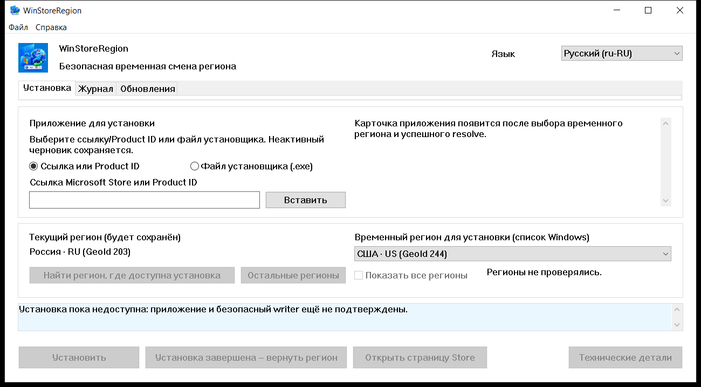
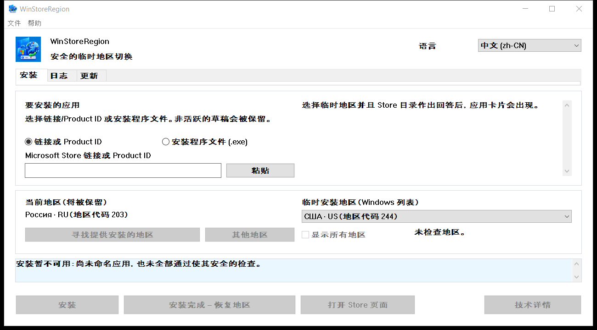

# WinStoreRegion


[](https://github.com/kroxiksut/win-store-region/actions/workflows/ci.yml)


Утилита для Windows, которая временно переключает регион Windows, отдаёт
установку приложения штатному механизму Microsoft Store и возвращает регион
обратно, дождавшись фактического результата.

Один portable-файл `WinStoreRegion.exe` для x64, около 1,3 МБ. Прав
администратора не требует и не запрашивает.

[English](README.md) · **Русский** · [简体中文](README.zh-CN.md) · [Изменения](CHANGELOG.md)

Основной язык документации — английский.



<details>
<summary>То же окно на английском и на китайском</summary>




</details>

Названия регионов приходят от самой Windows и на том языке, на котором она их
называет, — поле поэтому и подписано «список Windows», и поэтому же в китайском
окне регионы остаются русскими. Снимки сделаны на русской Windows при масштабе
125 %.

## Содержание

- [Зачем это нужно](#зачем-это-нужно)
- [Что делает и чего не делает](#что-делает-и-чего-не-делает)
- [Что проверено на самом деле](#что-проверено-на-самом-деле)
- [Требования](#требования)
- [Как пользоваться](#как-пользоваться)
- [Запуск из командной строки](#запуск-из-командной-строки)
- [Когда Store не обслуживает ваш регион](#когда-store-не-обслуживает-ваш-регион)
- [Поиск региона по рынкам](#поиск-региона-по-рынкам)
- [Вкладка «Обновления»](#вкладка-обновления)
- [Журнал операций](#журнал-операций)
- [Где хранятся данные](#где-хранятся-данные)
- [Если что-то пошло не так](#если-что-то-пошло-не-так)
- [Ограничения и открытые вопросы](#ограничения-и-открытые-вопросы)
- [Переводы](#переводы)
- [Сборка из исходников](#сборка-из-исходников)
- [Лицензия](#лицензия)
- [Правовые уведомления](#правовые-уведомления)

## Зачем это нужно

Регион Windows — это настройка, а не место жительства, и расходятся они
постоянно. Человек может жить в США, но держать русскоязычную Windows с
регионом «Россия»: Microsoft Store в этом случае не предлагает ему приложения,
доступные в его настоящей стране — те же кинотеатры и стриминговые сервисы.

Смену страны или региона Microsoft описывает у себя как штатную процедуру:
[Change your country or region in Microsoft Store](https://support.microsoft.com/en-us/account-billing/change-your-country-or-region-in-microsoft-store-5895e006-34f4-10f7-16b1-999e40adb048).
WinStoreRegion автоматизирует ровно её и ничего сверх того: меняется настройка
Windows, установку выполняет сам Microsoft Store, после чего настройка
возвращается на место. Меняется маршрут доставки приложения, а не механизм.
Эта же статья открывается из программы: «Справка → Microsoft: смена страны или
региона».

Ручной путь выглядит так: сменить регион в параметрах, дождаться, пока Store
подхватит изменение, найти приложение, запустить установку, не забыть вернуть
регион и не перепутать, каким он был. Последний шаг и есть источник проблем:
регион легко оставить чужим, а прерванная на середине операция не оставляет
следов. Эта утилита делает те же шаги, но записывает исходный регион на диск
до первого изменения и возвращает его даже после сбоя или перезапуска.

## Что делает и чего не делает

Делает:

- сохраняет текущий регион Windows на диск до того, как что-либо изменить;
- переключает регион и подтверждает переключение обратным чтением;
- находит приложение в каталоге уже под временным регионом;
- ещё до смены региона спрашивает каталог, может ли это устройство вообще
  получить этот продукт;
- запускает установку штатным механизмом и показывает ход работы;
- возвращает исходный регион, не дожидаясь конца установки, но только после
  подтверждения, что установка действительно началась;
- подтверждает завершение по появлению пакета приложения, а не по коду возврата;
- скачивает у Microsoft её собственный установщик Store, когда штатный механизм
  установить приложение не может, и запускает его под временным регионом;
- ведёт локальный журнал операций и диагностический лог;
- восстанавливает регион при следующем запуске, если предыдущий сеанс оборвался.

Не делает:

- не меняет регион учётной записи Microsoft;
- не меняет IP-адрес и не подменяет сетевое расположение;
- не скачивает пакеты Store с неофициальных серверов;
- не модифицирует Windows и Microsoft Store, ничего не патчит и не обходит;
- не гарантирует обход всех ограничений: доступность приложения определяет
  Microsoft Store, а не эта утилита;
- не является продуктом Microsoft.

Последствия того, что регион на время отличается от прежнего, остаются на
стороне пользователя: содержимое и подписки, купленные в одном регионе, в
другом могут вести себя иначе. Утилита это не скрывает и на этот счёт ничего не
обещает.

## Что проверено на самом деле

Раздел существует потому, что «работает» — это утверждение, а утверждения в
этом проекте обязаны называть своё доказательство.

Полный цикл пройден целиком и на Windows 10, и на Windows 11: регион записан до
первого изменения, сменён и подтверждён обратным чтением, приложение найдено под
временным регионом, установлено с показом хода работы, регион возвращён рано, а
завершение подтверждено появлением пакета приложения, а не кодом возврата. Так
же пройдены передача установщику, скачивание установщика Store по Product ID с
проверкой подписи и подписанта и отказ от продукта, который каталог не выдаёт
этому устройству. Все неуспешные прогоны до сих пор заканчивались возвращённым
регионом и снятой записью восстановления.

Какие это версии Windows — вопрос не проверок, а того, чего требует код:
манифест объявляет Windows 10 и Windows 11, а нижнюю границу внутри этого
диапазона задаёт App Installer — Windows 10 1809. См.
[Требования](#требования).

Что **не** проверено — и так и сказано:

- **Прогон на машине, отличной от машины разработчика**, после того как были
  доделаны пути через кнопки.
- **Обновляет ли установщик Store уже установленное приложение.** Поэтому
  вкладка «Обновления» показывает и объясняет, но не предлагает обновление одним
  нажатием. См. [Ограничения](#ограничения-и-открытые-вопросы).
- **Внешний вид при масштабе 150 %.** Раскладка проверена арифметически на
  100–200 %, но это не отвечает на вопрос, влезает ли подпись в кнопку.
- **Сборки ARM64 и 32-битная x86 на живых устройствах.** Непрерывная интеграция
  собирает все три архитектуры на каждый push, то есть собираются они все; но ни
  одна из этих двух не запускалась на настоящем устройстве, и поставляется
  только x64.
## Требования

- **Windows 10 версии 1809 (сборка 17763) и новее либо любая Windows 11.**
  Нижнюю границу задаёт App Installer: в нём живёт COM-интерфейс установки, и
  сам он требует 1809. Всё остальное, что вызывает программа, старше —
  `GetDpiForWindow` нужен 1607, PerMonitorV2 — 1703. Манифест объявляет
  поддержку Windows 10 и 11. Проверялось на Windows 10 22H2 и, ранее в
  разработке, на Windows 11.
- x64. На ARM64-устройствах x64-сборка работает через эмуляцию Windows; нативная
  ARM64-сборка собирается из тех же исходников (см.
  [Сборка из исходников](#сборка-из-исходников)).
- **App Installer** (пакет `Microsoft.DesktopAppInstaller`) — через него работает
  установка. Если его нет, утилита скажет об этом и предложит открыть страницу
  установки.
- **Microsoft Store** (пакет `Microsoft.WindowsStore`).
- Каталог, из которого запущен `.exe`, должен быть доступен на запись: при
  первом запуске рядом с программой появляется файл
  `Microsoft.Management.Deployment.winmd`, скопированный из установленного App
  Installer. Без него COM-интерфейсы установки недоступны. Программа не
  копирует себя в другое место, чтобы обойти это ограничение, а честно сообщает
  о невыполненном условии.
- Права администратора не нужны.

**Исполняемый файл не подписан, и Windows об этом скажет.** При первом запуске
SmartScreen показывает «Windows защитила ваш компьютер» и прячет кнопку запуска
за **Подробнее → Выполнить в любом случае**. Так Windows поступает с любым
исполняемым файлом без подписи Authenticode и без репутации загрузок; это не
утверждение об этом файле. Отсюда два следствия, и оба — предмет вашего решения:

- Предупреждение снимается только подписью релиза сертификатом для подписи кода.
  Ничто в сборке его не подавляет, и здесь этого не пытаются сделать.
- Проверить вместо доверия можно происхождение. Каждая сборка публикует SHA-256
  собранного бинарника — в сводке прогона и файлом рядом с ним внутри артефакта,
  — а сам прогон публичен. Сверьте то, что у вас, командой
  `Get-FileHash .\WinStoreRegion.exe -Algorithm SHA256`: файл либо тот самый,
  который собрал этот прогон, либо не тот.

У файла, скачанного браузером, остаётся метка, из-за которой SmartScreen
вмешивается и после распаковки. Снять её: `Unblock-File .\WinStoreRegion.exe`
в PowerShell либо **Свойства → Разблокировать**. Если разблокировать архив до
распаковки, файлы внутри выйдут уже чистыми.

## Как пользоваться

1. Укажите приложение на вкладке «Установка»: ссылку Microsoft Store или
   Product ID. Файл установщика Store (`.exe`) можно перетащить в окно — он
   проверяется на доверенную подпись Microsoft и запускается под временным
   регионом, но опознать его нельзя: такой файл не содержит Product ID в
   открытом виде, поэтому какое приложение он поставит — это ваше утверждение,
   а не факт, который программа может проверить.
2. Выберите временный регион. Как только Product ID разобран, утилита
   спрашивает у источника карточку приложения под выбранным регионом — имя,
   издателя и способ доставки видно до того, как регион будет изменён.
3. Если приложение недоступно в выбранном регионе, нажмите «Найти регион, где
   доступна установка». Утилита опросит около сорока основных рынков и оставит
   в списке те, где приложение действительно предлагается. Кнопка «Остальные
   регионы» доводит проверку до полного перечня, «Показать все регионы»
   возвращает исходный список.
4. Нажмите «Установить». Дальше утилита работает сама: меняет регион,
   подтверждает изменение чтением, находит приложение, отдаёт установку Store,
   показывает прогресс и возвращает регион.
5. Итог операции попадает на вкладку «Журнал».

Кнопки «Отменить установку» нет намеренно. Установкой управляет Windows:
остановить или удалить приложение можно в Microsoft Store либо в «Параметры →
Приложения». Диалог закрытия окна во время операции сообщает об этом.

Интерфейс работает с клавиатуры, учитывает масштабирование экрана и переключает
язык без перезапуска между теми, что есть в сборке.

## Запуск из командной строки

Режима без окна нет. Командная строка решает только одно: с чем окно откроется —
один необязательный адрес приложения, подставленный в поле на вкладке
«Установка». Ничего не запускается: регион не трогается и установка не
начинается, пока вы не нажмёте кнопку.

```powershell
# Открыть окно с пустым полем.
.\WinStoreRegion.exe

# Открыть с уже подставленным Product ID.
.\WinStoreRegion.exe 9WZDNCRFJ3PZ

# Веб-адрес Store делает то же самое.
.\WinStoreRegion.exe https://apps.microsoft.com/detail/9WZDNCRFJ3PZ

# И URI ms-windows-store тоже.
.\WinStoreRegion.exe "ms-windows-store://pdp/?productid=9WZDNCRFJ3PZ"

# Адрес с & берите в кавычки — PowerShell считает & своим оператором.
.\WinStoreRegion.exe "https://apps.microsoft.com/detail/9WZDNCRFJ3PZ?hl=ru-ru"

# Напечатать справку и выйти, не открывая окна.
.\WinStoreRegion.exe --help
.\WinStoreRegion.exe -h
```

Переданное значение только *кладётся* в поле. Разбирается оно уже при открытии
окна, поэтому про значение, которое не является ни Product ID, ни адресом Store,
скажет окно, а не приглашение командной строки.

Коды возврата — на случай, если запускает скрипт:

| Код | Что означает |
|---|---|
| `0` | Окно отработало и закрылось либо `--help` напечатал справку. |
| `1` | Графический интерфейс не удалось запустить. |
| `2` | Командная строка неверна. |

Неверной она бывает ровно в двух случаях, и оба называют себя, прежде чем
повторить справку в стандартный поток ошибок:

```powershell
PS> .\WinStoreRegion.exe --install
Unknown option: --install

Usage:
...

PS> .\WinStoreRegion.exe 9WZDNCRFJ3PZ 9N1SV6841F0B
Only one application input is allowed.

Usage:
...
```

Две детали стоит знать. Программа оконная, поэтому для этих сообщений она
подключается к консоли, из которой её запустили; если консоли нет — запуск из
диалога «Выполнить» или с ярлыка — тот же текст показывается диалоговым окном.
И текст командной строки — **английский при любом языке интерфейса**: язык
выбирается внутри окна, которого в момент разбора аргументов ещё нет, а угадывать
по языку системы значило бы отвечать на языке, которого никто не выбирал.

## Когда Store не обслуживает ваш регион

Некоторые продукты штатный механизм установить не может даже под правильным
регионом. Тогда окно предлагает второй путь — **«Скачать установщик Store»**.

Утилита просит у Microsoft тот же подписанный установщик, который человек
получил бы со страницы Store, адресуя его по Product ID. Дальше файл
обрабатывается ровно так же, как выбранный руками: тот же гейт подписи, то же
подтверждение с именем, издателем и SHA-256, та же транзакция региона.

Три вещи про этот путь стоит знать, и все они измерены, а не предположены:

- Скачивание **не зависит от региона**, поэтому файл берётся, пока машина ещё
  держит ваш собственный регион. Временный нужен только для запуска.
- Установщик открывает **своё окно и молча не ставит**. Установку вы доводите
  в нём, и только потом нажимаете «Вернуть регион».
- Так как работу выполняет сам Microsoft Store и нам ничего не сообщает, этот
  путь **никогда** не может утверждать, что приложение установлено. В журнале
  он записывается как «передано установщику» — то, что произошло на самом деле.

Скачанные установщики не хранятся: они удаляются по завершении handoff и ещё
раз при следующем запуске, потому что файл всегда можно взять заново, а папку
с установщиками Store никто копить не просил.

## Поиск региона по рынкам

Каталог Microsoft Store отвечает только про регион, действующий прямо сейчас,
поэтому приложение, которого нет в домашнем регионе, до смены региона обычно
вообще не показывается. Утилита обходит это, спрашивая источник напрямую по
каждому рынку, и различает три ответа: приложение предлагается, приложение не
предлагается, ответ не получен. Третий случай не выдаётся за отказ — рынок,
который не удалось проверить, вполне может оказаться нужным.

Набор из сорока рынков намеренно неполный, и утилита это пишет прямо. Полный
перечень — примерно двести пятьдесят запросов, поэтому он выполняется вторым
шагом и только по явной команде.

Ответ источника — это справка, а не разрешение на установку: внутри операции
приложение всё равно ищется заново под тем регионом, который реально
установлен.

## Вкладка «Обновления»

Microsoft Store не будет обновлять приложение, которое он не обслуживает в
вашем текущем регионе. Вкладка «Обновления» находит именно такие: перечисляет
установленные приложения Store, чей продукт источник в вашем регионе отвергает,
предлагая его в другом, — и показывает установленную версию рядом с той, что
предлагает каталог.

Чего вкладка намеренно **не** утверждает — что обновление вышло. Этому мешают
два измеренных факта:

- `winget` не умеет обновлять продукты Store вообще. На попытку он отвечает
  «доступные обновления не найдены», потому что источник `msstore` сообщает
  версию как `Unknown`.
- Два номера версии не всегда сопоставимы. Каталог нумерует бандл независимо от
  пакета внутри него, а издатели меняют схемы нумерации. Показывается та версия,
  которая реально попадёт на эту машину, — она читается изнутри бандла, а не из
  его имени.

Поэтому вкладка показывает оба числа и утверждает только доказуемое: Store в
этом регионе этот продукт не обслуживает. Действие по записи переносит её
Product ID на вкладку «Установка» и запускает поиск регионов; обновление — не
отдельный вид операции, и все гейты остаются там же, где были.

Результаты проверки запоминаются между запусками и показываются с временем,
когда были получены, и только для того же региона.

## Журнал операций

На вкладке «Журнал» видно, что было установлено: приложение, Product ID, тип,
регион, под которым приложение было найдено, дата, версия и результат.
Незавершённые и неопределённые операции показываются отдельно и заметно —
именно они требуют внимания.

Для выбранной записи доступны только безопасные действия: открыть страницу
приложения в Store, перенести Product ID в новый черновик установки,
скопировать Product ID и удалить локальную запись. Ни одно из них не запускает
установку и не меняет регион.

## Где хранятся данные

Всё лежит в профиле пользователя, в каталоге `%LOCALAPPDATA%\WinStoreRegion`:

| Файл | Назначение |
|---|---|
| `journal.json` | журнал операций: что, когда, под каким регионом и с каким результатом |
| `pending-restore.json` | запись восстановления, существует только пока регион временно изменён |
| `updates-scan.json` | последняя проверка обновлений, чтобы повторное открытие окна не стоило сети |
| `installers\` | установщик Store, который передаётся прямо сейчас; очищается по завершении |
| `logs\winstoreregion.log` | диагностический лог с ротацией |

Телеметрии нет. В лог не попадают ни содержимое буфера обмена, ни введённый
текст, ни полные пути к файлам: выбранный файл записывается именем и хешем
SHA-256.

## Если что-то пошло не так

Регион остаётся временным ровно до подтверждённого возврата. Если процесс
завершился аварийно или машина перезагрузилась, при следующем запуске утилита
найдёт запись восстановления, сообщит об этом и предложит вернуть исходный
регион либо оставить текущий. Пока такая запись не разобрана, новая установка
не начинается.

Установка, начатая предыдущим запуском, переживает гибель процесса: её выполняет
служба Windows. При старте утилита это обнаруживает и продолжает наблюдение
вместо того, чтобы считать операцию брошенной.

Ход каждой операции пишется в диагностический лог: старт, запись восстановления,
смена региона с обоими значениями и результатом обратного чтения, поиск
приложения, ответ механизма установки с его кодами, фазы установки, возврат
региона и итог. Меню «Справка → Открыть диагностический лог» открывает каталог
с этим файлом; «Справка → Скопировать детали» кладёт в буфер обмена технический
блок текущей ошибки.

## Ограничения и открытые вопросы

- Устанавливаются только приложения, которые Store доставляет как пакеты
  Microsoft Store. Приложения с собственным установщиком Win32 не поддерживаются:
  для них нельзя доказать завершение установки, а установка, которую никто не
  может проверить, предлагаться не должна.
- У вкладки «Обновления» нет кнопки обновления одним нажатием. Обновляет ли
  установщик Store уже установленное приложение — не измерено, а кнопка, которая
  может ничего не делать, хуже отсутствия кнопки.
- **Открытый дефект:** 21.08.2026 Windows закрыла окно как переставшее отвечать
  после пяти неудачных операций подряд. Транзакция региона при этом не
  пострадала — регион был возвращён в каждой из них, — то есть дефект в
  интерфейсе, а не в модели. С тех пор не воспроизводился, а сборка, на которой
  это случилось, предшествует нескольким исправлениям; причина неизвестна и
  здесь не угадывается.
- Языки интерфейса — русский, английский и упрощённый китайский. Китайский
  текст — машинный черновик, который не читал ни один носитель языка; об этом
  сказано в начале самого файла.
- Одновременно работает один экземпляр программы.

## Переводы

Язык — это файл. `lang/ru.toml`, `lang/en.toml` и всё, что вы добавите:
скопируйте любой, переведите значения, пришлите pull request. Писать на Rust не
нужно — сборка читает этот каталог и генерирует список языков, выпадающий список
и таблицы, поэтому `lang/zh.toml` — это всё, что требуется, чтобы предложить
китайский.

**Новый язык одобряется без вычитки текста**, потому что прочитать его здесь
некому. Проверяется структура, и проверяет её сборка: пропущенный ключ, лишний
ключ, список другой длины и строка, у которой `{подстановки}` отличаются от
оригинала, одинаково ломают сборку. После одобрения сопровождающий планирует
выпуск с этим языком.

Раз вычитки нет, одно правило важнее остальных. Многие строки здесь намеренно
осторожны: они говорят, что завершение **не доказано**, что ответ получен только
от одного рынка, что набор неполный. Эти оговорки — то, что делает программу
заслуживающей доверия, и перевод обязан их сохранить, даже если более смелая
фраза читается лучше.

По той же причине уже выпущенные языки — самые вероятные носители ошибок.
**Если вы читаете один из них и что-то не так — заведите, пожалуйста, issue**:
неверный перевод, обрезанная подпись, потерянная оговорка или просто неестественная
формулировка. Назовите язык и ключ; предложенный вариант приветствуется, но не
обязателен. Pull request решает ту же задачу, а issue — намеренно низкий порог.

Переводчик называется в поле `authors` языкового файла, и это имя показывается в
«Справка → О программе» рядом с языком — под автором и лицензией самой программы.
Кредит генерируется из файла, поэтому не может разойтись с работой.

Перевод — такой же вклад, как код: принимается под **GPL-3.0-or-later** и ни под
какой другой лицензией, авторские права остаются за вами, права на смену
лицензии проект не получает.

Языковой файл покрывает всё, что видно на экране: и подписи, и статусы, и
диагностику, и диалоги. Не покрывает он только командную строку — она английская
при любом языке, потому что аргументы разбираются раньше, чем выбран язык.
Полный список шагов — в [CONTRIBUTING.md](CONTRIBUTING.md#translations).

## Сборка из исходников

Нужен стабильный Rust 1.85 или новее для `x86_64-pc-windows-msvc`.

```
cargo build --release
cargo test
cargo clippy --all-targets
cargo fmt --all --check
```

Другие архитектуры собираются из тех же исходников добавлением цели; на машине
должен стоять соответствующий компонент MSVC. Манифест приложения не привязан к
архитектуре, поэтому больше ничего менять не нужно:

```
rustup target add aarch64-pc-windows-msvc
cargo build --release --target aarch64-pc-windows-msvc

rustup target add i686-pc-windows-msvc
cargo build --release --target i686-pc-windows-msvc
```

Ни одна из них не запускалась на настоящем устройстве своей архитектуры,
поэтому в релиз пока не выкладывается. Они собираются — и это всё, что
утверждается.

Часть тестов помечена `#[ignore]`: они меняют регион Windows, ставят приложения
или ходят в сеть. Тесты, меняющие регион, запускаются только на выделенной
тестовой машине.

## Лицензия

GPL-3.0-or-later.

## Правовые уведомления

Проект независим от Microsoft: не аффилирован с ней, не одобрен и не
поддерживается ею. Названия Microsoft, Windows, Microsoft Store и WinGet
используются только для точного описания совместимости и назначения программы.
Логотипы и фирменное оформление Microsoft не используются.

WinStoreRegion не меняет регион учётной записи Microsoft, не меняет IP-адрес,
не скачивает пакеты Microsoft Store с неофициальных серверов и не гарантирует
обход всех ограничений доступности.
