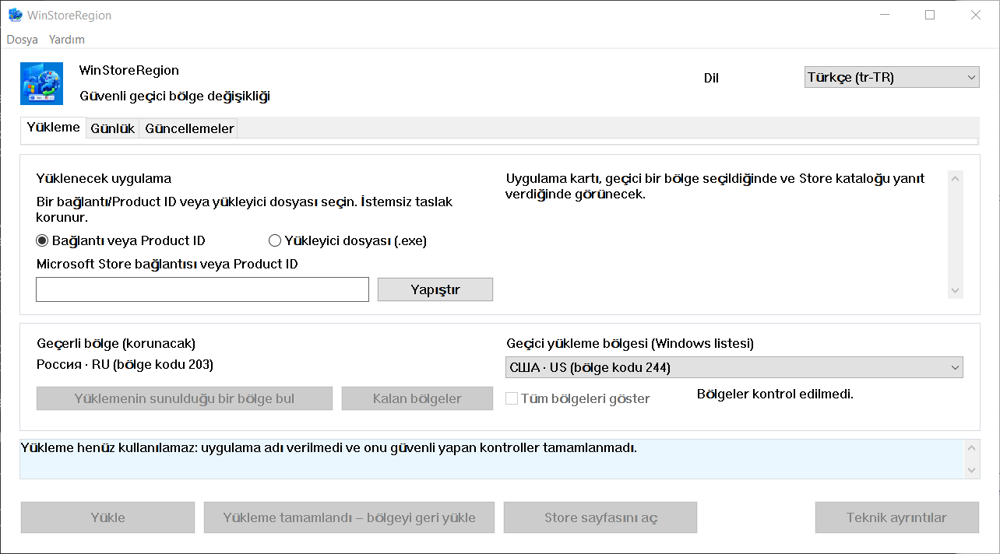

# WinStoreRegion


[](https://github.com/kroxiksut/win-store-region/actions/workflows/ci.yml)


Windows bölgesini tek bir kurulum süresince değiştiren, kurulumu Microsoft Store'un kendi mekanizmasına devreden ve bölgeyi gerçek sonucu gördükten sonra geri koyan bir Windows yardımcı programıdır.

Yaklaşık 2 MB'lık taşınabilir `WinStoreRegion.exe`, x64, ARM64 ve 32-bit x86 için yayımlanır. Yönetici haklarına ihtiyaç duymaz ve talep etmez. Yalnızca x64 derlemesi çalıştırılmıştır — [aslında doğrulanan](#aslında-doğrulanan-nedir)'i inceleyin.

[العربية](README.ar.md) · [English](README.md) · [Español](README.es-ES.md) · [فارسی](README.fa.md) · [日本語](README.ja.md) · [한국어](README.ko.md) · [Português](README.pt-BR.md) · [Русский](README.ru.md) · **Türkçe** · [简体中文](README.zh-CN.md) · [繁體中文](README.zh-TW.md)

[Değişiklikler](CHANGELOG.md)

> Bu belge makine tarafından çevirilen bir metindir ve hiçbir Türkçe konuşan kişi tarafından gözden geçirilmemiştir. Bu proje çevirileri incelemez; bu nedenle İngilizceden yanlış olma olasılığı daha yüksektir. Bir hata bulursanız, lütfen bir konu açın veya çekme isteği gönderin. [İngilizce](README.md) sürümü yetkilidir.



Bölge adları Windows'ün kendi sözleşkesinden gelir — bu nedenle alan "Windows listesi" olarak etiketlenmiştir ve yukarıdaki pencere bölgeleri Rusça olarak adlandırmaya devam eder. Ekran görüntüsü %125 ölçeklemede Rusça Windows'ten alınmıştır.

## İçindekiler

- [Neden var olduğu](#neden-var-olduğu)
- [Neleri yapar ve neleri yapmaz](#neleri-yapar-ve-neleri-yapmaz)
- [Aslında doğrulanan nedir](#aslında-doğrulanan-nedir)
- [Gereksinimler](#gereksinimler)
- [Nasıl kullanılır](#nasıl-kullanılır)
- [Komut satırından başlatma](#komut-satırından-başlatma)
- [Store bölgenizi hizmet vermediğinde](#store-bölgenizi-hizmet-vermediğinde)
- [Pazara göre bölge bulma](#pazara-göre-bölge-bulma)
- [Güncellemeler sekmesi](#güncellemeler-sekmesi)
- [İşlem günlüğü](#i̇şlem-günlüğü)
- [Veriler nerede tutulur](#veriler-nerede-tutulur)
- [Birşeyler ters gitse](#birşeyler-ters-gitse)
- [Bilinen sınırlamalar ve açık sorunlar](#bilinen-sınırlamalar-ve-açık-sorunlar)
- [Çeviriler](#çeviriler)
- [Kaynaktan derleme](#kaynaktan-derleme)
- [Lisans](#lisans)
- [Yasal bildirimler](#yasal-bildirimler)

## Neden var olduğu

Windows bölgesi bir konum değil, bir ayardır ve ikisi sürekli farklı kalır. Birisi Amerika Birleşik Devletleri'nde yaşayabilir ve bölgesi Rusya olarak ayarlı Rusça Windows çalıştırabilir: Microsoft Store o zaman gerçek ülkesinde bulunan uygulamaları sunmaz — akış hizmetleri vb.

Microsoft, ülke veya bölgeyi değiştirmeyi olağan bir prosedür olarak belgelemiştir:
[Change your country or region in Microsoft Store](https://support.microsoft.com/en-us/account-billing/change-your-country-or-region-in-microsoft-store-5895e006-34f4-10f7-16b1-999e40adb048).
WinStoreRegion bunu otomatikleştirir ve başka hiçbir şey yapmaz: Windows ayarı değişir, Microsoft Store kurulumu gerçekleştirir ve ayar geri döner.
Değişen şey uygulamanın teslim yoludur, mekanizması değil. Aynı makale programdan açılır: **Yardım → Microsoft: ülke veya bölgeyi değiştir**.

El ile prosedür şöyledir: Ayarlar'da bölgeyi değiştirin, Store'un farkına varmasını bekleyin, uygulamayı bulun, kurulumu başlatın, bölgeyi geri koymayı unutmayın ve hangisi olduğunu unutmayın. Son adım sorunun kaynağıdır: bölge yabancı olarak bırakılması kolaydır ve yarıda kesilen bir işlem hiç iz bırakmaz. Bu yardımcı program aynı adımları gerçekleştirir, ancak herhangi bir şey değiştirilmeden önce orijinal bölgeyi diske yazılır ve çökme veya yeniden başlatma sonrasında bile geri yüklenir.

## Neleri yapar ve neleri yapmaz

Yapar:

- geçerli Windows bölgesini diske yazılır, herhangi bir şey değiştirilmeden önce;
- bölgeyi değiştirir ve değişikliği geri okuyarak doğrular;
- geçici bölge altında uygulama kataloğunda arar;
- bölgeyi değiştirmeden önce, kataloga bu cihazın ürünü hizmet alıp alamayacağını sorar;
- kurulumu olağan mekanizmayla başlatır ve ilerleme gösterir;
- kurulumun fiilen başladığını doğruladıktan sonra, ancak kurulumun bitişini beklemeden orijinal bölgeyi geri yükler;
- tamamlamayı bir dönüş kodundan değil, uygulamanın paketinin görünmesiyle doğrular;
- olağan mekanizma kurulum yapamadığında Microsoft'un kendi Store yükleyicisini alır ve geçici bölge altında çalıştırır;
- yerel bir işlem günlüğü ve tanı günlüğü tutar;
- önceki oturum kesilidiyse sonraki başlangıçta bölgeyi geri yükler.

Yapmaz:

- Microsoft hesabınızın bölgesini değiştirmez;
- IP adresinizi değiştirmez veya ağ konumunuzu sahte yapmaz;
- Store paketlerini resmi olmayan sunuculardan indirmez;
- Windows veya Microsoft Store'u değiştirmez, hiçbir şeyi yamalamaz veya atlatmaz;
- her kısıtlamayı yenmek için söz vermez: mevcut olanı Microsoft Store'un kararı, bu yardımcı programın değil;
- Microsoft'dan değildir.

Bölgenin bir süre farklı olmasının sonuçları kullanıcı sorumluluğundadır:
bir bölgede satın alınan içerik ve abonelikler başka bir bölgede farklı davranabilir. Yardımcı program bunu gizlemez ve bunun hakkında hiçbir şey vaat etmez.

## Aslında doğrulanan nedir

Bu bölüm var çünkü "çalışır" bir iddidir ve bu projede iddialar kanıtlarını belirtmesi beklenir.

Tüm döngü Windows 10 ve Windows 11'de uçtan uca uygulanmıştır:
bölge herhangi bir şey değişmeden önce kaydedilmiştir, değiştirilmiş ve geri okuyarak doğrulanmıştır, uygulama geçici bölge altında aranmıştır, ilerleme ile kurulmuştur, bölge erken geri yüklenir ve tamamlama bir dönüş kodundan değil, uygulamanın paketinin görünmesiyle doğrulanır. İşlem yolu, Product ID tarafından getirilen Store yükleyicisi imza ve imzalayan tarafından denetlenmiş ve bu cihazın alamayacağını söyleyen katalogdan bir ürünün reddi aynı şekilde uygulanmıştır. Şimdiye kadar olan her başarısız çalışma, bölge geri yüklenen ve kurtarma kaydı temizlenen durumuyla sonuçlanmıştır.

Windows'ün hangi sürümleri olduğu test konusu değil, kodun gerektirdiği konudur: bildirim Windows 10 ve Windows 11'i bildirir ve bu aralığın alt sınırı App Installer tarafından belirtilen Windows 10 1809'dur. [Gereksinimler](#gereksinimler)'e bakın.

Doğrulanmadı ve açıkça belirtildi:

- **Geliştirici bilgisayarı dışında bir makinede çalıştırılan hiçbir şey** düğmeyle yönetilen yollar tamamlandığından beri.
- **Store yükleyicisinin zaten kurulu olan bir uygulamayı güncelleyip güncellemediği.** Bu nedenle Güncellemeler sekmesi listeler ve açıklar, tek tıklamayla güncelleme sunmaz. [Bilinen sınırlamalar](#bilinen-sınırlamalar-ve-açık-sorunlar)'ı inceleyin.
- **%150 ölçeklemede görünüş.** Düzen %100–200'de aritmetik olarak denetlenir, bu bir başlığın bir düğmenin içine sığıp sığmadığını söyleyemez.
- **Gerçek cihazlarda ARM64 ve 32-bit x86 derlemeleri.** Her üç mimari de her itişte yapılır ve her sürümle yayımlanır, bu nedenle derlenir.
Hiçbiri gerçek bir cihazda başlatılmamış. Makinenin onları çalıştırabileceği tek yol olan değişiklikler nedeniyle sunulur, çünkü burada bir şey çalıştığını söyleyen değildir.

## Gereksinimler

- **Windows 10 sürümü 1809 (yapı 17763) veya üzeri, veya herhangi bir Windows 11.** Alt sınır App Installer tarafından belirtilir, yükleme COM arabirimini taşır ve kendisi 1809'u gerektirir; bunun dışında bu program çağırdığı her şey daha eski — `GetDpiForWindow` 1607'yi gerektirir ve monitor başına v2 ölçekleme 1703'ü gerektirir. Bildirim Windows 10 ve 11 desteği bildirir. Windows 10 22H2'de ve geliştirme sırasında daha önce Windows 11'de test edilmiştir.
- x64, ARM64 veya 32-bit x86. Her sürüm üçünü taşır. ARM64 cihazında x64 derlemesi de Windows öykünmesi altında çalışır, bu x64 donanımında uygulanmış olan yoldur.
- **App Installer** (`Microsoft.DesktopAppInstaller`) — kurulum onun aracılığıyla çalışır. Onsuz yardımcı program bunu söyler ve mağaza sayfasını açmayı teklif eder.
- **Microsoft Store** (`Microsoft.WindowsStore`).
- `.exe` çalıştırılan dizin yazılabilir olmalıdır: ilk başlatmada `Microsoft.Management.Deployment.winmd` bir kopyası program yanında görünür, yüklü App Installer'dan alınır. Onsuz yükleme COM arabirimleri kullanılamaz. Program bunun etrafında çalışmak için kendisini başka bir yere kopyalamaz — bunun yerine karşılanmayan durumu rapor eder.
- Yönetici hakları yok.

**İkili imzalanmaz ve Windows bunu söyler.** İlk çalıştırmada SmartScreen "Windows bilgisayarınızı korudu" gösterir ve çalıştırma düğmesini **Daha fazla bilgi → Yine de çalıştır** arkasında gizler. Bu, hiçbir Authenticode imzası ve indirme itibarı taşımayan herhangi bir yürütülebilir dosya için Windows'ün yaptığıdır; bu dosya hakkında bir beyan değildir. İkisi birbirini izler ve her ikisini de tartmak size bırakılır:

- Uyarı yalnızca kod imzalama sertifikasıyla sürüm imzalanarak kaldırılır. Derleme hiçbir şey bastıramaz ve burada hiçbir şey denemez.
- Bunun yerine denetlenebilir şey kimlik. Her derleme ürettiği ikili dosyanın SHA-256'sini yayımlar — çalıştırma özeti içinde ve artefakt içindeki ikili dosyasının yanında bir dosyada — ve çalıştırma herkese açıktır. Sahip olduğunuz şeyi `Get-FileHash .\WinStoreRegion.exe -Algorithm SHA256` ile karşılaştırın ve dosya derlenmiş olanı veya değildir.

Tarayıcıdan indirilen bir dosya çıkarılmadan sonra SmartScreen'i ilgilendiren bir işaret de taşır. `Unblock-File .\WinStoreRegion.exe` PowerShell'de veya **Özellikler → Kilit Aç**'ta, bu işareti kaldırır. Dosyaları çıkarmadan önce arşivin kilidini açın ve içindeki dosyalar temiz çıkar.

## Nasıl kullanılır

1. **Yükleme** sekmesinde uygulamayı adlandırın: bir Microsoft Store bağlantısı veya bir Product ID. Bir Store yükleyicisi dosyası (`.exe`) de pencereye bırakılabilir; Microsoft'un güvenli bir imzası için denetlenir ve geçici bölge altında çalıştırılır, ancak tanımlanamaz — böyle bir dosya okunabilir Product ID taşımaz, bu nedenle kurduğu uygulama sizin talebiniz, bu programın denetleyebileceği bir gerçek değildir.
2. Geçici bir bölge seçin. Product ID ayrıştırıldığı anda, yardımcı program kaynaktan o bölge altındaki uygulamanın kartını sorar — ad, yayımcı ve teslim türü herhangi bir şey değişmeden önce görülebilir.
3. Uygulama seçilen bölgede sunulmuyorsa, **Kurulumun sunulduğu bir bölge bulun**'a basın. Yaklaşık kırk ana pazara sorulur ve liste gerçekten sunanlar kadar daralır. **Kalan bölgeler** süpürmeyi tamamlar; **Her bölgeyi göster** tam listeyi geri yükler.
4. **Kur**'a basın. Buradan yardımcı program kendi başına çalışır: bölgeyi değiştirir, değişikliği geri okuyarak doğrular, uygulamayı bulur, kurulumu Store'a devreder, ilerleme gösterir ve bölgeyi geri yükler.
5. Sonuç **Günlük** sekmesinde görünür.

Kasıtlı olarak "kurulumu iptal et" düğmesi yok. Windows kuruluma sahiptir: Microsoft Store veya **Ayarlar → Uygulamalar**'da durdurulabilir veya kaldırılabilir. İşlem sırasında pencere kapatılırken gösterilen diyalog bunu söyler.

Arayüz klavyeden çalışır, ekran ölçeklendirmesini onurlandırır ve hiçbir yeniden başlatma olmadan taşıdığı diller arasında geçiş yapar.

## Komut satırından başlatma

Başsız mod yok. Komut satırı yalnızca pencerenin açıldığı şeyi belirler — bir isteğe bağlı uygulama girdisi, Yükleme sekmesine önceden doldurulmuş. Hiçbir şey başlatmaz: bölge dokunulmaz ve düğmeye basana kadar kurulum başlamaz.

```powershell
# Pencereyi hiçbir şey doldurulmadan açın.
.\WinStoreRegion.exe

# Alanda zaten bir Product ID ile açın.
.\WinStoreRegion.exe 9WZDNCRFJ3PZ

# Bir Store web adresi aynı şeyi yapar.
.\WinStoreRegion.exe https://apps.microsoft.com/detail/9WZDNCRFJ3PZ

# ms-windows-store URI de öyle.
.\WinStoreRegion.exe "ms-windows-store://pdp/?productid=9WZDNCRFJ3PZ"

# & içeren bir adresi alıntı yapın — PowerShell bunu kendi operatörü olarak değerlendirir.
.\WinStoreRegion.exe "https://apps.microsoft.com/detail/9WZDNCRFJ3PZ?hl=en-us"

# Kullanımı yazdırın ve pencere açmadan çıkın.
.\WinStoreRegion.exe --help
.\WinStoreRegion.exe -h
```

İletilen ne olursa olsun, yalnızca alana *depolanır*. Pencere açıldığı anda ayrıştırılır, bu nedenle bir Product ID veya Store adresi olmayan bir değer komut isteminde değil, pencerede raporlanır.

Çıkış kodları, bir komut dosyası onları istiyorsa:

| Kod | Anlamı |
|---|---|
| `0` | Pencere çalıştı ve kapandı, veya `--help` kullanımı yazdırdı. |
| `1` | Grafik arayüz başlatılamadı. |
| `2` | Komut satırı yanlıştı. |

Yalnızca iki şey kod `2` için yeterince yanlıştır ve ikisi de standart hataya kullanımı tekrarlamadan önce kendisini adlandırır:

```powershell
PS> .\WinStoreRegion.exe --install
Unknown option: --install

Usage:
...

PS> .\WinStoreRegion.exe 9WZDNCRFJ3PZ 9N1SV6841F0B
Only one application input is allowed.

Usage:
...
```

İki detay bilmeye değer. Yürütülebilir dosya pencerelenen bir programdır, bu nedenle bunları yazdırmak için onu başlatanKonsoluna bağlanır; birisi olmadan başlatılırsa — Çalıştır iletişim kutusundan veya bir kısayoldan — aynı metni bunun yerine iletişim kutusunda gösterir. Ve komut satırı metni **her arayüz dilinde İngilizce**: arayüz dili pencerede seçilir, bu argümanlar okunduğunda henüz mevcut değildir ve sistem dilinden tahmin etmek, kimse seçmeyen bir dilde yanıt verirdi.

## Store bölgenizi hizmet vermediğinde

Olağan mekanizmanın doğru bölge altında bile kuramadığı bazı ürünler vardır.
Bu olursa pencere bir saniye yol sunar: **Store yükleyicisini indirin**.

Yardımcı program Microsoft'tan, bir kişinin Store web sayfasından alacağı aynı imzalı yükleyiciyi sorar, Product ID tarafından adlandırılmış. Bu dosya daha sonra elinizle aldığınız gibi tam olarak işlenir — aynı imza kapısı, ad, yayımcı ve SHA-256 gösteren aynı onay, aynı bölge işlemi.

Bu yol hakkında bilmeye değer üç şey, hepsi varsayılan değil ölçülür:

- İndirme bölgenize bağlı değildir, bu nedenle dosya makine hala kendi bölgesi tutarken alınır. Yalnızca çalıştırmak geçiciye ihtiyaç duyar.
- Yükleyici kendi penceresini açar ve **sessiz kurulmaz**. Kurulumu orada bitirirsiniz ve ancak o zaman **Bölgeyi geri yükle**'ye basarsınız.
- Microsoft Store bu çalışmaya sahip olduğu ve geri bildirmediği için, bu yol hiçbir zaman bir uygulamanın kurulduğunu iddia edemez. Günlük bunu *yükleyiciye teslim edildi* olarak kaydeder, bu aslında oldu.

İndirilen yükleyiciler tutulmaz. Işın bitişinde ve bir sonraki başlangıçta silinir, çünkü dosya her zaman afresh alınabilir ve bir Store yükleyicisi klasörü kimsenin biriktirmesi için istemediği bir şeydir.

## Pazara göre bölge bulma

Microsoft Store kataloğu yalnızca şu anda geçerli olan bölge hakkında yanıt verir, bu nedenle ana bölgenizden eksik olan bir uygulama genellikle bölge değişmeden önce hiç görünmez. Yardımcı program bunu pazar başına kaynağa sorarak ve üç yanıtı ayırarak çalışır: sunulan, sunulmayan ve yanıt yok. Üçüncü hiçbir zaman bir reddetme olarak sunulmaz — ulaşılamayan bir pazar, ihtiyacınız olan olabilir.

Kırk pazarın seti kasıtlı olarak tamamlanmamıştır ve yardımcı program bunu söyler.
Tam liste yaklaşık iki yüz elli istektir, bu nedenle ikinci adım olarak çalışır ve yalnızca açık bir komuta göre.

Kaynağın cevabı, kurulum izni değil, bir referencedir: işlemin içinde uygulama aslında kuvvette olan bölge altında tekrar aranır.

## Güncellemeler sekmesi

Microsoft Store, mevcut bölgenizde hizmet vermediği bir uygulamayı güncellemez. Güncellemeler sekmesi bunları bulur: yüklü Store uygulamalarını listeler, bunların ürünü kaynak bölgenizde reddederken başka yerde sunarken, yanında yüklü sürüm ve katalog sunan sürüm vardır.

Sekmenin kasıtlı olarak **iddia etmediği** şey, bir güncellenin açıklandığı. İki gerçek yol engeller, her ikisi de ölçülür:

- `winget` hiçbir zaman bir Store ürünü güncelleyemez. Sorulursa, "uygulanabilir güncelleme yok" yanıtı verir, çünkü `msstore` kaynağı sürümü `Unknown` olarak bildirir.
- İki sürüm numarası her zaman karşılaştırılabilir değildir. Katalog paketi içine bağımsız olarak numaralandırır ve yayımcılar numaralandırma düzenlerini değiştirir. Gösterilen sürüm, adından değil, içindeki paketten okunan bu makineye gerçekten iniş olacak olandır.

Bu nedenle sekme her iki sayı da gösterir ve şu kanıtlanabilir durum: bu bölgenin Store bu ürünü hizmet vermez. Bir giriş üzerinde hareket etmek, Product ID'sini Yükleme sekmesine taşır ve bölge aramasını başlatır; güncelleme ayrı bir operasyon türü değildir ve her kapı zaten olduğu yerde durur.

Tarama sonuçları çalıştırmalar arasında hatırlanır ve alınan zamanla gösterilir, yalnızca aynı bölge için.

## İşlem günlüğü

**Günlük** sekmesi kurulu olan şeyi gösterir: uygulama, Product ID, tür, uygulama bulunan bölge, tarih, sürüm ve sonuç. Bitmemiş ve belirsiz işlemler öne çıkar — bunlar dikkat gerektiren işlemlerdir.

Yalnızca seçili giriş için güvenli eylemler sunulur: uygulamanın Store sayfasını açın, Product ID'yi yeni bir kurulum taslağına taşıyın, Product ID'yi kopyalayın, yerel girişi silin. Hiçbiri bir kurulumu başlatmaz veya bir bölgeyi değiştirmez.

## Veriler nerede tutulur

Her şey `%LOCALAPPDATA%\WinStoreRegion` altında kullanıcı profilinde yaşar:

| Dosya | Amaç |
|---|---|
| `journal.json` | işlem geçmişi: ne, ne zaman, hangi bölge altında, ne sonuçla |
| `pending-restore.json` | kurtarma kaydı; yalnızca bir bölge geçici olarak değiştirilirken vardır |
| `updates-scan.json` | son Güncellemeler taraması, bu nedenle pencereyi yeniden açmak ağ yapmaz |
| `installers\` | sağında hemen devredilen bir Store yükleyicisi; bitişinde boşaltılır |
| `logs\winstoreregion.log` | dönen tanı günlüğü |

Telemetri yok. Günlük pano içeriğini, yazılı metni veya tam dosya yollarını kaydetmez: seçilen dosya ada ve SHA-256 tarafından kaydedilir.

## Birşeyler ters gitse

Bölge doğrulanmış geri yüklemeye kadar geçici kalır. İşlem ölürse veya makine yeniden başlatılırsa, sonraki başlangıç kurtarma kaydını bulur, söyler ve orijinal bölgeyi geri koymayı veya geçerli olanı tutmayı teklif eder. Bu kayıt çözülene kadar hiçbir yeni kurulum başlamaz.

Önceki çalıştırma tarafından başlatılan bir kurulum, işlemin ölümünden sonra yaşar: bir Windows servisi bunu gerçekleştirir. Başlangıçta yardımcı program bunu fark eder ve operasyonu terk edilmiş olarak değil yeniden gözlemlemeye devam eder.

Her işlem tanı günlüğüne yazılır: başlangıç, kurtarma kaydı, her iki değere sahip bölge anahtarı ve geri okuma sonucu, arama, yükleyicinin cevabı kodları, kurulum aşamaları, geri yükleme ve sonuç. **Yardım → Tanı günlüğünü aç** klasörü açar; **Yardım → Ayrıntıları kopyala** geçerli hatanın teknik bloğunu panoya koyar.

## Bilinen sınırlamalar ve açık sorunlar

- Yalnızca Store'un Microsoft Store paketleri olarak teslim ettiği uygulamalar kurulur. Kendi Win32 yükleyicisine sahip uygulamalar kapsam dışındadır: tamamlama onlar için kanıtlanamaz ve hiç kimse doğrulayamadığı kurulum sunulmamalı.
- Güncellemeler sekmesinin tek tıklamayla güncelleme düğmesi yok. Store yükleyicisinin zaten kurulu olan bir uygulamayı güncelleyip güncellemediği ölçülmemiştir ve hiçbir şey yapabilecek bir düğme, düğme olmaktan daha kötüdür.
- **Açık kusur:** 21.08.2026'de Windows beş başarısız işlemden sonra pencereyi yanıt vermez olarak kapattı. Bölge işlemi etkilenmedi — hepsinde geri yüklendi — bu nedenle hata arayüzde, modelde değil. O andan beri yeniden oluşmamıştır ve olduğu derleme birkaç onarımdan öncedir; sebep henüz bilinmez ve burada tahmin edilmez.
- On bir arayüz dili: Arapça, İngilizce, İspanyolca, Farsça, Japonca, Korece, Portekizce, Rusça, Türkçe ve her iki yazıtta Çince. İngilizce ve Rusça, yazarının kendi; diğer dokuz makine tarafından yapılan taslaklar ve hiçbir yerel okuyucu tarafından kontrol edilmedikleri, ve her dosya başında bunu söyler. Arapça ve Farsça, bunu nasıl okudukları olduğu için tüm pencereyi çevirer. Her birinin çevrilmiş bir README dosyası da vardır ve bu dosyaların her biri diğerlerinin tümüne bağlanır.
- Programın bir kez bir örneği çalışır.

## Çeviriler

Bir dil bir dosyadır. `lang/ru.toml`, `lang/en.toml` ve her ne eklierseniz:
birini kopyalayın, değerleri çevirin, bir çekme isteği açın. Yazılacak Rust yok —
derleme bu dizini okur ve dil listesini, seçiciyi ve tabloları oluşturur, bu nedenle `lang/zh.toml` Çince sunmak için yeterlidir.

Sağdan sola okunan bir dil bunu bir alanda söyler, `direction = "rtl"` ve pencere bunun için kendisini çevirir: paneller, başlıklar, düğmeler, tablo sütunları ve kaydırma çubukları tarafı değiştirir. Arapça ilk geldi ve Farsça bir dosya ve hiçbir kod için fiyatında takip etti, bütün tarafı olan; İbranice aynı maliyeti.

**Yeni bir dil dilbilimsel bir inceleme olmadan onaylanır**, çünkü burada onu kimse okuması. Kontrol edilen yapı ve derleme yapar: eksik anahtar, bilinmeyen anahtar, yanlış uzunluğun listesi, ya da orijinal `{yer tutucuları}` farklı bir dize yapıyı kırar. Onaydan sonra yazarı dilin taşıyan bir sürümü yayımlamayı hedefler.

İnceleme olmadığı için bir kural geri kalanından daha çok önemli. Burada çok sayıda dize kasıtlı olarak dikkatli — tamamlanmanın *kanıtlanmadığını*, bir cevabın tek bir pazardan geldiğini, bir kümenin tamamlanmadığını söylerler. Bu reddiye, bu uygulamayı güvenmek için güvenli yapan şey, ve bir çevirinin hatta daha cesur bir cümle daha iyi okuduğunda bile bunları tutması gerekir.

Aynı neden zaten gemi dillerini yanlış olmaya en olası olanlar yapar. **Birini okursanız ve birşey kesişirse, lütfen bir sorun açın** — bir yanlış çeviri, kırpılmış başlık, kaybolan bir reddiye, veya doğal olmayan sadece bir ifade. Dili ve anahtarı adlandırın; önerilen bir ifade hoşlanılan ancak gerekli değildir. Bir çekme isteği aynı işi yapar ve bir sorun amacı için daha düşük çubuğu.

Çevirmenler dil dosyasının `authors` alanında adlandırılır ve bu ad **Yardım → Hakkında** başında, uygulama yazarı ve lisansının altında, dile yanında görünür. Kredi dosyadan oluşturulur, bu nedenle ait olduğu işten uzaklaşamaz.

Bir çeviri başkası gibi bir katkı: **GPL-3.0-or-later** altında kabul ve başka lisans yok, telif hakkı sizin kalır ve kişiye relisans etme hakkı verilmez.

Bir dil dosyası ekrandaki her şeyi kapsar — başlıklar, durumlar, tanılar ve diyaloglar. Açıklamak yapmadığı bir şey komut satırı, her dilde İngilizce, çünkü bağımsız değişkenler dil seçilmeden önce okunur. Tam kontrol listesi
[CONTRIBUTING.md](CONTRIBUTING.md#translations)'dir.

## Kaynaktan derleme

`x86_64-pc-windows-msvc` için Stabil Rust 1.85 veya daha yeni.

```
cargo build --release
cargo test
cargo clippy --all-targets
cargo fmt --all --check
```

Diğer mimariler, eklenen hedef ile aynı kaynaklardan derler; makine eşleşen MSVC yapı araçları bileşenine ihtiyaç duyar. Uygulama bildirimi mimariye tarafsız, bu nedenle hiçbir şey değişmez:

```
rustup target add aarch64-pc-windows-msvc
cargo build --release --target aarch64-pc-windows-msvc

rustup target add i686-pc-windows-msvc
cargo build --release --target i686-pc-windows-msvc
```

Hiçbiri mimarisi gerçek bir cihazda çalıştırılmamıştır. Her ikisi de her sürümle yayımlanır yine de, bunları çalıştırabilen makine tek yol değişmektedir. Derlerler ve bu tarafı talep edilmiştir.

Bazı testler `#[ignore]` ile işaretlenir: Windows bölgesini değiştirirler, uygulamaları kurarlar veya ağa ulaşırlar. Bölgeyi değiştirenleri yalnızca ayrılmış test makinesinde çalıştırılır.

## Lisans

GPL-3.0-or-later.

## Yasal bildirimler

Bu proje Microsoft'tan bağımsız: afiliasyonlu değil, desteklenmiyor veya desteklenmiyor. Microsoft, Windows, Microsoft Store ve WinGet adları, uyumluluğu ve amacı doğru bir şekilde tanımlamak için kullanılır. Microsoft logoları ve ticari giysiler kullanılmaz.

WinStoreRegion bir Microsoft hesabının bölgesini değiştirmez, IP adresinizi değiştirmez, Microsoft Store paketlerini resmi olmayan sunuculardan indirmez ve her kullanılabilirlik kısıtlamasının çalışılabileceği garanti etmez.
