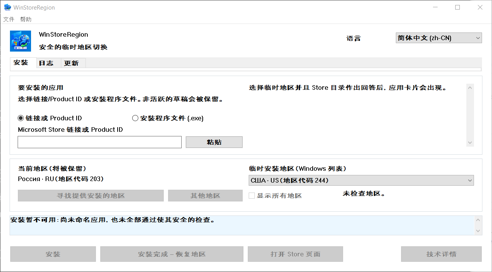

# WinStoreRegion


[](https://github.com/kroxiksut/win-store-region/actions/workflows/ci.yml)


一个 Windows 实用程序，在安装期间临时切换 Windows 地区，将安装移交给 Microsoft Store 本身的机制，并在看到实际结果后将地区改回。

一个便携式 `WinStoreRegion.exe`，约 2 MB，发布 x64、ARM64 与 32 位 x86 三种版本。它既不需要也不申请管理员权限。只有 x64 版本被实际运行过——参见[实际验证过的内容](#实际验证过的内容)。

[العربية](README.ar.md) · [English](README.md) · [Español](README.es-ES.md) · [فارسی](README.fa.md) · [日本語](README.ja.md) · [한국어](README.ko.md) · [Português](README.pt-BR.md) · [Русский](README.ru.md) · [Türkçe](README.tr.md) · **简体中文** · [繁體中文](README.zh-TW.md) · [更新日志](CHANGELOG.md)

> **本文档由机器翻译，未经中文母语者校对。**本项目不审校任何翻译，而这一份连译者都没有，因此它比英文原文更可能出错。发现问题请提交 issue 或 pull request。以 [English](README.md) 为准。

本工具由作者自荐发布于[小众软件发现频道](https://meta.appinn.net/t/topic/90878)，并在[该频道近 10 日热门排行榜 2026 年第 35 期](https://meta.appinn.net/t/topic/90962)中排在第 9 位。该榜单由论坛系统按热度自动生成。中文读者的问题与反馈也欢迎留在自荐帖里——那里比这里更可能有人用中文回答。



地区名称来自 Windows 本身，使用 Windows 称呼它们的语言——这既是该字段被标注为“Windows 列表”的原因，也是中文窗口中地区名称仍为俄文的原因。此屏幕截图是在俄文 Windows 上以 125% 缩放拍摄的。

## 目录

- [为什么存在](#为什么存在)
- [它做什么和不做什么](#它做什么和不做什么)
- [实际验证过的内容](#实际验证过的内容)
- [要求](#要求)
- [使用它](#使用它)
- [从命令行启动](#从命令行启动)
- [当 Store 不为您的地区提供服务时](#当-store-不为您的地区提供服务时)
- [按市场查找地区](#按市场查找地区)
- [更新选项卡](#更新选项卡)
- [操作日志](#操作日志)
- [数据保存位置](#数据保存位置)
- [出现问题时](#出现问题时)
- [已知限制和打开的问题](#已知限制和打开的问题)
- [翻译](#翻译)
- [从源代码构建](#从源代码构建)
- [许可证](#许可证)
- [法律声明](#法律声明)

## 为什么存在

Windows 地区是一个设置，不是居住地，两者不断分离。有人可以住在美国并运行俄文 Windows，地区设置为俄罗斯：Microsoft Store 随后将不会提供在他们实际国家中可用的应用程序——流媒体服务等。

Microsoft 记录了改变国家或地区是一个普通程序：[在 Microsoft Store 中更改您的国家或地区](https://support.microsoft.com/en-us/account-billing/change-your-country-or-region-in-microsoft-store-5895e006-34f4-10f7-16b1-999e40adb048)。WinStoreRegion 自动执行完全相同的操作：Windows 设置改变，Microsoft Store 执行安装，设置改回。改变的是应用程序的传递路线，而不是机制。同一文章从程序打开：**帮助 → Microsoft：更改您的国家或地区**。

手工进行此程序：在设置中改变地区、等待 Store 注意、查找应用程序、开始安装、记住将地区改回，并且不记错它是什么。最后一步是麻烦所在：地区很容易留下外国的，中途中断的操作不留痕迹。此实用程序执行相同步骤，但它在改变任何内容之前将原始地区写入磁盘，并在崩溃或重启后恢复它。

## 它做什么和不做什么

它做：

- 在改变任何内容**之前**将当前 Windows 地区写入磁盘；
- 切换地区并通过读取它来确认切换；
- 在**临时地区下**在目录中查找应用程序；
- 在触及地区之前，询问目录此设备是否可以完全被提供该产品；
- 通过普通机制启动安装并显示其进度；
- 恢复原始地区，而无需等待安装结束，但仅在安装已明确开始之后；
- 通过应用程序的包出现来确认完成，而不是通过返回代码；
- 当普通机制无法安装时为产品获取 Microsoft 自己的 Store 安装程序，并在临时地区下运行该安装程序；
- 保持本地操作日志和诊断日志；
- 如果上一个会话被切短，在下一个启动时恢复地区。

它不做：

- 改变您的 Microsoft 账户的地区；
- 改变您的 IP 地址或欺骗您的网络位置；
- 从非官方服务器下载 Store 包；
- 修改 Windows 或 Microsoft Store、修补任何东西或绕过任何东西；
- 承诺击败每个限制：可用内容由 Microsoft Store 决定，而不是由此实用程序决定；
- 来自 Microsoft。

地区暂时不同的后果由用户自己承担：在一个地区购买的内容和订阅可能在另一个地区的行为不同。实用程序不隐藏这一点，对此承诺任何内容。

## 实际验证过的内容

此部分存在是因为“它有效”是一种声称，此项目中的声称应该命名其证据。

完整周期已在 Windows 10 和 Windows 11 上端到端走通：在任何更改之前记录地区，切换并通过重新读取确认，在临时地区下查找应用，带进度安装，提前恢复地区，并通过应用的包出现而非返回码确认完成。移交路径、通过 Product ID 获取并检查签名与签署者的 Store 安装程序，以及拒绝目录称此设备无法接收的产品，都以同样方式走通。迄今每一次失败的运行都以地区已恢复、恢复记录已清除结束。

这些是哪些 Windows 版本，不取决于测试，而取决于代码的要求：清单声明 Windows 10 和 Windows 11，而该范围内的下限由 App Installer 决定，即 Windows 10 1809。参见 [要求](#要求)。

未验证，并陈述如下：

- **自按钮驱动的路径完成以来，没有在开发者以外的机器上运行过。**
- **Store 安装程序是否更新已安装的应用程序**。因此更新选项卡列出并解释，而不提供单击更新。参见 [已知限制](#已知限制和打开的问题)。
- **150% 缩放处的外观**。布局在 100–200% 处通过算术检查，这无法判断标题是否适合按钮内。
- **ARM64 与 32 位 x86 构建在真实设备上的表现**。三种架构在每次推送时都会构建，并随每个发布版一起提供，因此它们都能编译。但这两者从未在真实设备上启动过。提供它们，是因为能运行它们的机器是改变这一点的唯一途径，而不是因为这里有谁声称它们可用。
## 要求

- **Windows 10 版本 1809（构建 17763）或更高版本，或任何 Windows 11**。底线由 App Installer 设置，它提供安装 COM 接口并自身需要 1809；此程序调用的其他所有内容都较旧——`GetDpiForWindow` 需要 1607，每监视器 v2 缩放需要 1703。清单宣称 Windows 10 和 11 支持。已在 Windows 10 22H2 和早期开发中的 Windows 11 上测试。
- x64、ARM64 或 32 位 x86——每个发布版都包含全部三种。在 ARM64 设备上，x64 构建也可在 Windows 仿真下运行，这条路径至少在 x64 硬件上被走通过。
- **App Installer**（`Microsoft.DesktopAppInstaller`）——安装通过它运行。没有它，实用程序说这一点并提供打开其 Store 页面。
- **Microsoft Store**（`Microsoft.WindowsStore`）。
- `.exe` 运行所在的目录必须可写：首次启动时，`Microsoft.Management.Deployment.winmd` 的副本出现在程序旁边，取自已安装的 App Installer。没有它，安装 COM 接口不可用。程序不会将自己复制到其他地方来解决这个问题——它改为报告不满足的条件。
- 无需管理员权限。

**该可执行文件未签名，Windows 会这样说。**首次运行时 SmartScreen 会显示“Windows 已保护你的电脑”，并把运行按钮藏在**详细信息 → 仍要运行**后面。Windows 对任何没有 Authenticode 签名、也没有下载信誉的可执行文件都会这样做；这不是针对此文件的判断。由此有两点，且都由你权衡：

- 只有用代码签名证书为发布版签名才能去掉该警告。构建过程不会抑制它，这里也不试图抑制。
- 可以核对的是来源。每次构建都会公布所生成二进制文件的 SHA-256——在运行摘要中，以及作为工件内二进制文件旁边的一个文件——而运行本身是公开的。用 `Get-FileHash .\WinStoreRegion.exe -Algorithm SHA256` 核对你手上的文件：它要么正是该次运行构建的那个，要么不是。

通过浏览器下载的文件还带有一个标记，解压后 SmartScreen 仍会介入。用 PowerShell 的 `Unblock-File .\WinStoreRegion.exe`，或**属性 → 解除锁定**，可以移除该标记。先解锁压缩包再解压，里面的文件就是干净的。

## 使用它

1. 在**安装**选项卡上为应用程序命名：Microsoft Store 链接或 Product ID。Store 安装程序文件 (`.exe`) 也可以放在窗口上；它会被检查是否有受信任的 Microsoft 签名并在临时地区下运行，但它无法被识别——这样的文件没有可读的 Product ID，所以应用程序是您的声称，不是此程序可以检查的事实。
2. 选择临时地区。一旦 Product ID 被解析，实用程序就会向源请求该地区下应用程序的卡片——名称、发布者和传递类型在任何改变之前可见。
3. 如果应用程序未在所选地区提供，按**寻找提供安装的地区**。大约四十个主要市场被询问，列表缩小到实际提供的市场。**其他地区**完成扫描；**显示所有地区**恢复完整列表。
4. 按**安装**。从这里，实用程序自己工作：它切换地区、通过读取来确认改变、查找应用程序、将安装移交给 Store、显示进度并恢复地区。
5. 结果出现在**日志**选项卡上。

意图上没有"取消安装"按钮。Windows 拥有安装：它可以在 Microsoft Store 或**设置 → 应用**中停止或移除。关闭窗口时显示的对话框说明了这一点。

界面从键盘工作，遵守显示缩放，并在其携带的语言之间切换，无需重启。

## 从命令行启动

没有无外设模式。命令行仅决定窗口打开时显示什么——一个可选应用程序输入，预填充到安装选项卡。它不启动任何东西：地区未被触及，安装不开始，直到您按按钮。

```powershell
# 打开窗口且什么都没填写。
.\WinStoreRegion.exe

# 用 Product ID 在字段中打开它。
.\WinStoreRegion.exe 9WZDNCRFJ3PZ

# Store 网络地址做同样的事。
.\WinStoreRegion.exe https://apps.microsoft.com/detail/9WZDNCRFJ3PZ

# ms-windows-store URI 也一样。
.\WinStoreRegion.exe "ms-windows-store://pdp/?productid=9WZDNCRFJ3PZ"

# 引用包含 & 的地址——PowerShell 将其视为自己的运算符。
.\WinStoreRegion.exe "https://apps.microsoft.com/detail/9WZDNCRFJ3PZ?hl=zh-cn"

# 打印使用情况并退出而不打开窗口。
.\WinStoreRegion.exe --help
.\WinStoreRegion.exe -h
```

无论传递什么都仅被*存储*在字段中。它在窗口打开时被解析，所以不是 Product ID 或 Store 地址的值被报告在窗口中而不是提示处。

退出代码，因为脚本可能想要它们：

| 代码 | 含义 |
|---|---|
| `0` | 窗口运行并关闭，或 `--help` 打印了使用情况。 |
| `1` | 图形界面无法启动。 |
| `2` | 命令行错误。 |

只有两件事足够错误以至于代码 `2`，两者在重复标准错误上的使用前命名自己：

```powershell
PS> .\WinStoreRegion.exe --install
Unknown option: --install

Usage:
...

PS> .\WinStoreRegion.exe 9WZDNCRFJ3PZ 9N1SV6841F0B
Only one application input is allowed.

Usage:
...
```

两个细节值得了解。可执行文件是一个窗口程序，所以它附加到启动它的控制台来打印这些消息；在没有控制台的情况下启动——从运行对话框或快捷方式——它改为在对话框中显示相同文本。并且命令行文本是**每个界面语言中的英文**：界面语言在窗口内选择，窗口在读取参数时还不存在，从系统语言猜测会用没人选择的语言回答。

## 当-Store-不为您的地区提供服务时

一些产品，即使在正确的地区下，普通机制也无法安装。当这发生时，窗口提供第二条路径：**下载 Store 安装程序**。

实用程序向 Microsoft 请求同一个签名的安装程序，一个人会从 Store 网页接收，由 Product ID 寻址。该文件随后被视为完全像您手工选择的文件——相同的签名门、相同的确认显示名称、发布者和 SHA-256、相同的地区事务。

三件事值得关于此路径知道，都是测量的而非假设的：

- 下载不依赖于您的地区，所以文件在机器仍然持有您自己的地区时被获取。仅运行它需要临时的。
- 安装程序打开自己的窗口并**不静默安装**。您在那里完成安装，随后仅按**恢复地区**。
- 因为 Microsoft Store 拥有那项工作并不报告回来，此路径永远无法声称应用程序被安装。日志记录它为*移交给安装程序*，这是实际发生的。

下载的安装程序不被保留。它们在移交结束时删除，再在下一个启动时删除，因为文件总是可以被新获取，一个 Store 安装程序文件夹不是任何人要求累积的东西。

## 按市场查找地区

Microsoft Store 目录仅回答关于现在生效的地区的问题，所以从您的家庭地区缺失的应用程序通常完全不出现在地区改变之前。实用程序通过按市场询问源来解决这个问题，并且它区分三个答案：提供、不提供和无答案。第三个从未被呈现为拒绝——一个可能未到达的市场可能正是您需要的那个。

四十个市场的集合意图上是不完整的，实用程序说这一点。完整列表是大约两百五十个请求，所以它作为第二步运行并仅在明确命令上。

源的答案是一个参考，不是安装的许可：在操作内，应用程序在实际生效的地区下再次查找。

## 更新选项卡

Microsoft Store 不会更新它在您当前地区不提供的应用程序。更新选项卡找到这些：它列出已安装的 Store 应用程序，其产品源在您的地区拒绝，同时在其他地方提供，已安装版本旁边是目录提供的版本。

选项卡意图上**不**声称的是已发布更新。两个事实阻挡了这条路，都是测量的：

- `winget` 根本无法更新 Store 产品。被要求时，它回答"无适用更新"，因为 `msstore` 源报告版本为 `Unknown`。
- 两个版本号并不总是可比较的。目录独立于其内部的包为数字捆束编号，发布者改变其编号方案。显示的版本是实际到达此机器的版本，从捆束内部而不是从其名称读取。

所以选项卡显示两个数字并陈述可证实的：此地区的 Store 不会提供此产品。在条目上采取行动将其 Product ID 带到安装选项卡并启动地区搜索；更新不是一个单独的操作类型，每个门停留在它已经在的地方。

扫描结果在运行之间被记住并与拍摄时间一起显示，仅针对相同地区。

## 操作日志

**日志**选项卡显示安装了什么：应用程序、Product ID、类型、应用程序被找到的地区、日期、版本和结果。未完成和不确定的操作脱颖而出——这些是需要注意的。

仅提供安全行动用于所选条目：打开应用程序的 Store 页面、将 Product ID 转入新安装草稿、复制 Product ID、删除本地条目。它们都不启动安装或改变地区。

## 数据保存位置

所有内容都存在用户配置文件中，在 `%LOCALAPPDATA%\WinStoreRegion` 下：

| 文件 | 目的 |
|---|---|
| `journal.json` | 操作历史：什么、何时、在哪个地区下、以什么结果 |
| `pending-restore.json` | 恢复记录；仅当地区临时改变时存在 |
| `updates-scan.json` | 最后一次更新扫描，所以重新打开窗口不花费网络 |
| `installers\` | 正在移交的 Store 安装程序；移交完成时清空 |
| `logs\winstoreregion.log` | 轮转诊断日志 |

没有遥测。日志既不记录剪贴板内容、也不记录类型化文本、也不记录完整文件路径：选择的文件由名称和 SHA-256 记录。

## 出现问题时

地区保持临时状态完全到确认恢复。如果进程死亡或机器重启，下一个启动找到恢复记录、说这一点并提供放回原始地区或保留当前地区。没有新安装开始，直到该记录被解决。

由前一个运行启动的安装存活进程的死亡：一个 Windows 服务执行它。启动时，实用程序注意并恢复观察而不是把操作当作被放弃。

每个操作被写入诊断日志：启动、恢复记录、地区切换与两个值和读取确认结果、查找、安装程序的答案与其代码、安装阶段、恢复和结果。**帮助 → 打开诊断日志**打开文件夹；**帮助 → 复制详情**把当前错误的技术块放在剪贴板上。

## 已知限制和打开的问题

- 仅安装 Store 作为 Microsoft Store 包传递的应用程序。具有自己的 Win32 安装程序的应用程序不在范围内：无法为它们证明完成，没人可以验证的安装不应被提供。
- 更新选项卡没有单击更新按钮。Store 安装程序是否更新已安装的应用程序未被测量，一个可能什么都不做的按钮比没有按钮更糟。
- **打开的缺陷**：在 2026.08.21 Windows 在五次快速连续的失败操作后关闭了窗口作为无响应。地区事务不受影响——它在每一次中都被恢复——所以故障在界面中，不在模型中。它此后没有重现，缺陷发生的构建早于多个修复；原因尚未已知且此处未猜测。
- 十一种界面语言：阿拉伯文、英文、西班牙文、波斯文、日文、韩文、葡萄牙文、俄文、土耳其文，以及两种字形的中文。英文与俄文由维护者本人撰写；其余九种是由机器制作的草稿，未由母语读者检查，每个文件在顶部说这一点。阿拉伯文与波斯文会让整个窗口从右向左排布，因为它们就是这样读的。每一种都有翻译过的 README，而其中每一份都链接到其余所有。
- 程序的一个实例一次运行。

## 翻译

一个语言是一个文件。`lang/ru.toml`、`lang/en.toml` 和随便你加什么：复制一个、翻译值、打开拉取请求。没有 Rust 要写——构建读取该目录并生成语言列表、选择器和表格，所以 `lang/zh.toml` 是提供中文所需的所有。

从右向左阅读的语言只需一个字段说明这一点——`direction = "rtl"`——窗口便自行翻转：面板、标签、按钮、表格列与滚动条都换到另一侧。阿拉伯文先来，波斯文随后，代价只是一个文件、一行 Rust 都没有——这里要说的就是这一点；希伯来文的代价也一样。

**新语言被批准没有语言学审查**，因为这里没人能读它。什么被检查是结构，构建做它：缺失的键、未知的键、错误长度的列表或 `{占位符}` 与原始不同的字符串都失败构建。批准后，维护人员旨在发布一个发行版，携带语言。

因为没有审查，一个规则重于其余的。许多字符串这里意图上是谨慎的——它们说完成*未被证实*，答案来自单一市场，一个集合不完整。那些保留意见是什么使此应用程序安全信任，一个翻译必须保留它们，即使一个更大胆的句子读得更好。

相同原因使已发货的语言最可能是错误的。**如果您读一个并且某些不对，请打开一个 issue**——一个误翻译、一个被剪裁的标题、一个被丢失的保留意见或词语仅是不自然。命名语言和键；建议的措辞是欢迎但不要求的。拉取请求做相同工作，且 issue 是目的的低条。

翻译者在语言文件的 `authors` 字段中被命名，且该名称出现在**帮助 → 关于**旁边语言，在应用程序自己的作者和许可证下。信用从文件生成，所以它无法漂离它属于的工作。

一个翻译是像任何其他的贡献：被接受在 **GPL-3.0-or-later** 下且没有其他许可证，版权停留在您的，没有权利被授予任何人重新许可。

一个语言文件覆盖屏幕上的所有东西——标题、状态、诊断和对话框一样。仅一件事它不覆盖是命令行，这在每个语言中是英文，因为参数在语言被选择前读取。完整清单在 [CONTRIBUTING.md](CONTRIBUTING.md#translations)。

## 从源代码构建

稳定的 Rust 1.85 或更新的用于 `x86_64-pc-windows-msvc`。

```
cargo build --release
cargo test
cargo clippy --all-targets
cargo fmt --all --check
```

其他架构从相同源通过添加的目标构建；机器需要匹配的 MSVC 构建工具组件。应用程序清单是架构中立的，所以没有其他改变：

```
rustup target add aarch64-pc-windows-msvc
cargo build --release --target aarch64-pc-windows-msvc

rustup target add i686-pc-windows-msvc
cargo build --release --target i686-pc-windows-msvc
```

这些都没有在其架构的真实设备上运行过。但它们仍随每个发布版一起提供，因为能运行它们的机器是改变这一点的唯一途径。它们能编译，这就是全部的声称。

一些测试被标记 `#[ignore]`：它们改变 Windows 地区、安装应用程序或到达网络。改变地区的那些仅在专用测试机器上运行。

## 许可证

GPL-3.0-or-later。

## 法律声明

此项目独立于 Microsoft：不从属于、不被其认可或不被其支持。名称 Microsoft、Windows、Microsoft Store 和 WinGet 仅用于准确描述兼容性和目的。Microsoft 徽标和商用装饰未被使用。

WinStoreRegion 不改变 Microsoft 账户的地区、不改变您的 IP 地址、不从非官方服务器下载 Microsoft Store 包，且不保证每个可用性限制都可以解决。
