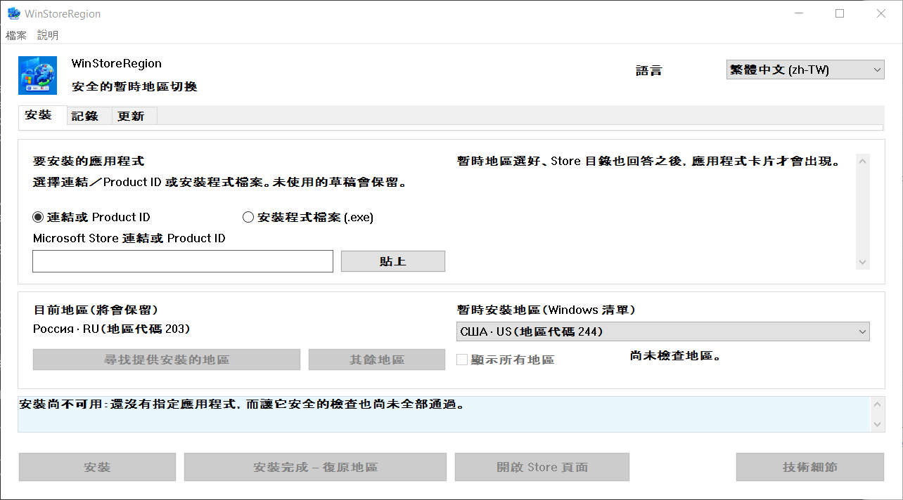

# WinStoreRegion


[](https://github.com/kroxiksut/win-store-region/actions/workflows/ci.yml)


一個 Windows 工具程式：在一次安裝的期間暫時切換 Windows 地區，把安裝交給 Microsoft Store 自己的機制，並在看到實際結果之後把地區放回去。

一個可攜的 `WinStoreRegion.exe`，約 2 MB，發行 x64、ARM64 與 32 位元 x86 三種版本。它既不需要也不索取系統管理員權限。只有 x64 版本真的被執行過 —— 參見[實際驗證過的內容](#實際驗證過的內容)。

[العربية](README.ar.md) · [English](README.md) · [Español](README.es-ES.md) · [فارسی](README.fa.md) · [日本語](README.ja.md) · [한국어](README.ko.md) · [Português](README.pt-BR.md) · [Русский](README.ru.md) · [Türkçe](README.tr.md) · [简体中文](README.zh-CN.md) · **繁體中文** · [變更記錄](CHANGELOG.md)

> **本文件由機器翻譯，未經正體中文母語者校對。**本專案不審校任何翻譯，而這一份連譯者都沒有，因此它比英文原文更可能出錯。發現問題請提交 issue 或 pull request。以 [English](README.md) 為準。



地區名稱來自 Windows 本身，用的是 Windows 稱呼它們的語言 —— 這既是那個欄位標著「Windows 清單」的原因，也是上面這個視窗裡地區名稱仍是俄文的原因。這張截圖是在俄文 Windows 上以 125% 縮放拍的。

## 目錄

- [為什麼有這個程式](#為什麼有這個程式)
- [它做什麼、不做什麼](#它做什麼不做什麼)
- [實際驗證過的內容](#實際驗證過的內容)
- [需求](#需求)
- [怎麼使用](#怎麼使用)
- [從命令列啟動](#從命令列啟動)
- [當 Store 不為你的地區提供服務時](#當-store-不為你的地區提供服務時)
- [依市場尋找地區](#依市場尋找地區)
- [「更新」索引標籤](#更新索引標籤)
- [操作記錄](#操作記錄)
- [資料存放位置](#資料存放位置)
- [出問題的時候](#出問題的時候)
- [已知限制與未解問題](#已知限制與未解問題)
- [翻譯](#翻譯)
- [從原始碼建置](#從原始碼建置)
- [授權](#授權)
- [法律聲明](#法律聲明)

## 為什麼有這個程式

Windows 地區是一項設定，不是居住地，而這兩者不斷地各走各的。一個人可以住在美國，卻用著地區設為俄羅斯的俄文 Windows：那麼 Microsoft Store 就不會提供他實際所在國家能取得的應用程式 —— 串流服務之類的。

Microsoft 把變更國家或地區當成一般程序寫進文件：[在 Microsoft Store 中變更你的國家或地區](https://support.microsoft.com/en-us/account-billing/change-your-country-or-region-in-microsoft-store-5895e006-34f4-10f7-16b1-999e40adb048)。WinStoreRegion 自動化的正是這件事，不多做別的：變更一項 Windows 設定，由 Microsoft Store 執行安裝，然後把設定放回去。改變的是應用程式的送達路徑，不是它的機制。同一篇文章可以從程式裡開啟：**說明 → Microsoft：變更你的國家或地區**。

用手做的話，步驟是：在「設定」裡改地區、等 Store 注意到、找到應用程式、開始安裝、記得把地區放回去，而且別把它記錯。麻煩就出在最後一步：地區很容易被留在外國，而中途被打斷的操作不會留下任何痕跡。這個工具做的是同樣的步驟，但它在動任何東西之前先把原本的地區寫到磁碟上，即使當機或重新開機也會把它復原。

## 它做什麼、不做什麼

它會：

- 在變更任何東西**之前**把目前的 Windows 地區寫到磁碟；
- 切換地區，並以重新讀取來確認這次切換；
- **在暫時地區之下**到目錄裡查詢應用程式；
- 在動到地區之前先問目錄，這台裝置究竟能不能收到這個產品；
- 透過一般機制開始安裝，並顯示它的進度；
- 不等安裝結束就復原原本的地區，但只在安裝確實已經開始之後；
- 以應用程式的套件出現來確認完成，而不是以回傳碼；
- 當一般機制無法安裝時，取得 Microsoft 自己的 Store 安裝程式，並在暫時地區之下執行它；
- 保存一份本機操作記錄與一份診斷記錄檔；
- 若上一次工作階段被中斷，在下次啟動時把地區復原。

它不會：

- 變更你 Microsoft 帳戶的地區；
- 變更你的 IP 位址或偽造你的網路位置；
- 從非官方伺服器下載 Store 套件；
- 修改 Windows 或 Microsoft Store、修補任何東西、繞過任何東西；
- 保證能突破每一項限制：什麼能取得是由 Microsoft Store 決定的，不是這個工具；
- 來自 Microsoft。

地區暫時不同所帶來的後果由使用者自負：在某個地區購買的內容與訂閱，在另一個地區可能表現不同。這個工具不隱瞞這件事，也不對它做任何保證。

## 實際驗證過的內容

有這一節，是因為「它能用」是一個主張，而這個專案期待主張說出自己的證據。

整個流程已在 Windows 10 與 Windows 11 上端到端跑過：在任何東西改變之前記下地區、切換並以重新讀取確認、在暫時地區之下查詢應用程式、帶進度地安裝、提早復原地區，並以應用程式的套件出現而非回傳碼來確認完成。交付路徑、以 Product ID 取得並檢查了簽章與簽署者的 Store 安裝程式，以及對目錄說這台裝置收不到的產品的拒絕，也都以同樣方式跑過。到目前為止每一次失敗的執行，結束時地區都已復原、復原記錄也已清除。

那是哪些 Windows 版本，不是測試的問題而是程式碼要求的問題：資訊清單宣告 Windows 10 與 Windows 11，而這個範圍內的下限是 Windows 10 1809，由 App Installer 決定。參見[需求](#需求)。

未經驗證，並且照實說出來的：

- **在開發者以外的機器上執行過**——自從那些靠按鈕操作的路徑完成以來，沒有。
- **Store 安裝程式會不會更新已經安裝的應用程式。**因此「更新」索引標籤只列出並說明，不提供一鍵更新。參見[已知限制](#已知限制與未解問題)。
- **150% 縮放下的外觀。**版面配置在 100–200% 之間以算術檢查過，而那說不出一段標題是否塞得進按鈕裡。
- **ARM64 與 32 位元 x86 版本在真實裝置上。**三種架構每次推送都會建置，也隨每次發行一起發布，所以它們能編譯。這兩種從來沒有在真正的裝置上啟動過。提供它們，是因為只有一台能跑它們的機器才會改變這件事，不是因為這裡有誰說它們能用。

## 需求

- **Windows 10 版本 1809（組建 17763）或更新，或任何 Windows 11。**下限由 App Installer 決定，它帶著安裝用的 COM 介面，本身就需要 1809；這個程式呼叫的其他東西都更舊 —— `GetDpiForWindow` 需要 1607，每台顯示器第二代縮放需要 1703。資訊清單宣告支援 Windows 10 與 11。在 Windows 10 22H2 上測試過，更早在開發過程中於 Windows 11 上測試過。
- x64、ARM64 或 32 位元 x86。每次發行都帶著三種。在 ARM64 裝置上，x64 版本也能在 Windows 模擬之下執行，而那正是至少已在 x64 硬體上跑過的路徑。
- **App Installer**（`Microsoft.DesktopAppInstaller`）—— 安裝是透過它進行的。沒有它，這個工具會這麼說，並提議開啟它的 Store 頁面。
- **Microsoft Store**（`Microsoft.WindowsStore`）。
- 執行 `.exe` 的那個目錄必須可寫入：第一次啟動時，程式旁邊會出現一份 `Microsoft.Management.Deployment.winmd`，取自已安裝的 App Installer。沒有它，安裝用的 COM 介面就無法使用。這個程式不會為了繞過這點而把自己複製到別處 —— 它改為回報這個未滿足的條件。
- 不需要系統管理員權限。

**這個執行檔沒有簽章，Windows 會這麼說。**第一次執行時，SmartScreen 會顯示「Windows 已保護您的電腦」，並把執行按鈕藏在**其他資訊 → 仍要執行**後面。任何不帶 Authenticode 簽章、也沒有下載信譽的執行檔，Windows 都是這麼對待的；這不是針對這個檔案的判斷。由此有兩件事，兩件都由你自己衡量：

- 這個警告只有用程式碼簽署憑證為發行版簽章才會消失。建置裡沒有任何東西能壓下它，這裡也沒有任何東西試圖這麼做。
- 能改為檢查的是身分。每次建置都會發布它所產生的執行檔的 SHA-256 —— 在執行摘要裡，也在成品內執行檔旁邊的檔案裡 —— 而那次執行本身是公開的。用 `Get-FileHash .\WinStoreRegion.exe -Algorithm SHA256` 比對你手上的檔案，它要嘛就是那次建置產出的，要嘛不是。

從瀏覽器下載的檔案還會帶著一個標記，讓 SmartScreen 在解壓縮之後仍然介入。在 PowerShell 執行 `Unblock-File .\WinStoreRegion.exe`，或用**內容 → 解除封鎖**，可以移除那個標記。在解壓縮之前先解除封鎖壓縮檔，裡面的檔案出來就是乾淨的。

## 怎麼使用

1. 在**安裝**索引標籤指定應用程式：一個 Microsoft Store 連結或一個 Product ID。也可以把 Store 安裝程式檔案（`.exe`）拖放到視窗上；它會被檢查是否有受信任的 Microsoft 簽章，並在暫時地區之下執行，但無法被辨識 —— 這種檔案不帶可讀的 Product ID，所以它會裝什麼是你的主張，不是這個程式能檢查的事實。
2. 選一個暫時地區。Product ID 一被解析，這個工具就會在那個地區之下向來源索取應用程式的卡片 —— 名稱、發行者與交付類型在任何東西改變之前就看得到。
3. 若應用程式在所選地區沒有提供，按**尋找提供安裝的地區**。大約四十個主要市場會被詢問，清單會縮到真正有提供的那些。**其餘地區**會把整輪掃完；**顯示所有地區**會還原完整清單。
4. 按**安裝**。從這裡開始工具自行作業：切換地區、以重新讀取確認變更、找到應用程式、把安裝交給 Store、顯示進度，然後復原地區。
5. 結果會出現在**記錄**索引標籤。

刻意沒有「取消安裝」按鈕。安裝屬於 Windows：可以在 Microsoft Store 或**設定 → 應用程式**裡停止它或移除應用程式。操作期間關閉視窗時出現的對話方塊就是這麼說的。

介面可以完全用鍵盤操作、尊重顯示縮放，並且不用重新啟動就能在它所帶的語言之間切換。

## 從命令列啟動

沒有無介面模式。命令列只決定視窗開啟時帶著什麼 —— 一個選擇性的應用程式輸入，預先填進「安裝」索引標籤。它不啟動任何東西：在你按下按鈕之前，地區不會被動到，也不會有任何安裝開始。

```powershell
# 開啟視窗，什麼都不填。
.\WinStoreRegion.exe

# 開啟視窗，欄位裡已經有 Product ID。
.\WinStoreRegion.exe 9WZDNCRFJ3PZ

# Store 網址也是一樣。
.\WinStoreRegion.exe https://apps.microsoft.com/detail/9WZDNCRFJ3PZ

# ms-windows-store 位址也是。
.\WinStoreRegion.exe "ms-windows-store://pdp/?productid=9WZDNCRFJ3PZ"

# 含有 & 的網址要加引號 —— PowerShell 會把它當成自己的運算子。
.\WinStoreRegion.exe "https://apps.microsoft.com/detail/9WZDNCRFJ3PZ?hl=en-us"

# 印出用法並結束，不開啟視窗。
.\WinStoreRegion.exe --help
.\WinStoreRegion.exe -h
```

傳進來的東西只會被*存放*在欄位裡。它在視窗開啟的那一刻才被解析，所以不是 Product ID 也不是 Store 位址的值，會在視窗裡被回報，而不是在提示字元上。

結束代碼，因為指令碼可能會需要：

| 代碼 | 意義 |
|---|---|
| `0` | 視窗執行過並關閉了，或 `--help` 印出了用法。 |
| `1` | 圖形介面無法啟動。 |
| `2` | 命令列有誤。 |

只有兩件事錯得足以拿到代碼 `2`，而且兩者都會先說出自己是什麼，再把用法印到標準錯誤上：

```powershell
PS> .\WinStoreRegion.exe --install
Unknown option: --install

Usage:
...

PS> .\WinStoreRegion.exe 9WZDNCRFJ3PZ 9N1SV6841F0B
Only one application input is allowed.

Usage:
...
```

有兩個細節值得知道。這個執行檔是視窗程式，所以它會附著到啟動它的主控台來印這些訊息；在沒有主控台的情況下啟動 —— 從「執行」對話方塊或捷徑 —— 它會改用對話方塊顯示同樣的文字。而命令列文字在**每一種介面語言下都是英文**：介面語言是在視窗裡選的，而讀取引數的時候那個視窗還不存在，依系統語言去猜，等於用一個沒有人選過的語言回答。

## 當 Store 不為你的地區提供服務時

有些產品，就算在對的地區之下，一般機制也裝不起來。發生這種情況時，視窗會提供第二條路：**下載 Store 安裝程式**。

這個工具會依 Product ID 向 Microsoft 索取一個人從 Store 網頁上會拿到的同一個已簽章安裝程式。那個檔案接著會被當成你親手挑的檔案來對待 —— 同一道簽章關卡、同一個顯示名稱、發行者與 SHA-256 的確認、同一筆地區交易。

關於這條路有三件事值得知道，全都是量出來的而不是假設的：

- 下載不取決於你的地區，所以檔案是在機器還持有你自己的地區時取得的。只有執行它才需要暫時地區。
- 安裝程式會開自己的視窗，而且**不會靜默安裝**。你在那裡完成安裝，然後才按**復原地區**。
- 因為那份工作屬於 Microsoft Store，而它什麼也不回報，這條路永遠不能宣稱某個應用程式被安裝了。記錄把它記成*已交給安裝程式*，那才是實際發生的事。

下載來的安裝程式不會留著。交付結束時會刪除，下次啟動時再刪一次，因為那個檔案隨時可以重新取得，而一整個資料夾的 Store 安裝程式不是任何人要求要累積的東西。

## 依市場尋找地區

Microsoft Store 目錄只會回答目前生效的那個地區，所以你家鄉地區沒有的應用程式，在地區改變之前通常根本不會出現。這個工具的辦法是逐個市場去問來源，並且分辨三種答案：有提供、沒有提供、沒有回答。第三種絕不會被當成拒絕呈現 —— 那個連不上的市場，很可能正是你要的那一個。

那四十個市場的集合刻意是不完整的，而這個工具會這麼說。完整清單大約是兩百五十個請求，所以它作為第二個步驟執行，而且只在明確的指令下才跑。

來源的答案是一個參考，不是安裝的許可：在操作內部，應用程式會在實際生效的地區之下重新查詢一次。

## 「更新」索引標籤

Microsoft Store 不會更新一個它在你目前地區不提供服務的應用程式。「更新」索引標籤找的就是這些：它列出已安裝的 Store 應用程式中，來源在你的地區拒絕、卻在別處提供的那些產品，並把已安裝的版本放在目錄提供的版本旁邊。

這個索引標籤刻意**不**宣稱的，是有更新發布了。有兩個事實擋在中間，兩個都是量出來的：

- `winget` 根本無法更新 Store 產品。要它更新，它會回答「沒有適用的更新」，因為 `msstore` 來源把版本回報為 `Unknown`。
- 兩個版本號未必可以比較。目錄為套件組合編號的方式，和裡面那個套件是各自獨立的，而且發行者也會換編號方式。顯示的版本是實際會落到這台機器上的那一個，從套件組合內部讀出來的，不是從它的名字。

所以這個索引標籤同時顯示兩個號碼，並說出可以證明的事：這個地區的 Store 不會為這個產品提供服務。對一個項目採取行動，會把它的 Product ID 帶到「安裝」索引標籤並開始地區搜尋；更新不是另一種操作，每一道關卡都留在它原來的位置。

掃描結果會在多次執行之間記住，並和取得它的時間一起顯示，而且只限同一個地區。

## 操作記錄

**記錄**索引標籤顯示裝了什麼：應用程式、Product ID、類型、應用程式是在哪個地區之下被找到的、日期、版本與結果。未完成與不確定的操作會突出顯示 —— 需要留意的正是那些。

對選取的項目只提供安全的動作：開啟應用程式的 Store 頁面、把 Product ID 帶進新的安裝草稿、複製 Product ID、刪除本機項目。這些都不會開始安裝，也不會改變地區。

## 資料存放位置

一切都在使用者設定檔裡，位於 `%LOCALAPPDATA%\WinStoreRegion`：

| 檔案 | 用途 |
|---|---|
| `journal.json` | 操作歷史：什麼、何時、在哪個地區之下、結果如何 |
| `pending-restore.json` | 復原記錄；只在地區被暫時改變的期間存在 |
| `updates-scan.json` | 上一次「更新」掃描，好讓重新開啟視窗不花網路 |
| `installers\` | 此刻正在交付的 Store 安裝程式；完成後清空 |
| `logs\winstoreregion.log` | 會輪替的診斷記錄檔 |

沒有遙測。記錄檔既不記剪貼簿內容，也不記輸入的文字或完整檔案路徑：選取的檔案是以名稱與 SHA-256 記下的。

## 出問題的時候

地區維持暫時狀態，直到一次經過確認的復原為止。如果行程死掉或機器重新開機，下次啟動會找到那筆復原記錄、把這件事說出來，並提議把原本的地區放回去或保留目前的。在那筆記錄被處理掉之前，不會有新的安裝開始。

由上一次執行開始的安裝能在行程死亡之後存活：執行它的是一個 Windows 服務。啟動時這個工具會注意到，並恢復觀察，而不是把那個操作當成被拋棄的。

每一個操作都會寫進診斷記錄檔：啟動、復原記錄、帶著兩個值與重新讀取結果的地區切換、查詢、安裝程式帶著代碼的回答、安裝各階段、復原與結果。**說明 → 開啟診斷記錄檔**會開啟那個資料夾；**說明 → 複製細節**會把目前錯誤的技術區塊放到剪貼簿。

## 已知限制與未解問題

- 只安裝 Store 以 Microsoft Store 套件形式交付的應用程式。有自己 Win32 安裝程式的應用程式不在範圍內：無法為它們證明完成，而沒有人能驗證的安裝不該被提供。
- 「更新」索引標籤沒有一鍵更新按鈕。Store 安裝程式會不會更新已經安裝的應用程式沒有量過，而一顆可能什麼都不做的按鈕，比沒有按鈕更糟。
- **未解的缺陷：**2026.08.21，在五次快速接連的失敗操作之後，Windows 把視窗當成沒有回應而關掉了。地區交易不受影響 —— 每一次都復原了 —— 所以故障在介面裡，不在模型裡。此後沒有再重現，而發生時的那個建置早於好幾項修正；原因尚未查明，這裡也不猜。
- 十一種介面語言：阿拉伯文、英文、西班牙文、波斯文、日文、韓文、葡萄牙文、俄文、土耳其文，以及兩種字形的中文。英文與俄文由維護者自己撰寫；其餘九種是機器製作的草稿，沒有母語讀者檢查過，每個檔案在頂端都這麼說。阿拉伯文與波斯文會讓整個視窗從右往左排，因為它們就是這樣讀的。每一種都有翻譯過的 README，而其中每一份都連結到其餘所有。
- 程式一次只執行一個實例。

## 翻譯

一個語言就是一個檔案。`lang/ru.toml`、`lang/en.toml`，以及你加的任何一個：複製一個、翻譯值、開一個 pull request。沒有 Rust 要寫 —— 建置會讀那個目錄，並產生語言清單、選擇器與表格，所以 `lang/zh.toml` 就是提供中文所需要的全部。

從右往左讀的語言只用一個欄位說明這件事，`direction = "rtl"`，視窗就會為它把自己轉過來：面板、標題、按鈕、表格欄與捲軸全都換邊。阿拉伯文先來，波斯文隨後，代價是一個檔案、一行 Rust 都沒有 —— 這裡要說的就是這一點；希伯來文的代價也一樣。

**新語言不經語言學審查就被接受**，因為這裡沒有人讀得懂。被檢查的是結構，而且是建置在做：缺少的鍵、未知的鍵、長度不對的清單，或 `{佔位符}` 和原文不同的字串，全都會讓建置失敗。通過之後，維護者會設法發行一個帶著該語言的版本。

因為沒有審查，有一條規則比其他都重要。這裡許多字串刻意保守 —— 它們說完成*未經證實*、答案來自單一市場、集合並不完整。那些保留正是讓這個程式值得信任的東西，即使更肯定的句子讀起來更順，翻譯也必須保留它們。

同樣的理由讓已經在發行的語言，正是最可能有錯的那些。**如果你讀了其中一種、覺得哪裡不對，請開一個 issue** —— 誤譯、被截斷的標題、走失的保留，或只是讀起來不自然的措辭。說出語言和鍵；建議的措辭歡迎但不是必要。pull request 做的是同樣的事，而 issue 的門檻刻意比較低。

譯者記在語言檔案的 `authors` 欄位裡，而那個名字會出現在**說明 → 關於**中該語言旁邊，位於程式本身的作者與授權之下。這份記名是從檔案產生的，所以它不會和它所屬的工作走散。

翻譯和其他貢獻一樣：以 **GPL-3.0-or-later** 而非任何其他授權被接受，著作權仍然是你的，也沒有把重新授權的權利給任何人。

一個語言檔案涵蓋畫面上的一切 —— 標題、狀態、診斷與對話方塊都一樣。它唯一不涵蓋的是命令列，那在每一種語言下都是英文，因為引數是在語言被選定之前讀取的。完整的檢查清單在 [CONTRIBUTING.md](CONTRIBUTING.md#translations)。

## 從原始碼建置

穩定版 Rust 1.85 或更新，目標 `x86_64-pc-windows-msvc`。

```
cargo build --release
cargo test
cargo clippy --all-targets
cargo fmt --all --check
```

其他架構從同樣的原始碼加上一個目標就能建置；機器需要對應的 MSVC 建置工具元件。應用程式資訊清單與架構無關，所以其他什麼都不用改：

```
rustup target add aarch64-pc-windows-msvc
cargo build --release --target aarch64-pc-windows-msvc

rustup target add i686-pc-windows-msvc
cargo build --release --target i686-pc-windows-msvc
```

這兩種都沒有在自己架構的真實裝置上跑過。儘管如此仍隨每次發行一起發布，因為只有一台跑得動它們的機器才會改變這件事。它們能編譯，而這就是全部的主張。

有些測試標了 `#[ignore]`：它們會變更 Windows 地區、安裝應用程式，或連上網路。會變更地區的那些，只在一台專用的測試機器上執行。

## 授權

GPL-3.0-or-later。

## 法律聲明

本專案獨立於 Microsoft：與其無隸屬關係，未獲其背書，也未受其支援。Microsoft、Windows、Microsoft Store 與 WinGet 這些名稱，僅用於準確描述相容性與用途。未使用 Microsoft 的標誌與商業外觀。

WinStoreRegion 不變更 Microsoft 帳戶的地區、不變更你的 IP 位址、不從非官方伺服器下載 Microsoft Store 套件，也不保證每一項可用性限制都能繞過。
